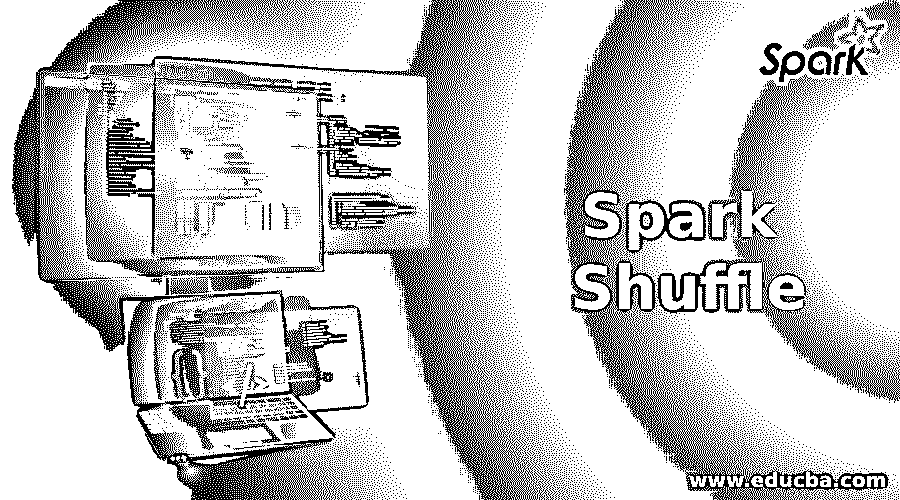
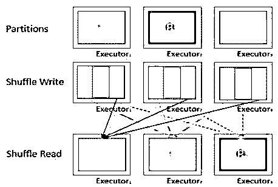
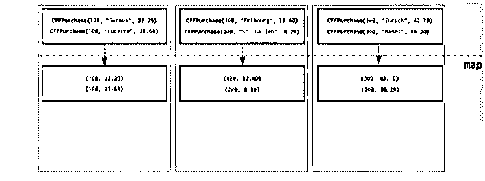
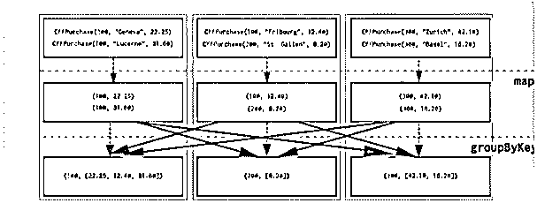

# 火花洗牌

> 原文：<https://www.educba.com/spark-shuffle/>

## 火花洗牌简介

在 Apache Spark 中，Spark Shuffle 描述了 reduce 任务和 map 任务之间的过程。混洗是指给定数据的混洗。这项手术被认为是最昂贵的。spark shuffle 操作的有效并行化为 spark 作业提供了良好的性能输出。火花数据帧是混洗操作的分区。原始数据帧分区随着数据帧分区的数量而不同。数据从一个分区移动到另一个分区的过程被称为洗牌，其目的是为了以其他方式进行整理、聚合、连接或分散。

### 句法

Spark 体系结构中的混洗语法:

<small>Hadoop、数据科学、统计学&其他</small>

`rdd.flatMap { line => line.split(' ') }.map((_, 1)).reduceByKey((x, y) => x + y).collect()`

**解释:**这是平面图操作 RDD 中的一种混洗火花分区方法，我们创建了一个单词计数的应用程序，其中每个单词被分成一个元组，然后被聚合成结果。

### Spark 架构洗牌如何工作

在随机播放期间，数据返回到磁盘并通过网络传输。将完成混洗操作数量的减少，或者因此减少被混洗的数据量。

默认情况下，Spark shuffle 操作使用散列分区来确定哪个键值对应该被发送到哪个机器。更多的数字重组并不总是坏事。内存限制和其他不可能的事情可以通过洗牌来克服。

在 RDD，下面是一些操作和洗牌的例子:
–subtract by key
–group by
–foldby key
–reduce by key
–aggregate by key
–任意类型 join 的转换
–distinct
–co group

这些建立在散列表中的混洗操作在每个任务中执行分组。这往往是巨大的或巨大的。这可以通过增加并行度来解决，并且输入任务被设置为小。

这是 Spark shuffle 操作中的几个系列——
一个分区——一个执行器——一个核心
四个分区——一个执行器——四个核心
两个分区——两个执行器——两个核心
歪斜的按键。

### 实现火花混洗的示例

让我们看一个例子:

#### 示例#1

(customerId: Int，destination: String，price: Double) case 类 CFFPurchase

让我们坐在我们组成的移动应用程序 CFF 的用户购买手册，这是在过去一个月的 RDD。

val purchase add:RDD[CFP purchase]= sc . textfile(…)

目标:让我们计算一下每个人花了多少钱，看看他一个月内旅行了多少次。

**代码:**

`val buyRDD: RDD[ADD_Purchase] = sc.textFile()
// Return an array - Array[(Int, (Int, Double))] // Pair of RDD
//group By Key returns RDD [(K, iterable[V])] val purchasesForAmonth = buyRDD.map( a=> (a.IdOfCustomer, a.cost))
.groupByKey()
.map(p=> (a._1\. (a._2.size, a._2.add)))
.collect()`

样品 1–样品 1.txt:

`val Buy = List (ADDPurchase (100, “Lucerne”, 31.60))
(100, “Geneva”, 22.25))
(300, “Basel”, 16.20))
(200, “St. Gallen”, 8.20))
(100, “Fribourg”, 12.40))
(300, “Zurich”, 42.10))`

根据上面给出的数据分布，集群应该是什么样子？

**输出:**

**解释:**我们有具体的数据实例。为了创建与每个唯一的键-值对相匹配的值集合，我们必须在网络中移动键-值对。我们必须收集每个键在承载该键的节点上的所有值。在本例中，我们假设有三个节点，每个节点都有一个键，所以我们在每个节点上放置 100、200、300 个键，如下所示。然后，我们移动所有的键-值对，以便第一个节点上客户编号为 100 的所有采购、第二个节点上客户编号为 200 的采购以及第三个节点上客户编号为 300 的采购都在这个值中，这是一个集合。groupByKey 部分是所有数据在网络中移动的地方。这种操作被认为是 Spark 体系结构中的混洗。

### 在 Spark 中混洗需要注意的要点

1.火花混洗分区具有静态数量的混洗分区。
2。混洗火花分区不随数据大小而变化。
3。对于小数据来说，200 是一个大杀器，它会由于调度开销而降低处理速度。
4。200 对于大型数据来说较小，并且它没有有效地使用群集中存在的所有资源。
为了克服这些问题，spark 中的洗牌分区应该动态完成。

### 结论

我们在 Spark 架构中看到了洗牌的概念。洗牌操作非常迅速，根本不需要排序。有时不需要维护哈希表。当包含在地图中时，会在地图端创建少量数据或文件。随机输入输出操作，少量是必需的，大部分是顺序读写。

### 推荐文章

这是一个指导火花洗牌。这里我们讨论 Spark Shuffle 的介绍，它是如何工作的，例子，以及要点。您也可以浏览我们的其他相关文章，了解更多信息——

1.  [火花版本](https://www.educba.com/spark-versions/)
2.  [火花阶段](https://www.educba.com/spark-stages/)
3.  [火花广播](https://www.educba.com/spark-broadcast/)
4.  [火花命令](https://www.educba.com/spark-commands/)

