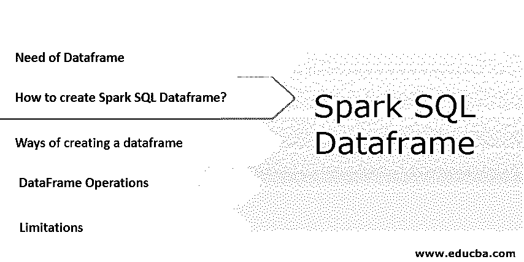

# Spark SQL 数据框架

> 原文：<https://www.educba.com/spark-sql-dataframe/>

## Spark SQL 数据框架简介

Spark SQL Dataframe 是以表格结构格式存储的分布式数据集。Dataframe 类似于数据抽象的 RDD 或弹性分布式数据集。Spark 数据框架通过 R 语言、Python、Scala 和 Java 数据框架 API 得到优化和支持。Spark SQL 数据帧来源于现有的 RDD、日志表、配置单元表以及结构化数据文件和数据库。Spark 使用选择和过滤查询功能进行数据分析。Spark SQL Dataframe 支持容错、内存处理等高级功能。Spark SQL 数据帧是高度可扩展的，可以处理非常大量的数据。

产生数据帧的不同来源有

<small>Hadoop、数据科学、统计学&其他</small>

*   现有 RDD
*   结构化数据文件和数据库
*   蜂巢餐桌

### 数据框架的需求

spark 社区一直试图将数据结构化，spark SQL- dataframes 就是朝着这个方向迈出的一步。RDD spark 最初的 API 是针对计算和数据都不透明的非结构化数据的。因此，需要创建一个能够提供额外优化好处的 API。以下是构成数据框架基础的几个要求

*   流程结构化和半数据
*   多个数据源
*   与多种编程语言集成
*   可以对数据执行的操作数，如选择和过滤。

### 如何创建 Spark SQL 数据框架？

在了解创建数据帧的方法之前，了解 spark 应用程序从不同来源创建数据帧的另一个概念很重要。这个概念被称为 sparksession，是所有 spark 功能的入口点。之前，我们必须单独创建 sparkConf、sparkContext 或 sqlContext，但使用 sparksession，所有这些都封装在一个会话中，其中 spark 充当 sparksession 对象。

`import org.apache.spark.sql.SparkSession
val spark = SparkSession
.builder()
.appName("SampleWork")
.config("config.option", "value")
.getOrCreate()`

### 创建 Spark SQL 数据框架的方法

让我们讨论创建数据帧的两种方法。

#### 1.从现有的 RDD

有两种方法可以通过 RDD 创建数据帧。一种方法是使用自动推断数据模式的反射，另一种方法是以编程方式创建一个模式，然后应用于 RDD。

*   **通过推断模式**

由于 Spark 的 SQL 接口，将 RDD 转换为数据帧的一个简单方法是当它包含 case 类时。传递给 case 类的参数是使用反射获取的，它成为表中列的名称。序列和数组也可以在 case 类中定义。将使用 case 类创建的 RDD 可以使用 toDF()方法隐式转换为 Dataframe。

`val sqlContext = new org.apache.spark.sql.SQLContext(sc)
import sqlContext.implicits._
case class Transport(AutoName: String, year: Int)
val Vehicle = sc.textFile("//path//").map(_.split(",")).map(p => Transport(p(0), p(1)).toDF()`

创建一个 dataframe Vehicle，并将其注册为一个表，可以对该表执行 sql 语句。

*   **通过编程指定模式**

可能会有我们事先不知道模式的情况，或者 case 类不能接受超过 22 个字段的情况。在这种情况下，我们使用编程方式创建模式。首先，从原始 RDD 创建行的 RDD，即将 rdd 对象从 rdd[t]转换为 rdd[row]。然后使用 StructType(表)和 StructField(字段)对象创建一个模式。该模式使用 createDataFrame 方法应用于行的 RDD，这类似于前面创建的 rdd[row]的结构。

`val Vehicle = sc.textFile("//path")
import org.apache.spark.sql._
val schema = StructType(Array(StructField("AutoName",StringType,true),StructField("Year",IntegerType,true)))
scala> val rowRDD = vehicle.map(_.split(",")).map(p => org.apache.spark.sql.Row(p(0),p(1).toInt))
val vehicleSchemaRDD = sqlContext.applySchema(rowRDD, schema)`

#### 2.通过数据源

Spark 允许通过多个来源创建数据帧，如 hive、json、parquet、csv 和文本文件，这些文件也可用于创建数据帧。

`Val file=sqlContext.read.json(“path to the json file”)
Val file=sqlContext.read.csv(“path to the json file”)
Val file=sqlContext.read.text(“path to the json file”)
val hiveData = new org.apache.spark.sql.hive.HiveContext(sc)
val hiveDF = hiveData.sql(“select * from tablename”)`

### 数据帧操作

由于数据与模式一起以表格格式存储，因此可以在数据帧上执行许多操作。它允许对数据帧中的数据执行多种操作。

考虑文件是从 csv 文件创建的数据帧，包含两列——全名和年龄

**1。printSchema()-** 查看模式结构

`file.printSchema()
// |-- AgePerPA: long (nullable = true)
// |-- FullName: string (nullable = true)`

**2。select-** 类似于 SQL 中的 select 语句，展示了 select 语句中提到的数据。

`file.select("FullName").show()
// +-------+
// |   name|
// +-------+
// |Sam|
// |Jodi|
// | Bala|
// +-------+`

**3。Filter-** 查看数据框中的过滤数据。命令中提到的条件

`file.filter($"AgePerPA" > 18).show()`

**4。GroupBy-** 对值进行分组

`file.groupBy("AgePerPA").count().show()`

**5。show()-** 显示 dataframe 的内容

`file.show()`

### 限制

虽然使用 dataframes 可以在编译时捕获 SQL 语法错误，但是直到运行时才能处理任何与分析相关的错误。例如，如果在代码中引用了一个不存在的列名，直到运行时才会被注意到。这将导致浪费开发人员的时间和项目成本。

### 结论

本文给出了关于 Spark SQL 的 dataframe API 的总体情况(需求、创建、限制)。由于 dataframe APIs 的流行，Spark SQL 仍然是广泛使用的库之一。就像 RDD 一样，它提供了容错、延迟评估、内存处理等特性以及一些额外的好处。它可以定义为以表格形式分布在集群中的数据。因此，一个数据帧将有一个与之相关联的模式，并且可以通过 spark session 对象通过多个源来创建。

### 推荐文章

这是一个指导火花 SQL 数据框架。在这里，我们将讨论基本概念、需求以及创建有限制的数据框架的两种方法。您也可以阅读以下文章，了解更多信息——

1.  [火花外壳命令](https://www.educba.com/spark-shell-commands/)
2.  [SQL 中的游标](https://www.educba.com/cursors-in-sql/)
3.  [SQL 约束](https://www.educba.com/sql-constraints/)
4.  [SQL 中的数据库](https://www.educba.com/database-in-sql/)

