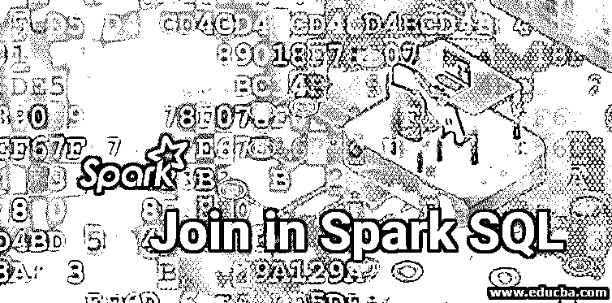
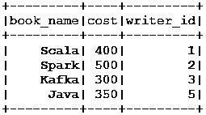
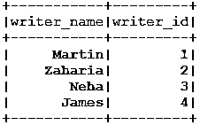
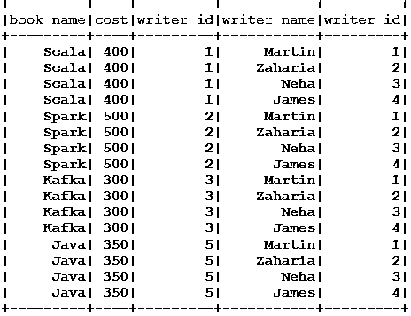
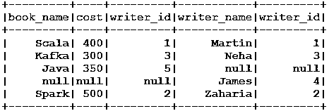
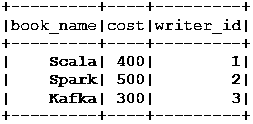

# 加入 Spark SQL

> 原文：<https://www.educba.com/join-in-spark-sql/>

## Spark SQL 加入简介

Spark SQL 中的连接是连接两个或多个数据集的功能，类似于基于 SQL 的数据库中的表连接。Spark 以数据集和数据框的表格形式工作。Spark SQL 支持几种类型的连接，如内部连接、交叉连接、左外部连接、右外部连接、完全外部连接、左半连接、左反连接。联接场景是基于业务用例在 Spark SQL 中实现的。一些连接需要很高的资源和计算效率。为了管理这样的场景，spark 支持 SQL optimizer 和交叉连接启用标志功能。

### Spark SQL 中的连接类型

以下是不同类型的联接:

<small>Hadoop、数据科学、统计学&其他</small>

*   [内部连接](https://www.educba.com/inner-join-in-oracle/)
*   [交叉连接](https://www.educba.com/oracle-cross-join/)
*   [左外连接](https://www.educba.com/left-outer-join-in-mysql/)
*   右外部联接
*   完全外部连接
*   左半连接
*   左反连接

### 数据创建示例

我们将使用以下数据来演示不同类型的连接:

#### 图书数据集:

`case class Book(book_name: String, cost: Int, writer_id:Int)
val bookDS = Seq(
Book("Scala", 400, 1),
Book("Spark", 500, 2),
Book("Kafka", 300, 3),
Book("Java", 350, 5)
).toDS()
bookDS.show()`

#### 编写器数据集:

`case class Writer(writer_name: String, writer_id:Int)
val writerDS = Seq(
Writer("Martin",1),
Writer("Zaharia " 2),
Writer("Neha", 3),
Writer("James", 4)
).toDS()
writerDS.show()`

### 连接的类型

下面提到了 7 种不同类型的连接:

#### 1.内部连接

内部联接返回的数据集的行在两个数据集中具有匹配值，即公共字段的值相同。

`val BookWriterInner = bookDS.join(writerDS, bookDS("writer_id") === writerDS("writer_id"), "inner")
BookWriterInner.show()`

#### 2.交叉连接

交叉联接返回的数据集是第一个数据集中的行数乘以第二个数据集中的行数。这种结果叫做笛卡尔积。
先决条件:要使用交叉连接，spark.sql.crossJoin.enabled 必须设置为 true。否则，将引发异常。

`spark.conf.set("spark.sql.crossJoin.enabled", true)
val BookWriterCross = bookDS.join(writerDS)
BookWriterCross.show()`

#### 3.左外部连接

[左外部连接返回](https://www.educba.com/left-outer-join-in-postgresql/)数据集，该数据集包含左数据集中的所有行，以及右数据集中的匹配行。

`val BookWriterLeft = bookDS.join(writerDS, bookDS("writer_id") === writerDS("writer_id"), "leftouter")
BookWriterLeft.show()`

#### 4.右外部联接

右外部联接返回的数据集包含右数据集中的所有行，以及左数据集中的匹配行。

`val BookWriterRight = bookDS.join(writerDS, bookDS("writer_id") === writerDS("writer_id"), "rightouter")
BookWriterRight.show()`

#### 5.完全外部连接

当左数据集中或右数据集中存在匹配时，完全外连接返回包含所有行的数据集。

`val BookWriterFull = bookDS.join(writerDS, bookDS("writer_id") === writerDS("writer_id"), "fullouter")
BookWriterFull.show()`

#### 6.左半连接

左半连接返回一个数据集，该数据集包含左数据集中的所有行，这些行在右数据集中有对应关系。与左外连接不同，左半连接中返回的数据集只包含左数据集中的列。

`val BookWriterLeftSemi = bookDS.join(writerDS, bookDS("writer_id") === writerDS("writer_id"), "leftsemi")
BookWriterLeftSemi.show()`

#### 7.左反连接

反半连接返回的数据集包含左侧数据集中所有与右侧数据集中不匹配的行。它还只包含左侧数据集中的列。

`val BookWriterLeftAnti = bookDS.join(writerDS, bookDS("writer_id") === writerDS("writer_id"), "leftanti")
BookWriterLeftAnti.show()`

### 结论

连接数据是实现我们的业务用例的最常见和最重要的操作之一。Spark SQL 支持所有基本类型的连接。加入时，我们还需要考虑性能，因为它们可能需要大量网络传输，甚至创建超出我们处理能力的数据集。为了提高性能，Spark 使用 SQL optimizer 来重新排序或下推过滤器。Spark 还限制了危险连接，即交叉连接。要使用交叉连接，spark.sql.crossJoin.enabled 必须显式设置为 true。

### 推荐文章

这是一个加入 Spark SQL 的指南。在这里，我们通过示例讨论 Spark SQL 中可用的不同类型的连接。你也可以看看下面这篇文章。

1.  [SQL 中的连接类型](https://www.educba.com/types-of-joins-in-sql/)
2.  [SQL 中的表格](https://www.educba.com/table-in-sql/)
3.  [SQL 插入查询](https://www.educba.com/sql-insert-query/)
4.  [SQL 中的事务](https://www.educba.com/transactions-in-sql/)
5.  PHP 过滤器|如何使用各种过滤器来验证用户输入？

