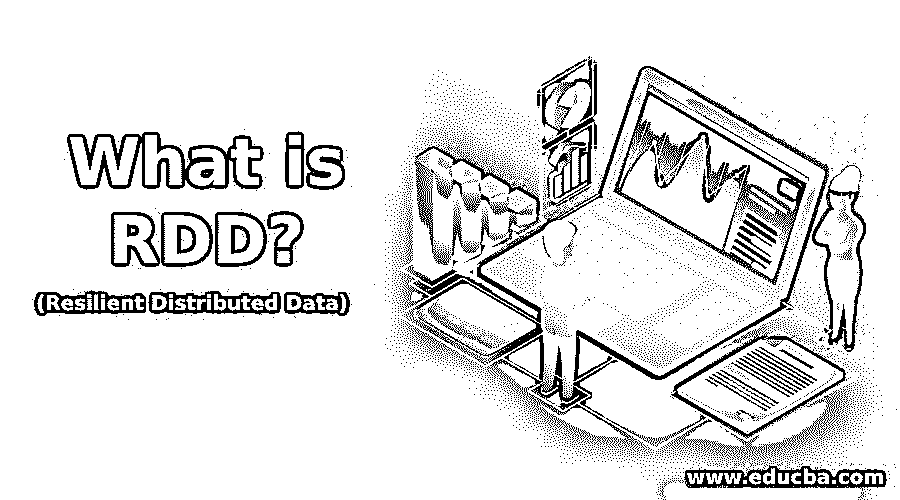

# 什么是 RDD？

> 原文：<https://www.educba.com/what-is-rdd/>

## RDD 简介

弹性分布式数据集是 Spark 的基本组件。每个数据集都被划分为逻辑部分，这些逻辑部分可以在集群的不同节点上轻松计算。它们可以并行操作，并且是容错的。RDD 对象可以由 Python、Java 或 Scala 创建。它还可以包括用户定义的类。为了获得更快、有效和准确的结果，Spark 使用了 RDD。rdd 可以通过两种方式创建。一种是在 Spark 上下文驱动程序中并行化现有的集合。另一种方法是引用外部存储系统中的数据集，该存储系统可以是 HDFS、HBase 或任何其他具有 Hadoop 文件格式的源。

要理解弹性分布式数据集(RDD)的基本功能，了解 Spark 的基础知识很重要。它是 Spark 的主要组成部分。Spark 是一个[数据处理引擎](https://www.educba.com/what-is-data-processing/)，提供更快更简单的分析。Spark 在弹性分布式数据集的帮助下进行内存处理。这意味着它捕获内存中的大部分数据。它有助于管理数据的分布式处理。在这之后，数据的转换也可以考虑了。RDD 中的每个数据集首先被划分成逻辑部分，并且可以在集群的不同节点上进行计算。

<small>Hadoop、数据科学、统计学&其他</small>

### 谅解

为了更好地理解它，我们需要知道它们是如何不同的，区别因素是什么。下面是区分 rdd 的几个因素。

**1。记忆中:**这是 RDD 最重要的特色。创建的对象集合存储在磁盘的内存中。这提高了 Spark 的执行速度，因为数据是从内存中的数据获取的。任何操作都不需要从磁盘中提取数据。

**2。懒评价:**Spark 中的变身懒。在对 RDD 中可用的数据执行任何操作之前，不会执行这些数据。要获取数据，用户可以利用 RDD 上的 count()操作。

**3。Cach Enable:** 当 RDD 被延迟评估时，对它们执行的操作需要被评估。这导致了为所有转换创建 rdd。数据也可以保存在内存或磁盘上。

### RDD 是如何让工作变得如此简单的？

RDD 可以让你拥有所有的输入文件，就像其他变量一样。这是不可能通过[使用 Map Reduce](https://www.educba.com/what-is-mapreduce/) 实现的。这些 rdd 通过分区自动分布在可用的网络上。每当执行一个动作时，每个分区都会启动一个任务。这鼓励并行性，分区数量越多，并行性越高。分区由 Spark 自动确定。完成后，RDDs 可以执行两个操作。这包括动作和转换。

### 你能拿 RDD 怎么办？

如前一点所述，它可用于两种操作。这包括动作和转换。在转换的情况下，从现有的数据集创建新的数据集。每个数据集都通过一个函数传递。作为返回值，它发送一个新的 RDD 作为结果。

另一方面，动作向程序返回值。它对所需的数据集执行计算。这里，当执行操作时，不会创建新的数据集。因此，可以说它们是返回非 RDD 值的 RDD 运算。这些值存储在外部系统或驱动程序中。

### 与 RDD 合作

为了有效地使用它，遵循以下步骤是很重要的。从获取数据文件开始。这些可以通过使用 import 命令轻松获得。一旦完成，下一步就是创建数据文件。通常，数据通过文件加载到 RDD。也可以使用并行化命令来创建它。一旦这样做了，用户就可以轻松地开始执行不同的任务。转换包括过滤转换、映射转换，其中映射也可以与预定义的函数一起使用。也可以执行不同的动作。这些包括收集动作、计数动作、采取动作等。一旦创建了 RDD 并完成了基本变换，就可以对 RDD 进行采样了。它是通过使用样本转换和样本动作来执行的。转换有助于应用连续的转换，而操作有助于检索给定的样本。

### 优势

以下是主要的特性或优点:

**1。不可变的和分区的:**所有的记录都是分区的，因此 RDD 是并行的基本单位。每个分区都是逻辑划分的，并且是不可变的。这有助于实现数据的一致性。

**2。粗粒度操作:**这些是应用于数据集中所有元素的操作。详细地说，如果一个数据集有一个映射、一个过滤器和一个操作分组，那么这些将在该分区中存在的所有元素上执行。

**3。** **转换和动作:**创建动作后，只能从稳定存储中读取数据。这包括 HDFS 或对现有 rdd 进行转换。动作也可以单独执行和保存。

**4。** **容错:**这是使用它的主要优势。因为创建了一组转换，所以所有的改变都被记录，而实际的数据不希望被改变。

**5。** **持久性:**可以重复使用，使其具有持久性。

### 所需技能和范围

对于 RDD，你需要对 Hadoop 生态系统有一个基本的了解。一旦你有了一个想法，你就可以很容易地理解 Spark 并了解其中的概念。作为新兴技术之一，它的应用范围很广。通过理解，你可以轻松获得处理和存储海量数据的知识。数据是基石，这使得 RDD 必须留下来。

### 为什么要用？

rdd 之所以成为热门话题，主要是因为它处理大量数据的速度。rdd 具有持久性和容错性，这使得数据保持弹性。

**对 RDD 的需求**

为了快速有效地执行数据操作，需要使用 rdd。内存中的概念有助于快速获取数据，可重用性使其更高效。

### 职业成长

它被广泛用于数据处理和分析。一旦你学会了 RDD，你将能够与 Spark 一起工作，这是当今技术中强烈推荐的。你可以很容易地要求加薪，也可以申请高薪工作。

### 结论

总之，如果你想留在数据行业和分析领域，这无疑是一个加分项。它将帮助您灵活高效地使用最新技术。

### 推荐文章

这是一本关于什么是 RDD 的指南？.在这里，我们讨论了 RDD 的概念，范围，需要，职业，理解，工作和优势。你也可以浏览我们推荐的其他文章来了解更多信息-

1.  什么是虚拟化？
2.  [什么是大数据技术](https://www.educba.com/what-is-big-data-technology/)
3.  [什么是阿帕奇 Spark？](https://www.educba.com/what-is-apache-spark/)
4.  [OOP 的优势](https://www.educba.com/advantages-of-oop/)

