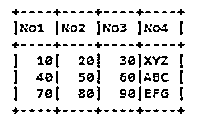

# 派斯帕卡 RDD

> 原文：<https://www.educba.com/pyspark-rdd/>


## PySpark RDD 简介

下面的文章提供了 PySpark RDD 的概要。我们知道 pyspark 是一个包含驱动编程的高级应用；在这个程序的帮助下，我们可以在集群上执行用户的主功能和不同的并行操作。所以在这里，主要的编程类是一个有弹性的分布式数据集。RDD 不过是可以并行执行的不同集群节点的集合。

### 关键要点

*   并行执行可以高效快速地处理元素。
*   它允许我们在处决 RDD 时容忍过失。
*   它不能快速计算 RDD 元素的计算结果。
*   在 RDD，我们无法转换数据集中的单个元素。

### 什么是派斯帕克·RDD？

RDD 代表弹性分布式数据集；这些组件在不同的集线器上运行和工作，类似于在一个组上处理。RDD 是不变的组件，这意味着一旦您制作了 RDD，您就不能对其进行转换。rdd 也很宽松；随后，如果有任何失望的事情发生，他们会恢复健康。您可以在这些 rdd 上应用各种程序来完成特定的任务。rdd 是从 Hadoop 文档框架(或一些其他 Hadoop 支持的文档框架)中的记录或驱动程序中的当前 Scala 分类开始，并对其进行更改。客户端可能会请求 Spark 在内存中继续 RDD，允许它在类似的活动中有效地重用。最终，rdd 从 hub 的失望中恢复过来。

<small>网页开发、编程语言、软件测试&其他</small>

### 派斯帕克 RDD 行动

让我们来看看 RDD 的操作如下:

基本上，在 RDD 有两种类型的操作:

#### 1.转换

这些活动接受一个 RDD 作为信息，结果产生另一个 RDD。当一个改变被应用到一个 RDD 时，它返回另一个 RDD；第一个 RDD 继续像以前一样，这样，是永久性的。应用更改后，它会生成一个有向非循环图或 DAG 用于计算，并在应用任何活动后结束。这就是他们所谓的冷漠评估过程的解释。

#### 2.行动

这些是应用在 RDD 上的各种活动，以传递一种孤独的价值。这些技术被应用到一个结果 RDD 和生产非 RDD 的尊重，消除了 RDD 的变化昏睡。

现在我们来看一个 RDD 操作的例子，如下所示:

在此之前，我们必须确保 RDD 的设置，这意味着安装，所以首先，我们需要在下面命令的帮助下在本地机器上安装 pyspark。

```
pip install pyspark
```

安装后，我们需要初始化 sparkcontext，如下所示:

**代码:**

```
from pyspark import SparkContext
sc_obj = SparkContext.getOrCreate()
```

我们来看一个不同的操作，如下所示:

##### 1..collect()操作

它用于返回所有元素的列表，这是一个非常简单和容易的方法来显示 RDD 元素。

**代码:**

```
element_rdd = sc.parallelize([4,5,6,7])
print(element_rdd.collect())
```

在上面的例子中，首先，我们初始化 RDD 元素，在第二行，我们打印该元素。上述实现的最终结果显示在下面的屏幕截图中。

**输出:**


##### 2..count()操作

它用于返回 RDD 有多少元素；通过使用这个操作，我们可以验证 RDD 元素。

**代码:**

```
element_rdd_count = sc.parallelize([4,5,6,7])
print(element_rdd_count.count())
```

**输出:**


##### 3..第一个()动作

在这次行动的帮助下，我们可以归还 RDD 的第一个元素。这有助于我们验证 RDD 的确切元素。

**代码:**

```
element_rdd_first = sc.parallelize([4,5,6,7])
print(element_rdd_count.first())
```

**输出:**


##### 4..采取()行动

如果我们想返回指定的元素，这意味着 n 个元素来自 RDD，那么我们可以使用这个操作。

**代码:**

```
element_rdd_take = sc.parallelize([4,5,6,7])
print(element_rdd_count.take(2))
```

**输出:**


类似地，我们可以根据自己的需求实现其他操作。

### 创造派斯帕克·RDD

让我们看看如何创建 pyspark RDD，如下所示:

rdd 加载外部数据集或分布式数据集有两种方法。在这里，我们将看到借助 parallelizing()函数创建 RDD 的示例。

**代码:**

```
from pyspark.sql import SparkSession
spark = SparkSession \
.builder \
.appName("PySpark creation") \
.config("spark.some.config.option", "some-value") \
.getOrCreate()
rdd_df = spark.sparkContext.parallelize([(10, 20, 30, 'XYZ'),
(40, 50, 60, 'ABC'),
(70, 80, 90, 'EFG')]).toDF(['No1', 'No2', 'No3','No4'])
Rdd_df.show()
```

**说明:**

*   在上面的代码中，我们可以看到 RDD 的并行化实现；这里，我们尝试用不同的值创建不同的列，如上面的代码所示。
*   上面的实现结果如下面的截图所示。

**输出:**




同样，我们可以使用 createDataFrame()、read 和 load 函数等创建 RDD。

### py spark RDD–特色

让我们来看看 RDD 的特色如下。

*   **内存计算:** PySpark RDD 提供的是分布式内存特性，而不是稳定存储，所以相比磁盘，它提供的是快速计算。
*   **懒进化:** 懒进化是指它不快速计算结果，或者我们可以说它不开始执行，也不等待一个动作被触发。
*   **容错:** 如果 RDD 发生任何故障，它会根据原始数据集重新计算输入数据集。
*   **不变性:** 无论何时需要，我们都可以很容易地检索到创建的数据。
*   **分区:** 我们知道 RDD 收集大尺寸数据；因此，我们无法将所有数据存储在一个节点中。我们需要将它们存储在不同的分区中。
*   **持久性:** 在 RDD，我们需要优化，或者我们可以保存评价，所以这是一个非常好的降低计算复杂度的特性。

### 常见问题解答

下面是提到的常见问题:

#### Q1。为什么我们使用 RDD 火花？

**答案:**

它允许我们跨节点存储对象，这意味着可以在不同的作业之间共享。

#### Q2。什么是 RDD？

**答案:**

RDD 不过是弹性分布式数据集，也不过是面向用户的 API。

#### Q3。RDD 有多少种？

**答案:**

行动和转化是 RDD 的两种类型。

### 结论

在这篇文章中，我们试图探索 PySpark RDD。在这篇文章中，我们看到了不同类型的 Pyspark RDD 和这些 Pyspark RDD 的用途和特点。文章的另一点是我们如何执行和设置 Pyspark RDD。

### 推荐文章

这是一个 PySpark RDD 指南。在这里，我们讨论介绍，操作，PIP 安装 PySpark，功能和常见问题。您也可以看看以下文章，了解更多信息–

1.  [PySpark Orderby](https://www.educba.com/pyspark-orderby/)
2.  [PySpark 将函数应用于列](https://www.educba.com/pyspark-apply-function-to-column/)
3.  [PySpark 计数](https://www.educba.com/pyspark-count/)
4.  [PySpark 列表到数据帧](https://www.educba.com/pyspark-list-to-dataframe/)


