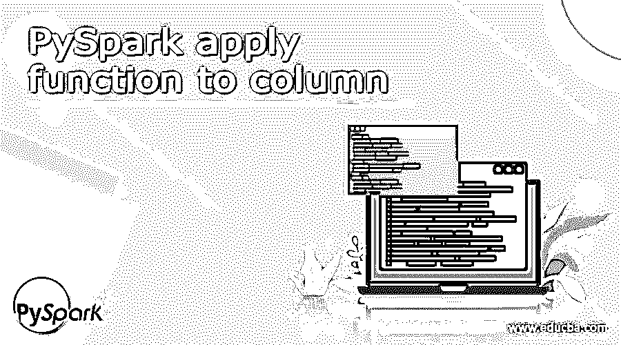
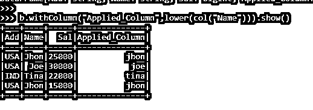

# PySpark 将函数应用于列

> 原文：<https://www.educba.com/pyspark-apply-function-to-column/>




## PySpark 简介将函数应用于列

PySpark 将函数应用于列是一种在 PySpark 中将函数和值应用于列的方法；这些函数可以是用户定义的函数，也可以是基于自定义的函数，可应用于数据框中的列。

该函数包含在大数据环境中进行数据分析所需的转换。我们可以在基于函数的模型上更新、应用自定义逻辑，该模型可以应用于 PySpark 数据框/数据集模型中的列函数。

<small>网页开发、编程语言、软件测试&其他</small>

本文将尝试分析使用 PYSPARK Apply 函数对列操作 PYSPARK 的各种方法。

让我们试着更详细地了解一下 PYSPARK 对列操作应用函数。

【Pyspark 将函数应用于列的语法

PYSPARK 应用函数的语法是:-

```
from pyspark.sql.functions import lower,col
```

```
b.withColumn("Applied_Column",lower(col("Name"))).show()
```

导入将用于传递用户定义的函数。

B:-所使用的数据框模型和要为列名传递的用户定义函数。它将列名作为参数，函数可以被传递。

**截图:-**


### 在 Pyspark 中对列应用函数

让我们看看如何在 PySpark 中将函数应用于列

该函数可以是用户可以定义并应用于数据框/数据集中的列的一组变换或规则。这个函数为用户提供了一组规则，这些规则可以通过注册 spark 会话来使用，并应用于所需的列。PySpark 还提供了内置函数，可以应用于 PySpark 上的列。然后返回带有转换后的列值的结果。如果该函数是用户定义的函数，则首先将其加载到 PySpark 内存中，然后传递列值，遍历 PySpark 数据框中的每一列，并对其应用逻辑。

内置函数预加载在 PySpark 内存中，然后这些函数可以应用于 PySpark 中的某个列值。然后存储结果，并通过 PySpark 数据模型中的列返回。

让我们用一些代码示例来检查 Apply Function to Column 的创建和工作。

### PySpark 将函数应用于列的示例

让我们看一些 PySpark 排序操作的例子

让我们从在 PySpark 中创建一个样本数据框开始。

```
data1  = [{'Name':'Jhon','Sal':25000,'Add':'USA'},{'Name':'Joe','Sal':30000,'Add':'USA'},{'Name':'Tina','Sal':22000,'Add':'IND'},{'Name':'Jhon','Sal':15000,'Add':'USA'}]
```

该数据包含姓名、工资和地址，将用作创建数据框的样本数据。

```
a = sc.parallelize(data1)
```

sc.parallelize 将用于使用给定数据创建 RDD。

```
b = spark.createDataFrame(a)
```

创建后，我们将使用 createDataFrame 方法来创建数据框。

这是数据框的外观。

```
b.show()
```

**截图:-**


让我们从使用 Spark 数据框中的预定义函数开始，将它应用于数据框中的一列，并检查结果是如何返回的。

```
from pyspark.sql.functions import lower,col
```

Import 语句用于定义列上的预定义函数。

```
b.withColumn("Applied_Column",lower(col("Name"))).show()
```

with Column 函数用于在 Spark 数据模型中创建新列，lower 函数用于获取列值并以小写形式返回结果。

**截图:-**




我们将通过定义自定义函数并将其应用于 PySpark 数据框来检查这一点。我们将从使用必要的进口开始。

```
from pyspark.sql.types import IntegerType
from pyspark.sql.functions import lower,col,udf
```

我们将定义一个自定义函数来返回 Sal 的总和，并尝试在数据框中的列上实现它。

```
def Sal(a):
...     return a+a
...
```

**截图:-**


我们将首先注册 UDF，指明返回类型。之后，UDF 被注册到内存中，这可以用来传递列值。

这个函数通过将它们相加得出一个新值。

```
reg_sal = udf(lambda q : Sal(q), IntegerType())
```

可以在列上传递自定义的用户定义函数，然后返回包含新列值的结果。

```
b.withColumn("Reg_Salary",reg_sal(col("Sal"))).show()
```

**截图:-**


下面是 PySpark 中对列应用函数的一些例子。

**注:-**

1.  将函数应用于列是一种应用于 PySpark 数据框模型中的列值的操作。
2.  对列应用函数应用转换，最终结果作为结果返回。
3.  Apply Function to Column 在 PySpark 上使用预定义的函数和用户定义的函数。
4.  将函数应用于列可以应用于多列，也可以应用于单列。

### 结论

从上面的文章中，我们看到了对列应用函数的工作。通过各种例子和分类，我们试图理解这个 Apply 函数是如何在 PySpark 中使用的，以及在编程级别使用了什么。所使用的各种方法显示了它如何简化数据分析的模式以及同样的成本效益模型。

我们还看到了 PySpark 数据框架中应用函数的内部工作和优点，以及它在各种编程目的中的使用。此外，语法和例子帮助我们更准确地理解函数。

### 推荐文章

这是 PySpark 将函数应用于列的指南。这里我们讨论 PySpark 数据框架中应用函数的内部工作和优点，以及它在各种编程目的中的使用。您也可以看看以下文章，了解更多信息–

1.  [PySpark SQL 类型](https://www.educba.com/pyspark-sql-types/)
2.  [PySpark 枢轴](https://www.educba.com/pyspark-pivot/)
3.  [PySpark 聚结器](https://www.educba.com/pyspark-coalesce/)
4.  [PySpark 重新分配](https://www.educba.com/pyspark-repartition/)

 `


`