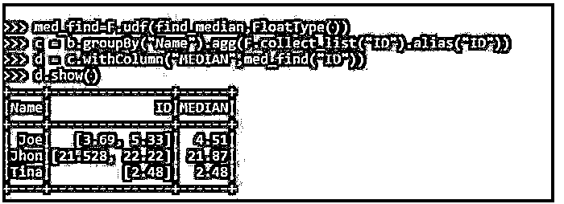
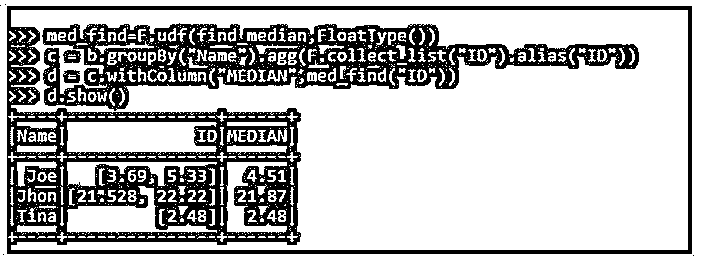

# PySpark 中值

> 原文：<https://www.educba.com/pyspark-median/>


## PySpark 中值简介

PySpark Median 是 PySpark 中的一种运算，用于计算数据框中各列的中值。中位数是对值进行平均并生成结果的运算。中位数运算是一种有用的数据分析方法，可用于 PySpark 数据框中的列，从中可以计算出中位数。它的功能是计算中位数，然后中位数的后计算可用于 PySpark 中的数据分析过程。中位数具有一组列或列中列表的中间元素，可以很容易地用作进一步数据分析操作的边界。在 PySpark 中，Median 是一项开销很大的操作，因为它需要对数据帧中的数据进行完全洗牌，并且数据分组在其中非常重要。

**py spark 中值的语法**

<small>网页开发、编程语言、软件测试&其他</small>

下面给出了提到的语法:

```
med_find=F.udf(find_median,FloatType())
c = b.groupBy("Name").agg(F.collect_list("ID").alias("ID"))
d = c.withColumn("MEDIAN",med_find("ID"))
d.show()
```

*   **Med_find:** 注册 find_median 函数的函数。
*   **C:** 使用 groupBy 函数并聚合数据的新数据帧。
*   **D:** 需要求出中位数的列。

**输出:**




### 中间火花的工作

*   中值运算用于计算与行相关的值的中间值。中值运算将列中的一个设定值作为输入，然后进一步生成输出并作为结果返回。
*   我们可以在 PySpark 中定义自己的 UDF，然后就可以使用 python 库 np 了。numpy 具有计算数据帧中值的方法。首先根据列值对数据框列进行分组，然后将需要计算中值的列作为数组列表进行分组。这使得迭代操作更容易，然后可以将值传递给用户可以用来计算中值的函数。
*   这是一项成本高昂的操作，因为它需要根据一些列对数据进行分组，然后进行发布；它需要计算给定列的中值。在给定数据帧的中值计算期间，数据混洗更多。我们可以使用函数的 collect list 方法来收集需要计算中值的列的列表中的数据。

### PySpark 中值示例

下面是 PySpark 中位数的例子:

让我们从在 PySpark 中创建简单数据开始。

**代码:**

```
data1 = [{'Name':'Jhon','ID':21.528,'Add':'USA'},{'Name':'Joe','ID':3.69,'Add':'USA'},{'Name':'Tina','ID':2.48,'Add':'IND'},{'Name':'Jhon','ID':22.22, 'Add':'USA'},{'Name':'Joe','ID':5.33,'Add':'INA'}]
```

创建一个示例数据，字段为 Name、ID 和 ADD。

```
a = sc.parallelize(data1)
```

RDD 是使用 sc.parallelize 创建的

```
b = spark.createDataFrame(a)
b.show()
```

使用 Spark.createDataFrame 创建了数据框。

**输出:**


让我们试着找出这个 PySpark 数据框的一列的中间值。

**代码:**

```
import pyspark.sql.functions as F
import numpy as np
from pyspark.sql.types import FloatType
```

这些是定义函数所需的导入。

让我们首先在 Python Find_Median 中定义一个函数，用于查找值列表的中值。

np.median()是 Python 中的 numpy 方法，它给出了值的中值。

**代码:**

```
def find_median(values_list):
    try:
        median = np.median(values_list)
        return round(float(median),2)
    except Exception:
        return None
```

这将返回列的四舍五入到小数点后两位的中值，我们需要这样做。我们已经使用 try-except 块处理了异常，该块在异常发生时处理异常。

```
med_find=F.udf(find_median,FloatType())
```

这将注册 UDF 和所需的数据类型。这里我们使用 FloatType()作为类型。

让我们尝试对一列进行分组，并聚合需要计算其中位数的列。

```
c = b.groupBy("Name").agg(F.collect_list("ID").alias("ID"))
```

此别名聚合列并创建列的数组。

```
d = c.withColumn("MEDIAN",med_find("ID"))
d.show()
```

这将引入一个新列，其中列值 median 被传递到该列，计算数据框的中值。

**输出:**





### 需要记住的要点

*   它可用于查找 PySpark 数据框中列的中位数。
*   这是一种可以通过计算列的中值来用于分析目的的操作。
*   通过对 PySpark 数据框中的列进行分组，可将其用于分组。
*   这是一个昂贵的操作，打乱了计算中值的数据。
*   也可以通过 PySpark 中的 approxQuantile 方法计算。

### 结论

从上面的文章中，我们看到了 PySpark 中 Median 的工作原理。然后，从各种例子和分类中，我们试图理解这种中位数运算是如何在 PySpark 列中发生的，以及它在编程级别的用途。我们还看到了 PySpark 数据框架中 Median 的内部工作和优势，以及它在各种编程目的中的使用。此外，语法和例子帮助我们更精确地理解了函数。

### 推荐文章

这是 PySpark 中值指南。这里我们分别讨论中值 PySpark 的介绍、工作原理和实例。您也可以看看以下文章，了解更多信息–

1.  [pypark 交换机列](https://www.educba.com/pyspark-withcolumn/)
2.  [PySpark foreach](https://www.educba.com/pyspark-foreach/)
3.  [py 帕克集团](https://www.educba.com/pyspark-groupby/)
4.  [pypark 群表计数](https://www.educba.com/pyspark-groupby-count/)


