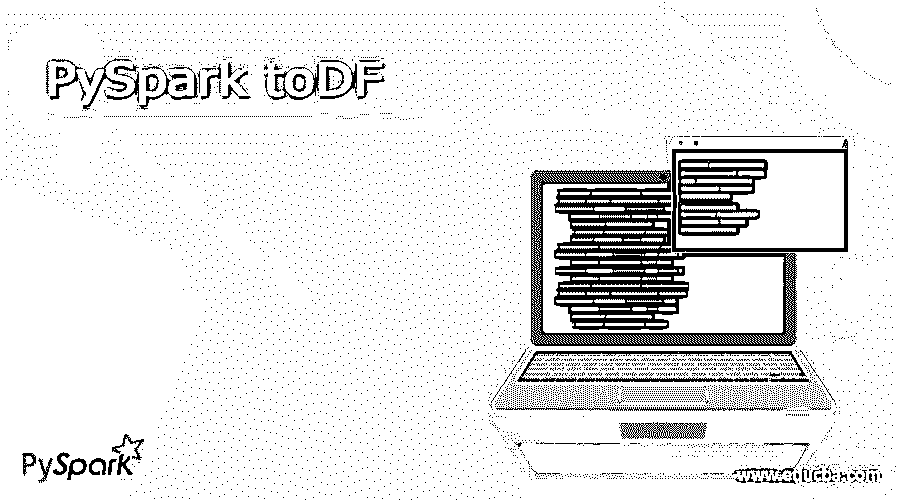
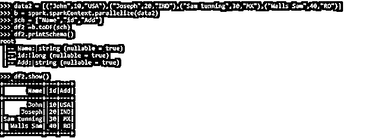

# PySpark toDF

> 原文：<https://www.educba.com/pyspark-todf/>




## PySpark toDF 简介

PySpark toDF 是 PYSPARK 中的一种方法，用于在 PYSPARK 中创建数据框。该模型提供了一种方法。可用于根据 RDD 创建数据框的 toDF。对数据框中的 RDD 进行转换后，数据将变得更加有组织，更易于分析。

它使用默认名称作为可用于创建数据框的列名，然后我们还可以传递需要完成的列的名称。这可以称为 PySpark 中手工创建数据框的方式。

<small>网页开发、编程语言、软件测试&其他</small>

在本文中，我们将尝试分析用于 toDF 的各种方法。

让我们试着更详细地了解一下 toDF。

【PySpark toDF 的语法

toDF 函数的语法是:-

```
a = sc.parallelize(data1)
b = a.toDF()
b.show()
```

*   **答:**要从数据中生成的 RDD。
*   **。toDF():** 创建 dataFrame 的 toDF 方法。
*   **B:** 创建的数据帧。

**截图:**


### PySpark toDF 的工作

让我们看看 toDF 操作在 PySpark 中是如何工作的

这是一个在 PySpark 中创建数据框的方法。创建数据框会占用 RDD，然后将其转换为数据框的 RDD。

它还可以接受用于命名数据框列的参数。可以对一系列对象调用它来创建数据框。

PySpark 的 toDF 方法中没有自定义列和 nullable 的类型。

使用创建数据框时，我们无法控制模式。toDF 方法。

让我们用一些代码例子来检查 ToDF 方法的创建和工作。

### PYSPARK toDF 示例

让我们看一些 PYSPARK toDF 操作的例子

让我们从在 PySpark 中创建简单数据开始。

```
data1  = [{'Name':'Jhon','ID':21.528,'Add':'USA'},{'Name':'Joe','ID':3.69,'Add':'USA'},{'Name':'Tina','ID':2.48,'Add':'IND'},{'Name':'Jhon','ID':22.22, 'Add':'USA'},{'Name':'Joe','ID':5.33,'Add':'INA'}]
```

创建一个示例数据，字段为 Name、ID 和 ADD。

```
a = sc.parallelize(data1)
RDD is created using sc.parallelize.
b = spark.createDataFrame(a)
b.show()
```

使用 Spark.createDataFrame 创建了数据框。

**输出:**


这将创建列名为 name、Add 和 ID 的数据框。上面的数据帧是使用 PySpark 中的 createDataFrame 方法制作的。

现在使用。toDF 方法在 PySpark 中创建相同的。

```
data1  = [{'Name':'Jhon','ID':21.528,'Add':'USA'},{'Name':'Joe','ID':3.69,'Add':'USA'},{'Name':'Tina','ID':2.48,'Add':'IND'},{'Name':'Jhon','ID':22.22, 'Add':'USA'},{'Name':'Joe','ID':5.33,'Add':'INA'}]
a = sc.parallelize(data1)
b = a.toDF()
b.show()
```

**输出:**


方法使用解析列名的列名创建数据框。

可以看到这个模式，从那里可以看到列名。

```
b.printSchema()
```

**输出:**


让我们再看一个例子，检查默认情况下列名的分配位置，并检查数据框的创建。

```
data2 = [("John",10,"USA"),("Joseph",20,"IND"),("Sam tunning",30,"MX"),("Walls Sam",40,"RO")]
b = sc.parallelize(data2)
c = b.toDF()
c.show()
```

这将创建默认列名为 _1、_2、_3 的数据框。

**输出:**


**注意:-** 这可以通过将列名作为参数传递来更改。

让我们详细检查一下这个。

```
data2 = [("John",10,"USA"),("Joseph",20,"IND"),("Sam tunning",30,"MX"),("Walls Sam",40,"RO")]
b = spark.sparkContext.parallelize(data2)
sch = ["Name","id","Add"]
df2 =b.toDF(sch)
df2.printSchema()
```

这将绕过中的参数，将列名加到中。toDF 方法。

```
df2.show()
```

**输出:**




这些创建的数据框经过优化，可进一步用于 SQL 查询和数据分析。成本模型转换后在数据框中更容易，我们有一个逻辑计划来查询数据框中的数据。

这些是 PySpark 中 toDF 的一些例子。

**注:**

1.  PySpark ToDF 用于在 PySpark 中创建数据框。
2.  这是一个内置的操作。
3.  ToDF 可以用来定义一个模式并从中创建一个数据框。
4.  这种方法成本低，广泛用于手术。
5.  默认情况下，ToDF 将列名装箱为 _1 和 _2。

### 结论

从上面的文章中，我们看到了 ToDF 函数的功能。然后，从各种例子和分类中，我们试图理解这个 ToDF 函数是如何工作的，以及在编程级别使用了什么。

我们还看到了 PySpark 数据框架中 toDF 的内部工作和优点，以及它在各种编程目的中的使用。此外，语法和例子帮助我们更准确地理解函数。

### 推荐文章

这是 PySpark toDF 的指南。在这里，我们讨论了 PySpark 数据框架中 toDF 的内部工作和优点。您也可以看看以下文章，了解更多信息–

1.  [PySpark foreach](https://www.educba.com/pyspark-foreach/)
2.  [pypark 群表计数](https://www.educba.com/pyspark-groupby-count/)
3.  [PySpark 聚结器](https://www.educba.com/pyspark-coalesce/)
4.  [PySpark 地图](https://www.educba.com/pyspark-map/)


