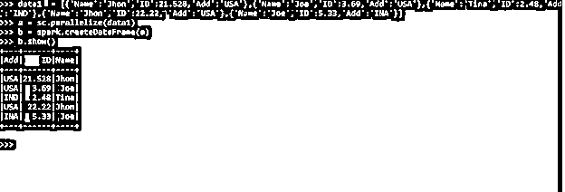
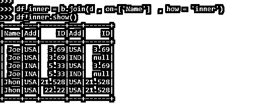
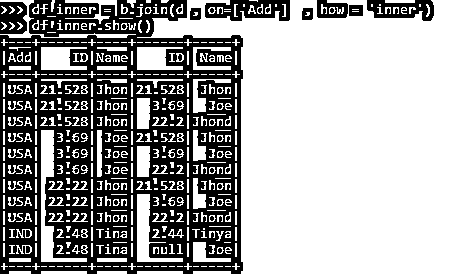
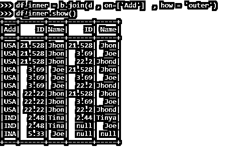
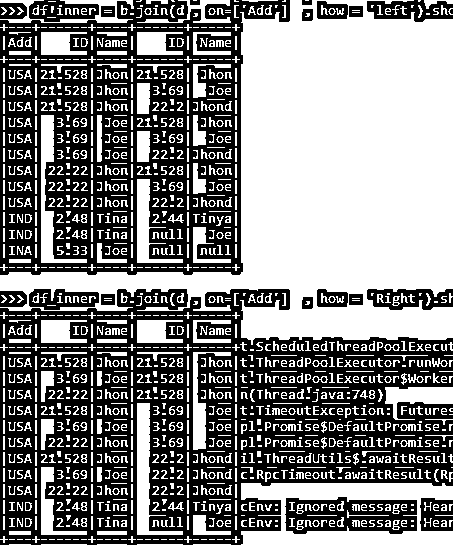

# PySpark 连接两个数据帧

> 原文：<https://www.educba.com/pyspark-join-two-dataframes/>


## PySpark 简介连接两个数据帧

PYSPARK 连接是一种用于连接数据框元素的操作。连接包括基于特定条件合并行和列。PySpark 中有一些方法允许合并数据框中的数据。对于数据分析人员来说，连接数据框有时会使分析变得更加容易。

这些方法基于需要对其执行连接操作的条件或列来查找数据框中的元素，并执行返回新的连接数据框的操作。数据框的连接是数据分析的一个重要部分，因为它允许用户轻松地处理多个数据源并从中提取值。

<small>网页开发、编程语言、软件测试&其他</small>

本文将尝试分析使用 PySpark 连接两个数据帧的各种方法。

让我们更详细地看看 PySpark 如何连接两个数据帧

【PySpark 连接两个数据帧的语法

PySpark 连接两个数据帧函数的语法是:-

```
df = b.join(d , on=['Name']  , how = 'inner')
```

**b:** 用于 join 的第 1 个 <sup>st</sup> 数据帧。

**d:** 第二个<sup>和</sup>数据帧，用于进一步连接。

条件定义了需要在哪个上完成连接操作。

**df:** 接收到的数据帧。


### PySpark 连接两个数据帧的工作

让我们看看 DATAFRAME 函数的 JOIN 操作在 PySpark 中是如何工作的

PySpark 中数据帧的连接是基于某种条件的，这种条件形成了连接函数需要完成的规则。join 函数接受某些参数，其中包括第一个需要发生连接的列条件，然后第二个包括所需的连接类型。这种类型决定了为连接目的需要选择的数据类型。

有多种连接条件可用于连接数据框，无论是内部连接、外部连接、左连接还是右连接。这些类型的联接首先在列上查找条件，然后选择符合该条件的数据作为结果。

这就是 PySpark 中使用数据帧间连接的方式。

### PySpark 连接两个数据帧的示例

让我们看一些 PYSPARK ORDERBY 函数如何工作的例子

让我们从创建 PySpark 数据框开始。

考虑具有相关 ID 和 Add 的名称的数据帧，并在此基础上制作数据帧。

**代码:**

```
data1  = [{'Name':'Jhon','ID':21.528,'Add':'USA'},{'Name':'Joe','ID':3.69,'Add':'USA'},{'Name':'Tina','ID':2.48,'Add':'IND'},{'Name':'Jhon','ID':22.22, 'Add':'USA'},{'Name':'Joe','ID':5.33,'Add':'INA'}]
```

sc.parallelize 方法用于从数据创建 RDD。

```
a = sc.parallelize(data1)
```

然后，spark.createDataFrame 方法用于创建 DataFrame。

```
b = spark.createDataFrame(a)
```

**截图:**




让我们再创建一个用于连接的数据框。

```
Data2  = [{'Name':'Jhon','ID':21.528,'Add':'USA'},{'Name':'Joe','ID':3.69,'Add':'USA'},{'Name':'Tinya','ID':2.44,'Add':'IND'},{'Name':'Jhond','ID':22.2, 'Add':'USA'},{'Name':'Joe','ID':5,'Add':'IND'}]
```

sc.parallelize 方法用于从数据创建 RDD。

```
c = sc.parallelize(Data2)
```

然后，spark.createDataFrame 方法用于创建数据框。

```
d = spark.createDataFrame(c)
```

**截图:**


我们将使用这两个数据帧对我们定义的数据帧 b 和 d 进行连接操作。

让我们从使用内部连接来连接数据帧开始。

在 PySpark 中，有几种方法可以连接数据框。让我们从内部连接开始。

```
df_inner = b.join(d , on=['Name']  , how = 'inner')
df_inner.show()
```

**截图:**




输出显示了数据框在条件名称上的连接。该条件连接与两个数据框中的数据相匹配的数据框。

该条件也可以在其他列上，它进行连接，然后根据得到的值返回数据。

```
df_inner = b.join(d , on=['Add']  , how = 'inner')
df_inner.show()
```

这里的连接条件是列添加。过程是相同的，只是改变了列连接条件。




如果我们希望从数据框中选择所有数据，我们可以使用外部连接类型。该外部连接从两个数据帧中选择所有数据帧，并对其执行连接操作。

```
df_inner = b.join(d , on=['Add']  , how = 'outer')
df_inner.show()
```

```
df_inner = b.join(d , on=['Name']  , how = 'outer')
df_inner.show()
```

连接操作也可以在多个列上进行，也可以在所用数据框的不同列上进行。




左右连接也是在 PySpark 中从特定数据框中选择数据的一种方式。

左侧是从左侧表中获取的数据，右侧是基于列值从右侧表中获取的数据。

```
df_inner = b.join(d , on=['Add']  , how = 'left').show()
```

```
df_inner = b.join(d , on=['Add']  , how = 'Right').show()
```




数据框被连接，然后结果被存储在新的数据框中。

从上面的例子中，我们看到了 PySpark 的 JOIN 操作的使用

### 结论

从上面的文章中，我们看到了 PySpark 中 JOIN 操作的工作原理。我们试图从各种例子和分类中理解这个 JOIN 函数在 PySpark 中是如何工作的，以及在编程级别使用了什么。所使用的各种方法显示了它如何简化数据分析的模式以及同样的成本效益模型。

我们还看到了 PySpark 数据框架中连接数据框架的内部工作和优势，以及它在各种编程目的中的使用。此外，语法和例子帮助我们更精确地理解了函数。

### 推荐文章

这是 PySpark 连接两个数据帧的指南。这里我们讨论 PySparak 中连接两个数据帧的介绍、工作和例子。您也可以看看以下文章，了解更多信息–

1.  [pypark 队](https://www.educba.com/pyspark-lag/)的比赛
2.  [PySpark 结构类型](https://www.educba.com/pyspark-structtype/)
3.  [PySpark 列到列表](https://www.educba.com/pyspark-column-to-list/)
4.  [PySpark 别名](https://www.educba.com/pyspark-alias/)


