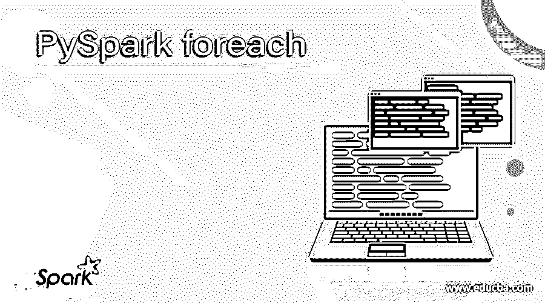

# PySpark foreach

> 原文：<https://www.educba.com/pyspark-foreach/>

## PySpark foreach 简介

PySpark foreach 在本大纲中有解释。PySpark foreach 是 Spark 中的一个活动操作，可用于 PySpark 中的数据帧、RDD 和数据集，以迭代数据集中的每个元素。For Each 函数循环遍历数据的每一个元素，并持久保存相关结果。PySpark ForEach 函数只返回那些满足 ForEach 循环函数中提供的条件的元素。适用于数据框中每个元素的简单函数也适用于 For Each 循环中的每个元素。ForEach 分区也用于应用于 RDD 的每个分区。我们可以创建一个函数，并为 pyspark 中的每个循环传递它，以将其应用于 spark 中的所有函数。这是 Spark 中的一个动作操作，用于 Spark 中的数据处理。在本主题中，我们将了解 PySpark foreach。

【PySpark foreach 的语法

<small>网页开发、编程语言、软件测试&其他</small>

PYSPARK WHEN 函数的语法是:-

`def function(x): //function definition
Dataframe.foreach(function)`

**代码:**

`def f(x): print(x)
b=a.foreach(f)`

**截图:**

### PySpark foreach 的工作原理

让我们看看 ForEach 函数在 PySpark 中是如何工作的

Pyspark 中的 ForEach 函数适用于 spark 应用程序中的每一个元素。我们有一个适用于 Spark 应用中每个元素的函数。

Spark 中的每一个元素都会被循环迭代。对 RDD 中的每个元素执行该函数，并评估结果。

循环中的每个元素都被迭代，给定的函数被执行，然后结果被返回给驱动程序，动作被执行。

ForEach 循环工作在不同的阶段，每个阶段在 Spark 中执行一个单独的操作。循环中的每个 iterate over items 是一个 iterable item，从循环中选择一个 item，并将函数应用于它，如果函数满足循环的谓词，它将作为操作返回。

循环迭代的次数等于数据中元素的长度。

如果数据不存在，或者列表或数据框为空，则循环不会迭代。

这同样适用于 PySpark 中的 RDD、数据帧和数据集。

### PySpark foreach 示例

让我们看一些 PYSPARK ForEach 函数如何工作的例子:

在 PYSPARK 中创建数据帧:

让我们首先用 Python 创建一个 DataFrame。

CreateDataFrame 用于在 Python 中创建 DF

`a= spark.createDataFrame(["SAM","JOHN","AND","ROBIN","ANAND"], "string").toDF("Name")
a.show()`

现在，让我们先创建一个简单的函数，它将打印所有的元素，并在 For Each 循环中传递它。

`Def f(x) : print(x)`

这是一个简单的打印函数，打印数据帧中的所有数据。

`def f(x): print(x)`

**代码快照:**

让我们使用 for Each 循环遍历所有元素。

`b = a.foreach(f)`

这对于遍历和打印数据帧的所有元素的每个语句来说都很简单。

`b = a.foreach(f)`

定义阶段并执行行动。

`[Stage 3:>                                                          (0 + 8) / 8] Row(Name='ROBIN')
Row(Name='ANAND')
Row(Name='AND')
Row(Name='JOHN')
Row(Name='SAM')`

**代码快照:**

`a= spark.createDataFrame(["SAM","JOHN","AND","ROBIN","ANAND"], "string").toDF("Name")
b=a.foreach(print)`

#### 实施例 2

让我们检查数据框中元素的类型。为此，我们将继续使用与上面创建的相同的数据框架，并尝试传递一个函数来定义内部变量的类型。

在 PYSPARK 中创建一个数据框架:-

让我们首先用 Python 创建一个 DataFrame。

CreateDataFrame 用于在 Python 中创建 DF

`a= spark.createDataFrame(["SAM","JOHN","AND","ROBIN","ANAND"], "string").toDF("Name").show()`

**代码快照:**

让我们创建一个定义变量类型的函数，这是一个用户可以根据需求创建的通用 UDF。

这个函数定义了内部变量的类型。

`def f(x): print(type(x))`

让我们使用 ForEach 语句并打印数据帧中的类型。

`b = a.foreach(f)`

**输出:**

这将打印出它迭代的每个元素的类型。

**代码快照:**

我们还可以构建复杂的 UDF，并在 PySpark 中为每个循环传递它。

从上面的例子中，我们看到了在 PySpark 中使用 ForEach 函数

**注:**

1.  For Each 用于迭代 PySpark 中的每个元素
2.  我们可以传递一个对数据帧的每个元素都进行操作的 UDF。
3.  ForEach 是 Spark 中的一个操作。
4.  它没有任何返回值。

### 结论

从上面的文章中，我们看到了 PySpark 中 FOR Each 的用法。通过各种例子和分类，我们试图理解 FOREach 方法在 PySpark 中是如何工作的，以及在编程级别使用了什么。

我们还看到了在 Spark 数据框架中使用 PySpark 的内部工作和优势，以及它在各种编程目的中的使用。此外，语法和例子帮助我们更准确地理解函数。

### 推荐文章

这是 PySpark foreach 的指南。在这里，我们讨论在 Spark 数据框架中使用 PySpark 的内部工作和优点，以及它在各种编程目的中的使用。您也可以看看以下文章，了解更多信息–

1.  [火花簇](https://www.educba.com/spark-cluster/)
2.  [火花广播](https://www.educba.com/spark-broadcast/)
3.  [火花拼花地板](https://www.educba.com/spark-parquet/)
4.  [PySpark SQL](https://www.educba.com/pyspark-sql/)

