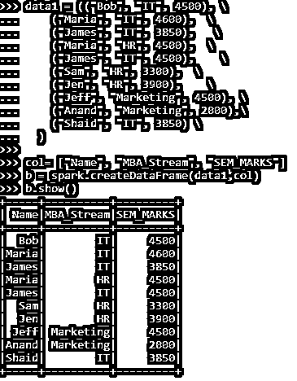
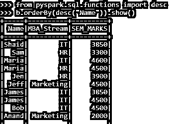
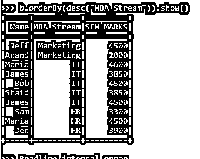
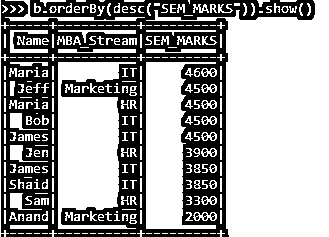
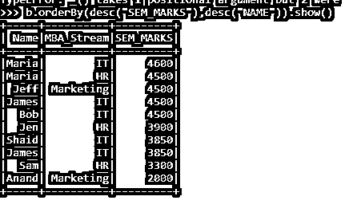

# PySpark 降序排序

> 原文：<https://www.educba.com/pyspark-orderby-descending/>

## PySpark OrderBy Descending 简介

PySpark orderby 是一个 Spark 排序函数，用于在 PySpark 框架中对数据帧/ RDD 进行排序。它用于对 PySpark 数据框中的多一列进行排序。Desc 方法用于按降序排列元素。默认情况下，使用的排序技术是升序，因此通过使用 Desc 方法，我们可以在 PySpark 数据帧中以降序对元素进行排序。

orderBy 子句用于以排序的方式返回行。它保证了输出的总顺序。OrderBy 函数可以用于一列，也可以用于 order by 中的多列。它采用两个参数 Asc 表示升序，Desc 表示降序。我们所说的降序是指最高值的列将首先出现，然后是第二高到最低的列。

<small>网页开发、编程语言、软件测试&其他</small>

**语法:**

PYSPARK ORDERBY Descending 函数的语法是:

`from pyspark.sql.functions import desc
b.orderBy(desc("col_Name")).show()`

**截图:**

*   Desc:要导入的下降函数。
*   OrderBy:PySpark 中的 Order By 函数。
*   b:需要做操作的数据框。

### OrderBy 在 PySpark 的工作

orderby 是一个排序子句，用于对数据框中的行进行排序。排序可以被称为以定义的特定方式排列元素。顺序可以是升序或降序，由用户根据需要指定。order 使用的默认排序技术是 ASC。我们可以导入 PySpark 函数，并使用 DESC 方法对数据帧进行降序排序。

我们可以通过传递数据框中的列来对元素进行排序，排序可以从一列到多列进行。它将列名作为参数，这个列名用于对元素进行排序。order by 函数创建了一个带有全局标志的排序逻辑操作符，用于在 PySpark 应用程序中对数据帧进行排序。

这就是 PySpark 中 ORDER BY 的用法。

### 例子

让我们看一些 PYSPARK ORDER BY function 如何工作的例子

让我们从创建 PySpark 数据框开始。考虑了具有相关系和整个学期分数的学生的数据框架，并在此基础上制作了数据框架。

**代码:**

`data1 = (("Bob", "IT", 4500), \
("Maria", "IT", 4600), \
("James", "IT", 3850), \
("Maria", "HR", 4500), \
("James", "IT", 4500), \
("Sam", "HR", 3300), \
("Jen", "HR", 3900), \
("Jeff", "Marketing", 4500), \
("Anand", "Marketing", 2000),\
("Shaid", "IT", 3850) \
)
col= ["Name", "MBA_Stream", "SEM_MARKS"] b = spark.createDataFrame(data1,col)
The create data to create the Data Frame from the column and Data
b.printSchema()
b.show()`

**截图:**

让我们尝试使用降序函数进行 Order By 运算。
我们将导入 SQL 函数 Desc，以便按降序使用 orderBy。

`from pyspark.sql.functions import desc
b.orderBy(desc("Name")).show()`

这将按名称降序排序。

**截图:**

对数据框中的其他列也可以进行同样的操作。我们可以使用 MBA_Stream 列和 SEM_MARKS 列进行相同的排序。

`b.orderBy(desc("MBA_Stream")).show()
This sorts according to MBA_Stream.`

**截图:**

`b.orderBy(desc("SEM_MARKS")).show()`

这将根据数据框中的 SEM_MARKS 列进行排序。

**截图:**

相同的顺序也可以用于该列上的多个条件。

`b.orderBy(desc("SEM_MARKS"),desc("NAME")).show()`

它将根据提供的列进行排序。

**截图:**

通过创建数据框的临时表，orderBy 函数也可用于 Spark SQL 函数。临时表可以与 SPARK 一起使用。我们可以使用 Order By 函数的 SQL 函数。DESC 函数用于在 PySpark SQL 数据框中对其进行降序排序。

从上面的例子中，我们看到了 orderBy 函数在 PySpark 中的用法

### 结论

从上面的文章中，我们看到了 ORDERBY 在 PySpark 中的使用。通过各种例子和分类，我们试图理解 ORDERBY(DESC)方法在 PySpark 中是如何工作的，以及在编程级别使用了什么。工作模式使我们正确理解了职能的内涵，并帮助我们获得了更多的相关知识。语法有助于检查使用的确切参数和函数的功能知识。我们还看到了 PySpark 中 ORDERBY 在 Spark 数据帧中的内部工作和优势，以及它在各种编程目的中的用途。此外，语法和例子帮助我们更精确地理解了函数。

### 推荐文章

这是 PySpark 降序排列的指南。这里我们讨论 PySpark 中 OrderBy 的介绍、工作原理以及代码实现的例子。您也可以看看以下文章，了解更多信息–

1.  [PySpark 加入](https://www.educba.com/pyspark-join/)
2.  [PySpark SQL](https://www.educba.com/pyspark-sql/)
3.  [火花上下文](https://www.educba.com/sparkcontext/)
4.  [火花簇](https://www.educba.com/spark-cluster/)

