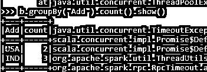
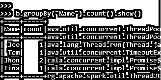

# pykick groupb 计数

> 原文：<https://www.educba.com/pyspark-groupby-count/>

## PySpark GroupBy Count 简介

PySpark GroupBy Count 是 PySpark 中的一个功能，它允许根据一些列值对行进行分组，并在 Spark 应用程序中对分组后关联的行数进行计数。group By Count 函数用于对分组后的数据进行计数，这些数据是根据某些条件进行分组的，聚合数据的最终计数显示为结果。简而言之，如果我们试图理解 groupBy count 的确切含义，它只是对 Spark 数据帧中具有某些值的行进行分组，并对生成的值进行计数。

相同的数据按组排列，并根据分区和条件相应地打乱数据。PySpark GroupBy 还支持多列数据的高级聚合。在数据帧上执行 Group By 后，返回类型是一个关系分组数据集对象，它包含聚合函数，我们可以从该函数中聚合数据。

<small>网页开发、编程语言、软件测试&其他</small>

**语法:**

PYSPARK GROUPBY COUNT 函数的语法是:

`df.groupBy(‘columnName’).count().show()`

*   PySpark 数据帧
*   ColumnName:需要对其执行 GroupBy 操作的列名。
*   COUNT()–计算 groupBY 之后的元素总数。

`a.groupby(“Name”).count().show()`

**截图:**

### PySpark 中的 GroupBy Count 如何工作？

PySpark 中的分组计数工作。

让我们看看 GROUPBY COUNT 函数在 PySpark 中是如何工作的:

GROUP BY 函数用于根据在 PySpark 应用程序中对 RDD /数据帧进行操作的相同键值对数据进行分组。

具有相同密钥的数据被混洗在一起，并被带到可以分组在一起的地方。洗牌发生在整个网络上，这使得操作有点昂贵。

具有相同键的组合在一起，并根据条件返回值。

然后，计数功能对分组数据进行计数，并显示计数结果。

Group By 可用于将多个列和多个列名组合在一起。Group By 为组合在一起的每个组合返回一行，聚合函数用于计算分组数据的值。

### 例子

让我们看一些 PYSPARK GROUPBY COUNT 函数如何工作的例子:

让我们首先创建一个简单的数据框，我们希望使用过滤操作。

**数据帧的创建:**

`a= spark.createDataFrame(["SAM","JOHN","AND","ROBIN","ANAND",”ANAND”], "string").toDF("Name")`

让我们从一个简单的 groupBy 代码开始，它过滤数据框中的名称。

`a.groupby("Name")`

这将按名称对元素进行分组。具有相同关键字的元素被分组在一起，并显示结果。

聚合后函数我们可以使用 count()函数计算数据帧中元素的数量。

`a= spark.createDataFrame(["SAM","JOHN","AND","ROBIN","ANAND"], "string").toDF("Name")
a.groupby("Name").count().show()`

**输出:**

让我们通过创建一个包含多个列的数据框并对其使用 count 函数来更准确地理解这一点。

`data1 = [{'Name':'Jhon','ID':2,'Add':'USA'},{'Name':'Joe','ID':3,'Add':'USA'},{'Name':'Tina','ID':2,'Add':'IND'}]`

创建一个示例数据，字段为 Name、ID 和 ADD。

`a = sc.parallelize(data1)`

RDD 是使用 sc.parallelize 创建的

`b = spark.createDataFrame(a)`

使用 Spark.createDataFrame 创建了 DataFrame。

`b.groupBy("Add").count().show()`

count 函数用于查找 post group By 的记录数。这将计算分组后的元素数量。

**输出:**

让我们通过计数来检查更多的例子。我们可以对数据框中一列的多个元素使用 GroupBY。

`data1 = [{'Name':'Jhon','ID':2,'Add':'USA'},{'Name':'Joe','ID':3,'Add':'USA'},{'Name':'Tina','ID':2,'Add':'IND'},{'Name':'Jhon','ID':2,'Add':'IND'},{'Name':'Tom','ID':2,'Add':'IND'}] a = sc.parallelize(data1)
b = spark.createDataFrame(a)
b.groupBy("Add","Name").count().show()`

这将基于多个列对元素进行分组，然后对每个条件的记录进行计数。

**截图:**

`Group By With Single Column:
b.groupBy("Add").count().show()`

**截图:**

与其他列一起分组，并使用 count 函数对元素进行计数。

**代码:**

`b.groupBy("Name").count().show()`

**输出:**

这是 PySpark 中 GroupBy Count 函数的一些例子。

### 结论

从上面的文章中，我们看到了 PySpark 中 groupBy Count 操作的使用。从各种示例和分类中，我们试图理解 GROUPBY COUNT 方法在 PySpark 中是如何工作的，以及在编程级别使用了什么。

我们还看到了 Spark 数据帧中 GroupBy 计数的内部工作和优点，以及它在各种编程目的中的使用。此外，语法和例子帮助我们更准确地理解函数。

### 推荐文章

这是 PySpark 分组计数指南。这里我们讨论 PySpark 中 GroupBy Count 的介绍、语法、如何工作？还有例子。您也可以看看以下文章，了解更多信息–

1.  [PySpark 加入](https://www.educba.com/pyspark-join/)
2.  [火花平面图](https://www.educba.com/spark-flatmap/)
3.  [Python 索引错误](https://www.educba.com/python-indexerror/)
4.  [Python 初始化列表](https://www.educba.com/python-initialize-list/)

