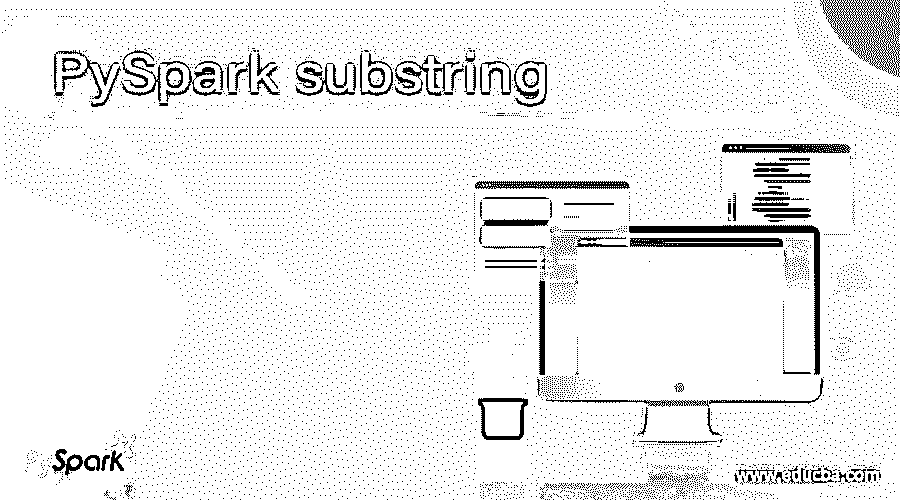
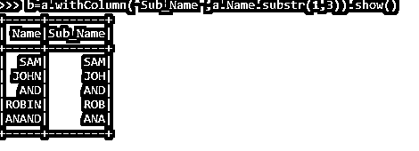

# PySpark substring

> 原文：<https://www.educba.com/pyspark-substring/>

## PySpark 子串介绍

PYSPARK SUBSTRING 是一个函数，用于从 PYSPARK 中的数据帧中提取子串。术语子串是指字符串的一部分的一部分。我们可以提供字符串的位置和长度，并从中提取相关的子字符串。

PySpark SubString 返回 PySpark 中列的子串。

<small>网页开发、编程语言、软件测试&其他</small>

我们还可以用 PySpark 中的 substring 方法从字符串中提取字符。子字符串所需的所有输出都是 PySpark 数据帧中另一个字符串的子集。在 PySpark 中使用这个函数来处理 string 类型的 DataFrame，并获取所需的模式。

**语法**

PYSPARK 子串函数的语法是:-

`df.columnName.substr(s,l)`

列名是数据帧中需要执行操作的列的名称。

PySpark 应用程序的起始索引。

L:-需要提取的子字符串的长度。

df:-py spark 数据帧。

b=a.withColumn("Sub_Name "，a.Name.substr(1，3))

**截图:**

PySpark 中使用 withColumn 函数在 Spark 数据帧中引入新列。

形容词（adjective 的缩写）Name 是用于处理需要获取其值的 DataFrame 字符串的列名的名称。

### PySpark 中子串的工作

让我们看看子串函数在 PySpark 中是如何工作的

substring 函数是一个字符串类方法。substring 的返回类型是 string 类型，它基本上是我们正在处理的 DataFrame 字符串的子字符串。

从起始索引和结束索引开始指定某个索引，子串基本上是结束-起始索引的减法。

String 基本上是一个 char[]，具有带偏移量和计数的字符串字符。调用 substring 方法时，使用相同的 char[]创建一个新字符串。创建不同的偏移量和计数，这基本上取决于我们为该特定字符串数据帧提供的输入变量。

计数是对于给定的数据帧，我们在其中工作的字符串的长度。

通过这种方法，使用 PySpark 中的索引和输入值提取字符串的值。

处理内存泄漏之前的另一个方法是每次调用方法时创建新的 char[]，并且字符串中不再有 offset 和 count 字段。

### 例子

让我们看一些 PYSPARK SubString 函数如何工作的例子

让我们首先创建一个小数据帧，我们希望 DataFrame substring 方法在其上工作。

`a= spark.createDataFrame(["SAM","JOHN","AND","ROBIN","ANAND"], "string").toDF("Name")`

这将创建一个数据帧，数据帧中的数据类型为字符串类型。

让我们看第一个例子来检查子串 normal 函数是如何工作的

`b=a.withColumn("Sub_Name",a.Name.substr(1,3)).show()`

这将使用 SubStr 创建一个名为 Sub_Name 的新列

输出将只包含从 1 到 3 的新列中的子字符串。

**截图:**

让我们检查一下是否要从最后一个索引中取出元素。子字符串的最后一个索引可以通过(-)符号后跟字符串的长度来获取。

让我们使用与上面相同的数据框，并尝试观察场景。

数据框的创建。

`a= spark.createDataFrame(["SAM","JOHN","AND","ROBIN","ANAND"], "string").toDF("Name")`

让我们尝试从最后一个 String 元素中获取 SubString 的一部分。

`b = a.withColumn("Name_End" ,a.Name.substr(-2,2))`

这将打印出 Python 数据框中的最后两个元素。

`b = a.withColumn("Name_End" ,a.Name.substr(-3,3)).show()`

这将打印数据帧的最后 3 个元素。

**截图:**

在 PySpark 中，子串还可以用来连接数据帧中的两个或多个子串，并生成一个新的子串。

使用 substring 实现这一点的方法是从提取所需的期望长度中提取两个子字符串，然后在相同的子字符串上使用 String concat 方法。

让我们通过创建与上一个示例中使用的相同的数据框来查看一个示例。

数据框的创建。

`a= spark.createDataFrame(["SAM","JOHN","AND","ROBIN","ANAND"], "string").toDF("Name")`

现在，让我们尝试连接两个子字符串，并将其放入 Python 数据框的新列中。

因为 SQL 函数 Concat 或 Lit 用于连接，所以我们需要从 PYSPARK 导入一个简单的 SQL 函数。

从 pyspark.sql.functions 导入 concat，col，lit

这将是连接所需的所有必要的导入。

`b = a.withColumn("Concated_Value", concat(a.Name.substr(-3,3),lit("--"),a.Name.substr(1,3))).show()`

这将把子字符串的最后 3 个值与前 3 个值连接起来，并在新列中显示输出。如果字符串长度相同或更小，则所有字符串都将作为输出返回。

**截图:**

从上面的例子中，我们看到了在 PySpark 中 substring 方法是如何用于各种数据相关操作的。

### 结论

从上面的文章中，我们看到了 PySpark 中 SubString 的使用。从各种例子和分类中，我们试图理解 SubString 方法在 PySpark 中是如何工作的，以及在编程级别使用了什么。

我们还看到了 Spark 数据帧中包含子串的内部工作和优点，以及它在各种编程目的中的使用。此外，语法和例子帮助我们更准确地理解函数。

### 推荐文章

这是一个 PySpark 子串的指南。这里我们讨论 PySpark 中 SubString 的使用，以及各种例子和分类。您也可以看看以下文章，了解更多信息–

1.  [PySpark SQL](https://www.educba.com/pyspark-sql/)
2.  [火花上下文](https://www.educba.com/sparkcontext/)
3.  [Python 子串](https://www.educba.com/python-substring/)
4.  [SQL 排名()](https://www.educba.com/sql-rank/)

