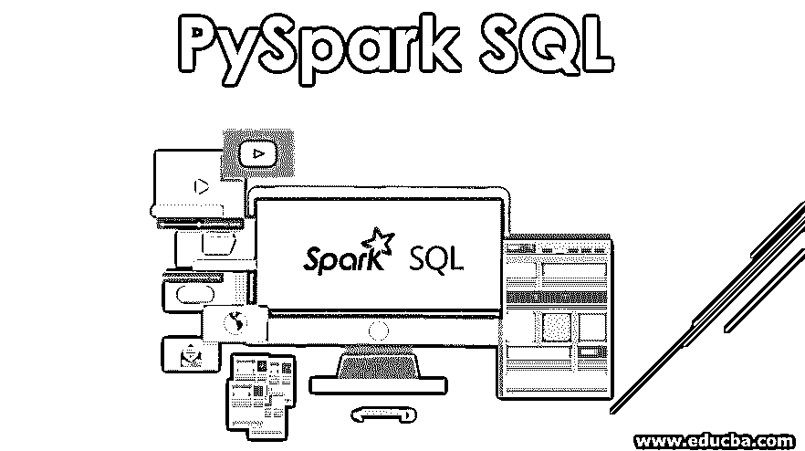

# PySpark SQL

> 原文：<https://www.educba.com/pyspark-sql/>

## PySpark SQL 简介

PySpark SQL 是 Spark 中管理结构化数据的模块，它本身支持 Python 编程语言。PySpark 提供了支持异构数据源的 API 来读取数据，以便用 Spark Framework 进行处理。它是高度可扩展的，并且可以应用于非常大容量的数据集。PySpark 以其高级功能而闻名，如速度、强大的缓存、实时计算、可与 Hadoop 和 Spark cluster 一起部署，以及与多种编程语言(如 Scala、Python、R 和 Java)一起使用。由于其强大的功能和效率，它在数据和机器学习实现中越来越受欢迎。

### 什么是 PySpark SQL？

它是一个用 Spark SQL 支持 python 的工具。它是为了在 Spark 中支持 Python 而开发的。要正确理解 PySpark，需要具备 Python、大数据和 Spark 的知识。由于其重要的特性，它正慢慢地受到数据库程序员的欢迎。

<small>网页开发、编程语言、软件测试&其他</small>

PySpark SQL 在分布式系统上工作，它也是可伸缩的，这就是为什么它在数据科学中被大量使用的原因。在 PySpark 中，python 库提供了 SQL 机器学习。这个 Python 库被称为机器学习库。

### PySpark SQL 的特性

PySpark SQL 的一些重要特性如下所示:

*   **速度:**比传统的 Hadoop 之类的大数据处理框架快很多。
*   **强大的缓存:** PySpark 提供了一个简单的编程层，比其他框架的缓存更有帮助。
*   **实时:**PySpark SQL 中的计算发生在内存中，这就是为什么它是实时的。
*   **部署:**可以通过 Hadoop 或者自己的集群管理器进行部署。
*   **Polyglot:** 支持 Scala、Java、Python、r 的编程。

它用在大数据中&哪里有大数据，哪里就有与数据分析相关的数据。它是大数据分析的[市场中最热门的工具。](https://www.educba.com/what-is-big-data-analytics/)

### PySpark SQL 的主要用途

下面给出了 Pyspark 使用最多的一些行业:

#### 电子商务行业

在电子商务行业，PySpark 增加了一个主要角色。它用于提高用户可访问性，向目标客户提供优惠，向真正的客户做广告。不同的电子商务行业，如易贝、阿里巴巴、Flipkart、亚马逊等，都用它来获取真正的数据，用于营销目的。

#### 媒体

不同的媒体驱动行业，如 Youtube、网飞、亚马逊等，大多数都使用 PySpark 来处理大数据，以供用户使用。对于服务器端应用程序，这种数据处理是实时进行的。

#### 银行业务

银行业是 PySpark 广泛应用的另一个重要领域。它正在帮助金融部门处理数百万条记录的实时交易、向真正的客户做广告、信用风险评估等。

### PySpark 模块

下面给出了一些重要的类及其特征:

*   **py spark . sql . Spark session:**这个类使程序员能够在 Spark 中使用 DataFrame 和 SQL 功能进行编程。SparkSession 用于创建数据帧，将数据帧注册为表，缓存表，对表执行 SQL。
*   **py spark . SQL . data frame:**data frame 类在数据的分布式采集中起着重要的作用。这些数据被分组到指定的列中。Spark SQL 数据框架类似于关系数据表。可以使用 SQLContext 方法创建 DataFrame。
*   **py spark . SQL . columns:**data frame 中的列实例可以使用这个类创建。
*   **py spark . SQL . row:**data frame 中的一行可以使用这个类创建。
*   **py spark . SQL . grouped data:**grouped data 类提供 groupBy()创建的聚合方法。
*   **py spark . SQL . dataframenafunctions:**该类提供了处理缺失数据的功能。
*   **py Spark . SQL . dataframestatfunctions:**Spark SQL 的数据帧提供统计函数。这个类提供了统计函数的功能。
*   **py Spark . SQL . functions:**Spark 中的许多内置函数可用于处理数据帧。下面给出了一些内置函数:

| **内置方法** | **内置方法** |
| abs(col) | locate(substr，str，pos=1) |
| acos(col) | 日志(arg1，arg2 =无) |
| add_months(开始，月) | log10(列) |
| approxcountdisct(col，res=none) | log1p(列) |
| 数组([列]) | 对数 2(列) |
| array_contains(列，值) | 下部(列) |
| asc(列) | ltrim(col) |
| ascii(col) | 最大值(列) |
| 阿辛(col) | md5(col) |
| 阿坦 | 平均值(col) |
| atan2 | 最小(列) |
| 平均 | 分钟(列) |
| base64 | 单调递增 id() |
| 箱子 | 月(列) |
| bitwiseNot | 月 _ 之间(日期 1，日期 2) |
| 广播 | nanvl(列 1，列 2) |
| 束缚 | 下一天(日期，星期几) |
| cbrt | 不完整的 |
| 装天花板 | 百分比排名() |
| 合并([列]) | posexplode(列) |
| 列(列) | 功率(列 1、列 2) |
| 收集列表(列) | 季度(列) |
| collect_set(列) | radians(col) |
| 列 | rand(种子=无 |
| concat(*列) | randn(种子=无) |
| concat _ ws(sep *，col) | 排名() |
| conv(上校，从基地，到基地) | regexp_extract(str，pattern，idx) |
| corr(第 1 列，第 2 列) | regexp_replace(字符串，模式，替换) |
| cos(颜色) | 重复(列，n) |
| cosh(col) | 反向(列) |
| 计数(列) | rint(col) |
| countDistinct(列，*列) | 圆形(列，比例=0) |
| covar_pop(列 1、列 2) | row_number() |
| covar_samp(列 1，列 2) | rpad(列、列、焊盘) |
| crc32(列) | rtrim(col) |
| 创建地图(*列) | 秒(列) |
| 累计距离() | sha1(col) |
| 当前日期() | sha2(列，数字位) |
| 当前时间戳() | shiftLeft(列，数字位) |
| 日期 _ 添加(开始，天数) | shiftRight(列，数字位) |
| 日期格式(日期，格式) | shiftRightUnsigned(col，numBits) |
| date_sub(开始，天数) | 符号(col) |
| datediff(结束，开始) | 罪恶(col) |
| dayofmonth(col) | 辛赫(上校) |
| dayofyear(col) | 大小(列) |
| 解码(列，字符集) | 偏斜度 |
| 度数(col) | sort_array(col，asc=True) |
| 密集等级() | 声音指数(col) |
| desc(上校) | spark_partition_id() |
| 编码(列，字符集) | 分割(字符串，模式) |
| 出口(列) | sqrt(列) |
| 分解(列) | 标准开发(列) |
| expm1(列) | stddev_pop(列) |
| expr(str) | 标准开发样本(列) |
| 阶乘 | 结构(*列) |
| first(col，ignorenulls=False) | 子字符串(字符串、位置、长度) |
| 地板(栏) | substring_index(字符串，分隔符，计数) |
| format_number(列，d) | 总和(列) |
| format_string(格式，*列) | sumDistinct(列) |
| from_json(列，模式，选项={}) | 谭(上校) |
| from_unixtime(时间戳，格式='yyyy-MM-dd HH:mm:ss ') | toDegrees(列) |
| 从 utc 时间戳(时间戳，tz) | 托拉迪亚人 |
| get_json_object(列，路径) | 截止日期(列) |
| 最大(*列) | to_json(col，options={}) |
| 分组(列) | 至 utc 时间戳(时间戳，tz) |
| grouping _ id(*列) | 翻译(srcCol，匹配，替换) |
| 哈希(*列) | 修剪(列) |
| 十六进制(列) | trunc(日期，格式) |
| 小时(列) | udf(f，returnType=StringType) |
| 海波(第一列，第二列) | 不平衡 64(列) |
| initcap(列) | unhex(列) |
| 输入文件名() | unix_timestamp(timestamp=None，format='yyyy-MM-dd HH:mm:ss ') |
| instr(str，substr) | 上部(列) |
| 伊斯南(山口) | var_pop(col) |
| isnull(列) | var_samp(列) |
| json_tuple(列，*字段) | 差异(列) |
| 峰度 | 一年一周(列) |
| 滞后(列，计数=1，默认值=无) | 何时(条件，值) |
| last(col，ignorenulls=False) | 窗口(时间列，窗口持续时间，幻灯片持续时间=无，开始时间=无) |
| 最后一天(日期) | 年份(列) |
| 潜在客户(列，计数=1，默认值=无) | 最小(*列)，升(列) |
| 长度(列) | 莱文斯坦(左，右) |

**pyspark.sql.types:** 这些类类型用于数据类型转换。使用这个类，可以将 SQL 对象转换成本地 Python 对象。

*   **py spark . SQL . streaming****:**这个类处理所有在后台继续执行的查询。流中使用的所有这些方法都是无状态的。上面给出的内置函数可用于处理数据帧。这些函数可以通过参考函数库来使用。
*   **py spark . SQL . window****:**这个类提供的所有方法都可以用来定义在数据帧中使用窗口的&。

### 结论

它是在[人工智能&机器学习](https://www.educba.com/machine-learning-vs-artificial-intelligence/)领域使用的工具之一。它被越来越多的公司用于分析和机器学习。在不久的将来，it 业熟练的专业人员将会有更大的需求。

### 推荐文章

这是 PySpark SQL 的指南。这里我们讨论什么是 pyspark SQL，它的特性、主要用途、模块和内置方法。您也可以阅读以下文章，了解更多信息——

1.  [星火面试试题](https://www.educba.com/spark-interview-questions/)
2.  [SQL 日期函数](https://www.educba.com/sql-date-function/)
3.  [SQL HAVING 子句](https://www.educba.com/sql-having-clause/)
4.  [SQL 排名()](https://www.educba.com/sql-rank/)

