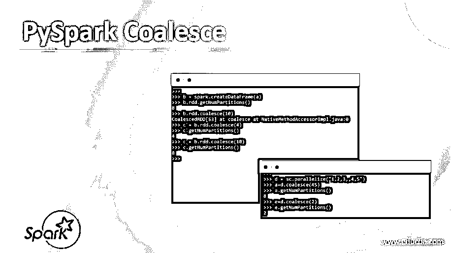
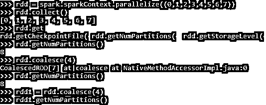
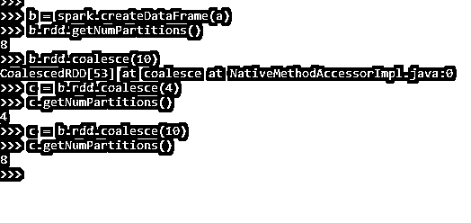
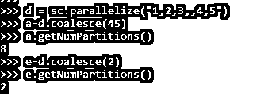

# PySpark 凝聚

> 原文：<https://www.educba.com/pyspark-coalesce/>

## PySpark Coalesce 简介

PySpark Coalesce 是 PySpark 中的一个函数，用于处理 PySpark 数据框中的分区数据。联合方法用于减少数据帧中的分区数量；联合功能避免了数据的完全混排。它调整现有分区，导致分区减少。该方法减少了数据帧的分割数。

这是一个优化得多的版本，其中数据的移动在较低的一侧。相比之下，这使得 PySpark 数据框模型的速度更快。本文将通过示例详细分析 coalesce 函数，并尝试理解它如何与 PySpark 数据帧一起工作。

<small>网页开发、编程语言、软件测试&其他</small>

**语法:**

PySpark Coalesce 函数的语法是:

`b = a.coalesce(5)`

*   甲:派斯帕克·RDD。
*   Coalesce:Coalesce 函数作用于一个分区。

**截图:**

### PySpark 中的 Coalesce 是如何工作的？

让我们看看 PySpark 中的 COALESCE 函数是如何工作的:

Coalesce 函数减少了 PySpark 数据帧中的分区数量。通过 reducing，它避免了数据的完全混洗，并使用哈希分割器来混洗数据；这是用于混洗数据的默认混洗机制。它避免了完全混洗，执行器可以将数据安全地保存在最小的分区上。这只会将数据从额外的节点移走。这使用现有的分区来最小化数据混乱。每个分区中的数据量可以均匀地不同。使用现有事务进行合并，从而加快数据洗牌的速度。这种结合每次都会创造一个新的 RDD，记录以前在旧 RDD 上的洗牌。Coalesce 处理具有大量分区的数据，它将这些分区组合起来，生成一个具有较少分区的新 RDD，从而避免了数据洗牌和网络上的最小移动。

### PySpark 聚结示例

让我们看看 PySpark COALESCE 的一些例子:

让我们从创建一个简单的 RDD 开始，我们希望了解合并操作。

**RDD 的创作:**

`rdd = spark.sparkContext.parallelize((0,1,2,3,4,5,6,7))
rdd.collect()
[0, 1, 2, 3, 4, 5, 6, 7]`

**截图:**

让我们检查一下在创建 RDD 时创建的分区。这可以使用 getNumpartitions()来完成，它检查用于创建 RDD 的分区数量。rdd.getNumPartitions()

**截图:**

我们将首先在给定的 RDD 上使用 coalesce 函数。

`rdd1 = rdd.coalesce(4)`

nativemethodaccesserimpl . Java:0 处的 coalesce 处的 coalesce DD[7]

这个 RDD 被分区并减少到 4。

`rdd1.getNumPartitions()`

结果显示分区将减少给定的参数数量。

**截图:**

让我们通过创建一个数据框并对其使用联合功能来更准确地理解这一点。

`data1 = [{'Name':'Jhon','ID':2,'Add':'USA'},{'Name':'Joe','ID':3,'Add':'USA'},{'Name':'Tina','ID':2,'Add':'IND'}]`

创建一个示例数据，字段为 Name、ID 和 ADD。

`a = sc.parallelize(data1)`

RDD 是使用 sc.parallelize 创建的

`b = spark.createDataFrame(a)
b.show()`

使用 Spark.createDataFrame 创建了 DataFrame。

**截图:**

通过使用，可以以相同的方式使用数据帧合并。RDD 将其转换为 RDD 并获得 NUM 个分区。

`b.rdd.getNumPartitions()
c = b.rdd.coalesce(4)
c.getNumPartitions()`

让我们查看更多关于 Coalesce 函数的示例。

**截图:**

让我们尝试使用 coalesce 函数增加分区；我们将尝试从默认分区增加分区。

`b = spark.createDataFrame(a)
b.rdd.getNumPartitions()`

这里默认的 NUM 分区是 8。让我们尝试用 coalesce 函数增加分区。

`c = b.rdd.coalesce(10)
c.getNumPartitions()`

这里我们可以看到，通过尝试增加分区，默认值保持不变。所以 coalesce 只能用来减少分区的数量。

**截图:**

让我们看看 PySpark Coalesce 的更多示例:

`d = sc.parallelize("1,2,3,,4,5")
a=d.coalesce(45)
a.getNumPartitions()
e=d.coalesce(2)
e.getNumPartitions()`

**截图:**

这些是 PySpark 中的一些合并函数的例子。

**注:**

1.Coalesce 函数在现有分区上工作，避免完全洗牌。
2。它经过优化，内存效率高。
3。它仅用于减少分区的数量。
4。数据在 Coalesce 中分布不均匀。
5。现有分区在联合中被打乱。

### 结论

从上面的文章中，我们看到了 PySpark 中 Coalesce 操作的使用。我们试图从各种例子和分类中理解聚结方法在 PySpark 中是如何工作的，以及在编程级别使用了什么。我们还看到了 Spark 数据框架中的联合的内部工作和优势，以及它在各种编程目的中的使用。此外，语法和例子帮助我们更精确地理解了函数。

### 推荐文章

这是 PySpark Coalesce 的指南。在这里，我们将讨论简介、语法以及如何在 PySpark？还有例子。您也可以看看以下文章，了解更多信息–

1.  [PySpark 加入](https://www.educba.com/pyspark-join/)
2.  [火花平面图](https://www.educba.com/spark-flatmap/)
3.  [火花簇](https://www.educba.com/spark-cluster/)
4.  [火花纱](https://www.educba.com/spark-yarn/)

