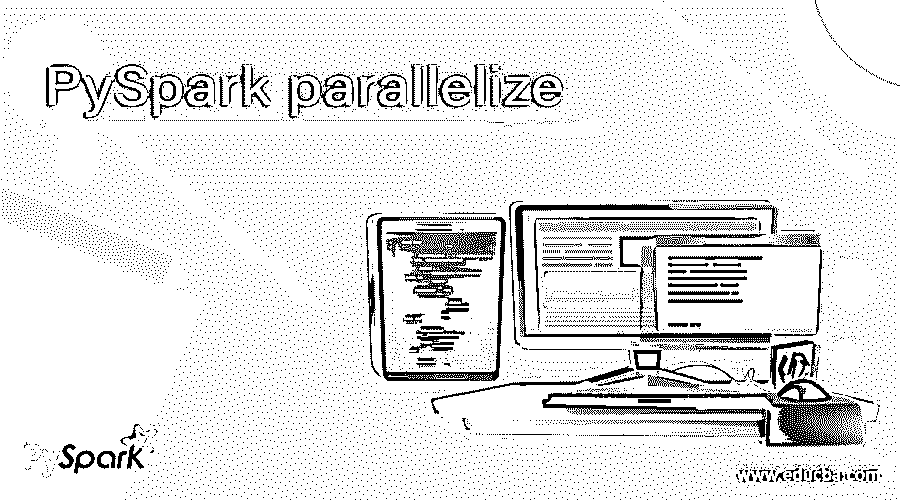
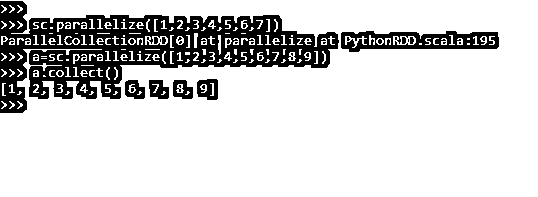
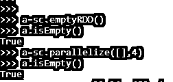

# PySpark 并行化

> 原文：<https://www.educba.com/pyspark-parallelize/>

## PySpark 并行化简介

PYSPARK 并行化是 SPARK 上下文中的一个 spark 函数，是在 spark 生态系统中创建 RDD 的一种方法。在 Spark 生态系统中，RDD 是 PySpark 中使用的基本数据结构，它是一个不可变的对象集合，是 Spark 应用程序的基本点。数据在 Spark 集群的不同节点上计算，这使得并行处理发生。

并行化是 PySpark 的 Spark 上下文中的一个功能，用于从集合列表中创建 RDD。并行化 spark 应用程序将数据分布在多个节点上，用于处理 Spark 生态系统中的数据。

<small>网页开发、编程语言、软件测试&其他</small>

并行化任务意味着在驱动节点或工作节点上运行并发任务。并行化是 Spark 中的一种方法，用于通过在 RDD 中对数据进行并行化。

PySpark 并行化的语法

PYSPARK 并行化函数的语法是:-

`sc.parallelize()`

**截图:-**

**解释**

sc:-Spark 应用程序的 SparkContext

用于并行化数据的并行化方法。

### PySpark 并行化的工作原理

让我们看看 PySpark 中的并行化函数是如何工作的

并行化方法是用于在 PySpark 应用程序中创建 RDD 的 spark 上下文方法。它用于创建 spark 框架的基本数据结构，然后 spark 处理模型就进入了画面。并行化后，数据会分发到集群的所有节点，这有助于数据的并行处理。

这是 spark 应用程序的工作模型，它使 Spark 成为低成本和快速处理引擎。为了实现这一点，spark 提出了基本的数据结构 RDD，这是通过与 spark 上下文并行实现的。spark 上下文通常是任何 Spark 应用程序的入口点，并行化方法用于通过给定的数据实现该模型。

并行化方法用于创建并行化集合，帮助 spark 在集群中分配作业，并在数据模型上执行并行处理。

当我们并行化一个方法时，我们试图在运行 spark 应用程序所需的 worker 节点的帮助下完成并发任务。数据在集群中的分布取决于 spark 内部架构处理的各种机制。

这就是 PySpark 中并行化的使用方式。

### 例子

让我们看一些 Pyspark 并行化函数如何工作的例子

通过在终端/控制台中启动 PySpark 来创建 spark 上下文。

使用 PySpark 上下文中的 sc.parallelize 方法创建 RDD。

`sc.parallelize([1,2,3,4,5,6,7])`

parallel collection rdd[0]at parallelize at python rdd . Scala:195

可以通过以下方式检查输出

`a=sc.parallelize([1,2,3,4,5,6,7,8,9])
a.collect()`

**截图:-**

这将创建一个整数 post 类型的 RDD，我们可以对数据进行 Spark 操作。

我们可以将操作或转换操作称为 RDD。这个 RDD 也可以转换成数据框架，用于优化 PySpark 中的查询。

在使用并行化方法时，我们可以做一些特定的操作，比如检查也可以用作参数的分区数量。

`a.getNumPartitions()`

这将为我们提供创建 RDD 时使用的默认分区，同样可以在创建分区时通过分区进行更改。

`a=sc.parallelize([1,2,3,4,5,6,7,8,9],4)
a.getNumPartitions()`

这将把分区定义为 4。

**截图:-**

这些分区基本上是 Spark 中的并行单元。

我们还可以在 PySpark 应用程序中创建一个空的 RDD。空 RDD 是指没有任何数据的东西。

这可以通过在 spark 上下文中使用该方法来实现。

`a=sc.emptyRDD()
a.isEmpty()`

同样可以通过并行化 PySpark 方法来实现。

`a=sc.parallelize([],4)
a.isEmpty()`

同样的空 RDD 被创造出来。

**截图:-**

创建 RDD 后，我们可以对数据执行某些动作操作，并并行处理数据。

让我们用并行化的方法制作一个 RDD，并在上面应用一些火花动作。

`ab = sc.parallelize(  [('Monkey', 12), ('Aug', 13), ('Rafif',45), ('Bob', 10), ('Scott', 47)])
ab.first()`

这将检查 RDD 的第一个元素。

`ab.collect()`

这将收集一个 RDD 的所有元素。

`ab.count()`

这将计算 PySpark 中元素的数量。

这些是在 PySpark 中使用并行化方法创建 RDD 后可以应用的一些 Spark 操作。

**截图:-**

从上面的例子中，我们看到了 PySpark 的并行化功能的使用

### 结论

从上面的文章中，我们看到了 PySpark 中并行化的使用。通过各种示例和分类，我们试图理解 PySpark 中的并行化方法是如何工作的，以及在编程级别使用了什么。工作模式使我们正确理解了职能的内涵，并帮助我们获得了更多的相关知识。语法有助于检查使用的确切参数和函数的功能知识。

我们还在 Spark Data Frame 中看到了 PySpark 的内部工作方式和并行化的优势，以及它在各种编程目的中的用途。此外，语法和例子帮助我们更准确地理解函数。

### 推荐文章

这是 PySpark 并行化指南。在这里，我们将讨论 Spark 数据框架中 PySpark 的内部工作方式以及并行化的优势。您也可以阅读以下文章，了解更多信息——

1.  [火花簇](https://www.educba.com/spark-cluster/)
2.  [火花并行化](https://www.educba.com/spark-parallelize/)
3.  [火花平面图](https://www.educba.com/spark-flatmap/)
4.  [火花上下文](https://www.educba.com/sparkcontext/)

