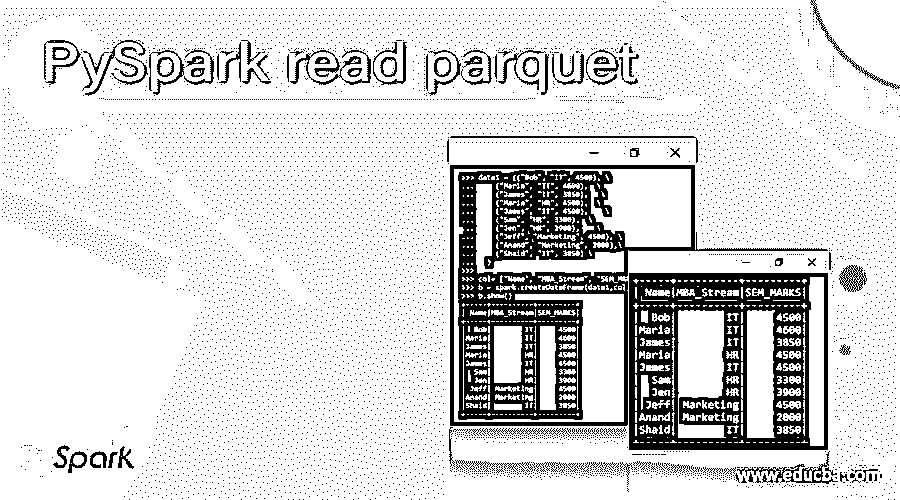
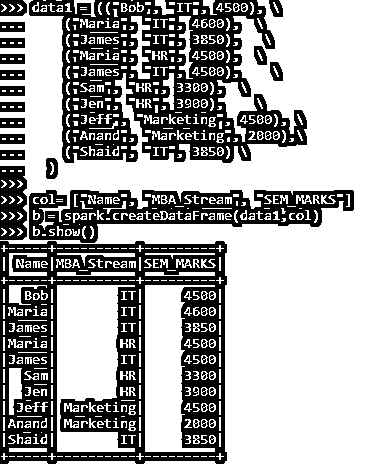

# PySpark 阅读拼花地板

> 原文：<https://www.educba.com/pyspark-read-parquet/>

## PySpark read 拼花地板简介。

pyspark read parquet 是 pyspark 中提供的一种方法，用于从 parquet 文件中读取数据，制作数据帧，并对其执行基于 spark 的操作。Parquet 是一种开源文件格式，设计用于在列的基础上存储数据；它维护模式和数据，使数据更加结构化，便于读取和处理。

PySpark 附带了 read.parquet 函数，用于从给定的文件位置读取这些类型的 parquet 文件，并通过创建数据框来处理数据。这个 parquet 文件的位置可以是从本地文件系统到基于云的存储结构的任何位置。

<small>网页开发、编程语言、软件测试&其他</small>

PySpark 的语法读为 parquet。

READ PARQUET 函数的语法是:-

`Spark.read.parquet(“path of the parquet file”)`

火花:-火花会议。

Read.parquet:-用于读取 parquet 文件的 spark 函数。

参数:-拼花文件的路径。

`spark.re
spark.read.parquet(“/ / / / / /”)`

**截图:-**

### PySpark 拼花地板的加工

让我们看看我们能不能用 PySpark 读拼花文件

parquet 格式是 PySpark 中数据处理的列方式，数据以结构化的方式存储。PySpark 提供了 Spark.read.parquet 的功能，用于通过 spark 应用程序读取这些基于 parquet 的数据。数据帧或数据集是由拼花文件构成的，spark 处理也是由拼花文件实现的。

Parquet 文件格式适合处理大数据，因为我们可以选择过滤这些数据，这仅用于数据处理。它支持压缩和各种编码方案，使其有效的火花处理。

PySpark 自动捕获原始数据的模式，将数据存储量减少了 75%。

在读取 parquet 文件时，这些列会自动转换为可空。parquet 文件源能够自动发现所使用的分区及其相关信息。这种分区用于存储和处理数据。通过用 spark.read.parquet 处理文件，Spark SQL 自动提取信息，并返回模式。数据类型是自动推断的。

在读取 parquet 文件时，可以通过将 mergeSchema 设置为 True 来合并模式。

这就是我们如何在 PySpark 中读取 Parquet 文件。

### PySpark read 拼花地板示例。

让我们看一些 PySpark read parquet 函数如何工作的例子

让我们从创建 PySpark 数据框开始。考虑一个包含相关系和整个学期成绩的学生数据框架，并在此基础上制作一个数据框架。

**代码:**

`data1 = (("Bob", "IT", 4500), \
("Maria", "IT", 4600),  \
("James", "IT", 3850),   \
("Maria", "HR", 4500),  \
("James", "IT", 4500),    \
("Sam", "HR", 3300),  \
("Jen", "HR", 3900),    \
("Jeff", "Marketing", 4500), \
("Anand", "Marketing", 2000),\
("Shaid", "IT", 3850) \
)
col= ["Name", "MBA_Stream", "SEM_MARKS"] b = spark.createDataFrame(data1,col)`

创建数据从列和数据创建数据框

`b.printSchema()`

**截图:**

由于我们没有任何 parquet 文件，我们将首先尝试将一个 parquet 文件写入一个位置，然后尝试使用 spark.read.parquet 读取它。

我们有一个数据框架；让我们用 parquet 格式写数据帧。

`b.write.parquet(“location”)`

文件将被写到给定的位置。

我们可以使用

`Spark. Read.parquet(“location”)`

我们可以将一个拼花文件存储在一个数据帧中，并对其进行操作。

DataFrame.show()可以显示其中的拼花数据。

`dataframe.show()`

我们还可以使用不同的模式来追加或覆盖给定的拼花文件位置。

我们还可以在读取 parquet 文件时创建一个临时表，然后执行与 SQL 相关的操作。

还可以在拼花文件上创建一个分区，在读取拼花文件时可以使用该分区。为每个分区创建了文件夹，我们可以从该拼花位置的指定文件夹中读取数据。相同的分区表也可以来自该数据。

从上面的例子中，我们看到了 PySpark 的 read parquet 函数的使用。

**结论**

从上面的文章中，我们看到了 PySpark 中 READ PARQUET 的使用。我们试图从各种示例和分类中理解 READ PARQUET 方法在 PySpark 中是如何工作的，以及在编程级别使用了什么。工作模式让我们正确理解了职能的内涵，并帮助我们获得了更多相关知识。语法有助于检查使用的确切参数和函数的功能知识。

我们还看到了在 Spark 数据框架中读取 PySpark 中的 PARQUET 的内部工作原理和优点，以及它的各种编程目的。此外，语法和例子帮助我们更准确地理解函数。

### 推荐文章

这是 PySpark 阅读拼花指南。在这里，我们通过各种例子和分类来讨论在 PySpark 中使用 READ PARQUET。您也可以看看以下文章，了解更多信息–

1.  [PySpark 加入](https://www.educba.com/pyspark-join/)
2.  [PySpark SQL](https://www.educba.com/pyspark-sql/)
3.  numpy save txt
4.  [火花拼花地板](https://www.educba.com/spark-parquet/)

