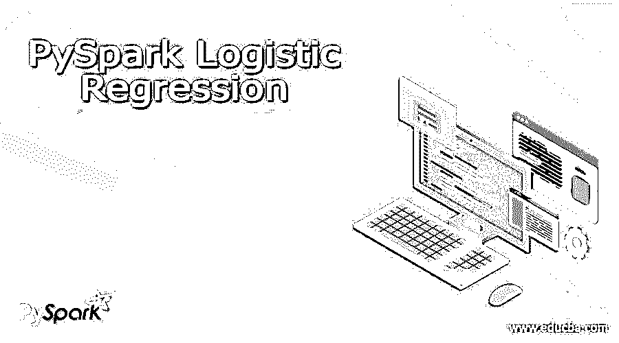
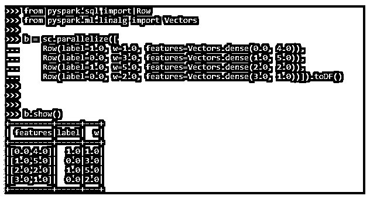
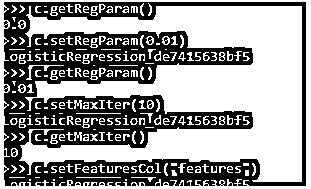

# PySpark 逻辑回归

> 原文：<https://www.educba.com/pyspark-logistic-regression/>




## PySpark 逻辑回归简介

PySpark 逻辑回归是一种监督机器学习模型，属于分类类型。该算法定义了数据之间的关系，并根据数据之间的关系对数据进行分类。逻辑回归是分类中的基本技术，相对更快且更容易计算。

它基于 PySpark 的机器学习模型中数据模型的训练和测试。它预测因变量的概率。它是一种预测分析，描述数据并解释变量之间的关系。在本文中，我们将尝试用 PySpark 中的数据来分析逻辑回归中使用的各种方法。让我们试着更详细地了解 pyspark 逻辑回归

<small>网页开发、编程语言、软件测试&其他</small>

### PySpark 逻辑回归的语法

PYSPARK 逻辑回归函数的语法是:

```
from pyspark.sql import Row
from pyspark.ml.classification import LogisticRegression
b = LogisticRegression(weightCol="weight")
```

.使用的导入语句。

LogisticRegression:与要使用的列名一起使用的模型。

**输出:**


### 逻辑回归在 Pyspark 中的应用

让我们看看 pyspark 中的逻辑回归操作是如何工作的

*   这是一种预测数据变量相关性的分类算法。逻辑回归预测二元结果，其中只有两种情况发生，一种是存在，一种是不存在。
*   它基于所使用的因变量和自变量的一些假设。这些假设然后用于训练目的。就像自变量必须相互独立一样，数据的大小必须强大有力。自变量属于那些能进一步影响结果的变量。
*   有几种类型的逻辑回归，包括预测因变量和自变量之间关系的二元回归。
*   然后，我们可以有多项式回归，可以有两个或两个以上的离散结果。
*   PySpark 数据框中的列包含标注、要素和用于回归模型技术计算的列名。
*   让我们通过一些代码示例来检查逻辑回归函数的创建和工作。

### PySpark 逻辑回归示例

让我们看一些 PYSPARK 逻辑回归运算如何工作例子

让我们从在 PySpark 中创建一个简单的数据框开始，我们可以在这个数据框上使用模型。我们将使用 sc。并行化方法来创建数据帧，随后是 PySpark 中的 toDF 方法，其中包含创建回归模型所需的数据。

必要的导入用于在 PySpark 中创建特性和 Row。

```
 from pyspark.sql import Row
 from pyspark.ml.linalg import Vectors
 b = sc.parallelize([
     Row(label=1.0, w=1.0, features=Vectors.dense(0.0, 4.0)),
     Row(label=0.0, w=3.0, features=Vectors.dense(1.0, 5.0)),
     Row(label=1.0, w=5.0, features=Vectors.dense(2.0, 2.0)),
     Row(label=0.0, w=2.0, features=Vectors.dense(3.0, 1.0))]).toDF()
 b.show()
```

**输出:**




我们可以导入逻辑回归模型进行分类，并在数据框架上开始操作

```
from pyspark.ml.classification import LogisticRegression
```

这适用于 PySpark 数据帧的列。

```
c = LogisticRegression(weightCol="w")
```

**输出:**


现在让我们试着分析逻辑回归模型中使用的一些方法。

1:-获取 regParam 或其默认值。

```
c.getRegParam()
```

2:-通过回归函数设置 regParam。

```
c.setRegParam(0.01)
```

3:-获取更新的值。

```
c.getRegParam()
```

4:-通过回归函数设置最大值

```
c.setMaxIter(10)
```

5:-获取迭代器的更新值。

```
c.getMaxIter()
c.setFeaturesCol("features")
```

这些是与 PySpark 数据框模型一起使用的逻辑回归模型，结果可以从模型中进行评估。请注意，该模型不能用于连续数据，如果模型的数据量很小，精度可能会有所不同。该模型是相对更快、最可信和最著名的预测模型。

**输出:**




这是 PYSPARK 中 PySpark 逻辑回归的一些例子。

**注:**

*   PySpark 逻辑回归是一种用于数据分析的机器学习模型。
*   PySpark 逻辑回归是预测 PySpark ML 模型中数据之间相互依赖关系的分类。
*   PySpark 逻辑回归是一种更快的数据分类方法，适用于较大的数据集，结果准确。
*   PySpark 逻辑回归适用于数据均匀分离的离散数据。
*   PySpark 逻辑回归使用因变量和自变量模型进行分析。

### 结论

从上面的文章中，我们看到了 PySpark 中逻辑回归的工作原理。从各种例子和分类中，我们试图理解这种回归操作是如何在 PySpark 数据框架中发生的，以及在编程级别使用了什么。所使用的各种方法显示了它如何简化数据分析的模式以及同样的成本效益模型。我们还看到了 PySpark 数据框架中逻辑回归的内部工作和优势，以及它在各种编程目的中的使用。语法和例子也帮助我们更精确地理解这个函数。

### 推荐文章

这是 PySpark 逻辑回归的指南。在这里，我们还将讨论 pyspark 中逻辑回归的介绍和工作，并给出一个例子。您也可以看看以下文章，了解更多信息–

1.  [PySpark 别名](https://www.educba.com/pyspark-alias/)
2.  [PySpark 直方图](https://www.educba.com/pyspark-histogram/)
3.  [PySpark 回合](https://www.educba.com/pyspark-round/)
4.  [pypark 交换机列](https://www.educba.com/pyspark-withcolumn/)


