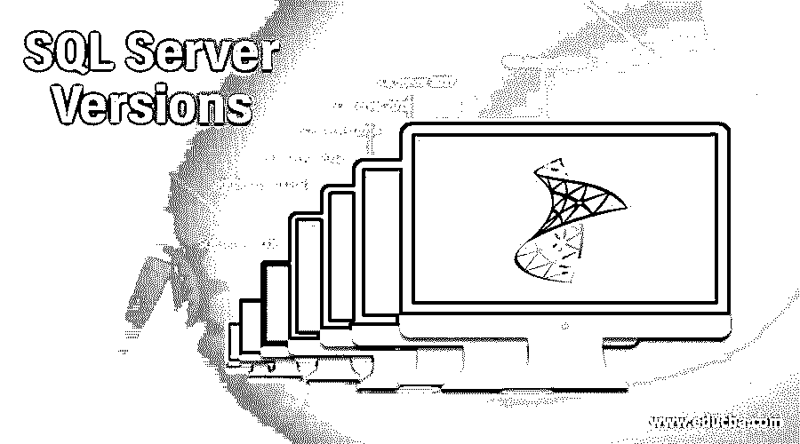

# SQL Server 版本

> 原文：<https://www.educba.com/sql-server-versions/>

## SQL Server 版本介绍

SQL Server 是世界上最流行的关系数据库管理系统之一。它提供了大量的服务，从基本的存储、操作和查询到复杂的任务，如大数据分析和机器学习，具体取决于您使用的 SQL Server 版本。第一个 SQL server 诞生于 1988-89 年左右，在 1989-2019 年间，一共推出了 20 个版本。

因此，在本文中，我们认为最好列出一些最流行的 SQL server 版本，以便您可以根据自己的需求计划使用哪一个。

<small>Hadoop、数据科学、统计学&其他</small>

### SQL Server 的版本

以下是下面提到的版本

#### 1.SQL server 2008

顾名思义，这个版本的 SQL Server 是在 2008 年推出的。每个随后的版本都是对先前版本的改进。SQL Server 2008 为将图像、音频和视频剪辑存储为二进制/BLOB 数据提供了改进的数据类型。它还具有将数据文件存储为 FILESTREAM 的功能。与以前的版本相比，此版本提供了更高的速度和返回时间，并支持 X64 和 X386 处理器。

#### 2.SQL Server 2008 R2 版

SQL server 2008 的进一步改进版本于 2010 年推出。它还有一个用于主数据库管理的主数据服务的附加功能。该工具有助于维护主数据实体的详细信息。它还引入了生成管理信息系统和水晶报告的报告系统。这是 SQL Server 中首次引入 reporting services。X64 和 X386 处理器目前支持该版本。但截至目前，微软并未向 SQL server 2008 和 SQL server 2008 R2 提供任何服务。

#### 3.SQL server 2012

一晃两年过去了，微软在 2012 年推出了 SQL server 的另一个更新版本。这是 SQL server 第一次从 ODBC 转向 OLE DB 连接支持。该版本改进了整体在线可用性和性能，为组提供了更多选项，并提供了角色登录管理。此外，它还具有更好的动态视图和用户自定义功能。

#### 4.SQL server 2014

2014 年，微软推出了另一个版本的 SQL Server。这个版本中使用了内存中的 OLTP 引擎。与 SQL server 2012 相比，它的性能提高了 20 倍。此外，它支持多维数据集/模型的列存储索引和超级视图。这些功能支持数据分析表达式。因此，您可以首次在数据库内系统中执行更好的商业智能和数据分析任务。对于大量数据来说，这是一件很酷的事情，因为您不能或者不想在 python 或 R IDE 中拖动和分析这些数据。SQL Server 2014 使用户能够加密备份。该版本还具有与 windows azure 集成的功能。

#### 5.SQL server 2016

从名字本身就可以看出，这个版本的 SQL server 已经推出。数据库服务器通过 OLTP 引擎和始终加密功能增强了性能和数据安全性。SQL Server 还具有其他功能，可以实现更好的数据集成。现在可以直接查询 Hadoop 和 Azure Blob 存储中的数据。该服务器提供了改进和增强的商业智能和数据分析功能。SQL Server 和 Azure as a service 之间实现了无缝集成。但是，此版本的 SQL Server 仅在 X64 处理器上受支持。

#### 6.SQL server 2017

微软第一次尝试让 SQL Server 数据库管理系统兼容 Linux、类 Linux 操作系统和 dockers。此外，服务器提供了开发语言的选择。现在，您可以在 SQL server 中编写 Python 脚本，并使用它们进行数据操作和分析。可以进一步强化写机器学习模型。再也不用担心从数据库中拖出大量数据集进行分析。这个版本中的一些附加特性是它支持图形数据库和字符串函数。一些新的字符串函数是 TRANSLATE、CONCAT_WS、STRING_AGG 和 TRIM。SQL Server 2017 还提供内置的自动数据库调优。SQL server 正在从仅仅是一个关系数据库管理服务器转变为一个完整的数据分析和机器学习环境。

#### 7.SQL server 2019

SQL Server 2019 是之前版本的改进和增强版本。但这个版本最引人注目的特性是大数据集群，它允许您使用 T-SQL 和 spark 动态分析您的数据。您可以在 SQL server 支持的 HDFS 中存储大数据。服务器支持额外的操作系统、数据类型和开发语言。此外，它还支持使用 polybase 查询和可视化不同数据库和云上的数据。

### 结论

SQL Server 是微软公司开发的数据库管理系统。它提供了增强的加密、可用性和性能，以及报告服务和管理服务。在当前版本中，从 2016 年及以上开始，您甚至可以运行您的 python 和 R 脚本进行数据分析和机器学习，并使用 polybase 在不同的数据库上运行查询。

### 推荐文章

这是 SQL Server 版本指南。在这里，我们讨论一些最流行的 SQL server 版本的列表，以便您可以根据自己的需求计划使用哪个版本。您也可以阅读以下文章，了解更多信息——

1.  [SQL 窗口函数](https://www.educba.com/sql-window-functions/)
2.  [MySQL DDL](https://www.educba.com/mysql-ddl/)
3.  [Postgres 列表模式](https://www.educba.com/postgres-list-schemas/)
4.  [MySQL 字符集](https://www.educba.com/mysql-character-set/)

