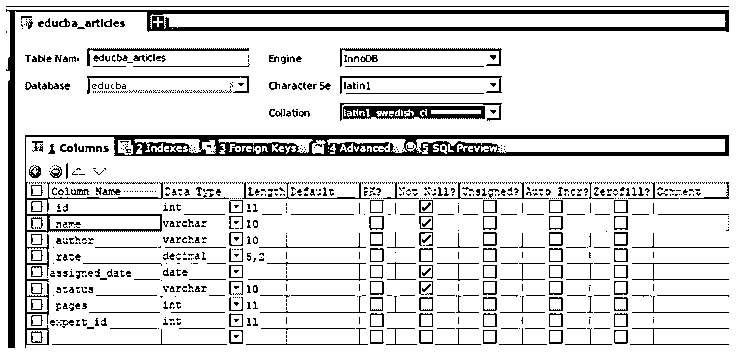
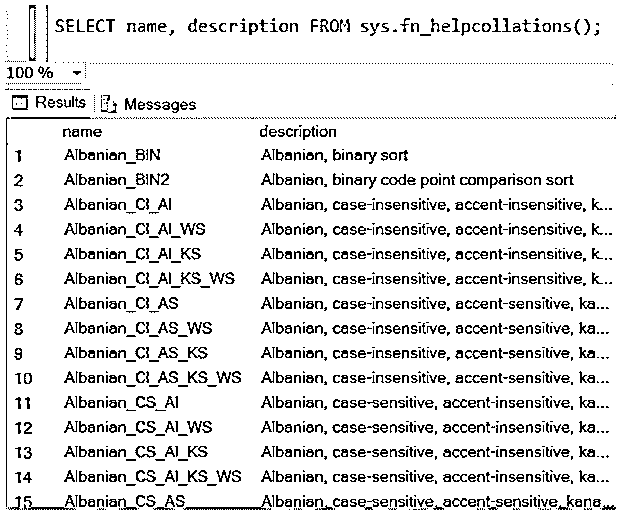
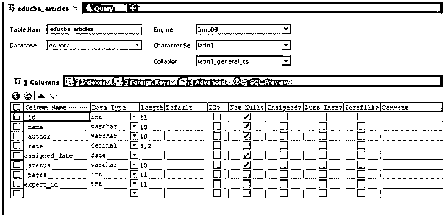
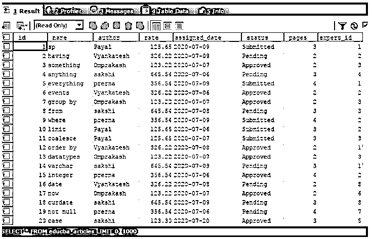

# SQL 不区分大小写

> 原文：<https://www.educba.com/sql-case-insensitive/>

## SQL 不区分大小写简介

SQL 不区分大小写是通过用大写或小写字母指定查询语句和关键字表和列来使用它们。SQL 关键字默认设置为不区分大小写，这意味着关键字允许以小写或大写形式使用。在 SQL 数据库服务器上，表和列规范的名称设置为不区分大小写，但是，可以通过在 SQL 中配置这些设置来启用和禁用它。排序规则是决定并帮助我们指定 SQL 中除关键字之外的元素是否允许不区分大小写的属性。在本文中，我们将了解如何使用排序规则定义区分大小写，并检查 SQL 数据库服务器分配的排序规则值和支持的排序规则值。

### 检查 SQL Server 是否区分大小写

我们可以编写关键字 SELECT、FROM、WHERE、GROUP BY 等。因为它们在 SQL 中是不区分大小写的。除关键字以外的对象，如列名、表名、视图名、触发器名、存储过程名等。可以区分大小写，也可以不区分大小写。默认情况下，它们被设置为不区分大小写。通过使用 SQL 的名为 Serverproperty()的函数，并将 collion 作为参数传递给该函数以获取设置为 SQL server 排序规则的值，可以检查 SQL server 的排序规则属性。在执行它之后，大多数情况下，您将获得如下查询语句输出所示的排序规则值——

<small>Hadoop、数据科学、统计学&其他</small>

`SELECT Serverproperty('COLLATION') AS COLLATION;`

执行上述查询语句的输出如下:

排序规则值中包含 CI 或 CS。它们分别代表不区分大小写和区分大小写。在上面的输出中，我们可以看到 collation value 包含区分大小写的 CI，因此在数据库服务器上查询时，除了关键字之外的对象可以用大写或小写来指定。这同样适用于关键字，因为它们允许在任何情况下输入，但大多数情况下，根据约定使用全部大写是一个好习惯。

或者，也可以通过查询 SQL server 的 sys database 中名为 databases 的表来检查 SQL database server 的排序规则属性，通过将 name 列的值作为正在检查排序规则的数据库名称的值来检查特定数据库是否区分大小写。让我们查询我的 SQL server 上名为 educba 的现有数据库，并使用名为 sys database 的 table 数据库的内容和以下查询语句检查排序规则值

`SELECT collation_name AS COLLATION
FROM sys.databases
WHERE name = 'educba';`

执行上述查询语句的输出如下，给出的排序规则值为 SQL_Latin1_General_CP1_CI_AS，其中 CI 代表不区分大小写，这允许我们通过以大写或小写指定非关键字来查询数据库

还可以对特定的表和列分配排序规则属性，以覆盖默认的排序规则属性。可以通过使用 SQLyog 中的 F6 键改变表的排序规则，或者使用 sys.databases 中的 SELECT NAME，collation_name 查询表来检查表的排序规则。选中时，其排序规则被设置为值 latin1_swedish_ci，这也允许使用不区分大小写的非关键字对象。

*   **检查表格列的排序**

从数据库服务器级别到数据库级别，然后到表级别，最后到列级别，可以进一步覆盖排序规则。上面的句子定义了等级。假设现在我们想要检查我的 SQL 数据库中存在的表 educba_articles 的列的排序规则属性。我们可以通过简单地执行以下查询语句来做到这一点

`SELECT
COLUMN_NAME,
COLLATION_NAME
FROM
INFORMATION_SCHEMA.COLUMNS
WHERE TABLE_NAME = 'educba_articles'
AND CHARACTER_SET_NAME IS NOT NULL ;`

执行上述查询语句的输出如下

我们可以通过查询 sys 数据库的 fn_helpcollations()并使用以下查询语句检索排序规则的名称及其描述来检查 SQL 数据库服务器允许的排序规则值

`SELECT name, description FROM sys.fn_helpcollations();`

执行上述查询语句的输出如下

*   **使用 LOWER( ad UPPER()函数进行区分大小写的查询**

假设我的 educba 数据库中名为 educba_articles 的表的排序规则设置为区分大小写，如下图所示

让我们通过对表执行以下查询语句来检查表的内容

`SELECT * FROM educba_articles;`

执行上述查询语句的输出如下

现在，使用 lower 函数执行以下查询有助于检索所有提交的记录

`SELECT * FROM educba_articles WHERE LOWER(status) = "submitted";`

执行上述查询语句的输出如下

现在，我们将使用函数进行不敏感的比较，使用 UPPER 函数进行比较，如下面的查询语句所示

`SELECT * FROM educba_articles WHERE UPPER(status) = "SUBMITTED";`

执行上述查询语句的输出如下

以类似的方式，可以在 LIKE 子句中使用 UPPER()和 LOWER()函数来获取类似的记录，并使表或数据库中的搜索不敏感，该表或数据库的排序规则在其排序规则中显示区分大小写的 CS。

### 结论

可以为非关键字对象(如表和列)设置 SQL 区分大小写，方法是在数据库、表和列级别指定排序规则，在排序规则中提到 CI 或 CS，它们分别代表不区分大小写和区分大小写。

### 推荐文章

这是一个 SQL 不区分大小写的指南。在这里，我们还将讨论 sql server 的介绍和检查，以及不同的示例及其代码实现。您也可以看看以下文章，了解更多信息–

1.  [SQL 选择顶部](https://www.educba.com/sql-select-top/)
2.  [SQL 删除触发器](https://www.educba.com/sql-drop-trigger/)
3.  [MySQL 显示用户](https://www.educba.com/mysql-show-users/)
4.  [MySQL 交叉连接](https://www.educba.com/mysql-cross-join/)

