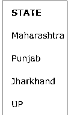
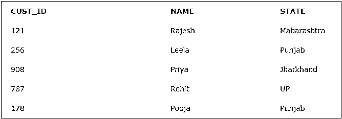
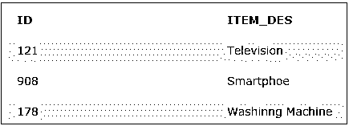
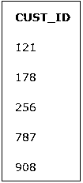
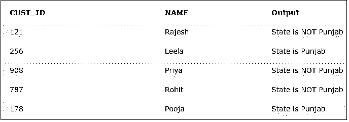

# SQL 关键字

> 原文：<https://www.educba.com/sql-keywords/>


## SQL 关键字介绍

在 SQL 中，关键字是用于在数据库中执行各种操作的保留字。SQL 中有许多关键字，因为 SQL 不区分大小写，所以我们是否使用 select 或 SELECT 并不重要。

### SQL 关键字列表

SQL 关键字可用于各种操作，如下例所述。

<small>网页开发、编程语言、软件测试&其他</small>

#### 1.创造

CREATE 关键字用于创建数据库、表、视图和索引。我们可以如下创建客户表。

```
CREATE TABLE CUSTOMER (CUST_ID INT PRIMARY KEY, NAME VARCHAR(50), STATE VARCHAR(20));
```

#### 2.主关键字

该关键字唯一标识每条记录。

可以使用 CREATE DATABASE 语句创建 SQL 中的数据库，如下所示:

```
CREATE DATABASE DATABASE_NAME;
```

可以使用 CREATE VIEW 创建 SQL 中的视图，如下所示:

```
CREATE VIEW VIEW_NAME AS
SELECT COLUMN1, COLUMN2, COLUMN3...
FROM TABLE_NAME WHERE [CONDITION];
```

#### 3.插入

[INSERT 关键字用于](https://www.educba.com/insert-in-oracle/)将数据行插入到表格中。我们可以使用下面的查询将下面的行插入到已经创建的客户表中。

```
INSERT INTO CUSTOMER VALUES (121,'Rajesh','Maharashtra');
INSERT INTO CUSTOMER VALUES(256,'Leela','Punjab');
INSERT INTO CUSTOMER VALUES(908,'Priya','Jharkhand');
INSERT INTO CUSTOMER VALUES(787,'Rohit','UP');
```

上述语句会将行插入到表“CUSTOMER”中。我们可以通过使用下面一个简单的 SELECT 语句来查看结果

```
SELECT * FROM CUSTOMER;
```


#### 4.挑选

该关键字用于从数据库或表中选择数据。“*”在 select 语句中用于选择表中的所有列。

```
SELECT NAME FROM CUSTOMER; 
```

上述查询的结果将显示 CUSTOMER 表中的列名，如下所示


#### 5.从

关键字用于指示从中选择或删除数据的表。

#### 6.改变

关键字 ALTER 用于修改表中的列。ALTER COLUMN 语句修改列的数据类型，而 ALTER TABLE 通过添加或删除列来修改列。

我们可以通过添加新列“AGE”来修改 CUSTOMER 表的列，如下所示。

```
ALTER TABLE CUSTOMER ADD AGE INT;
SELECT * FROM CUSTOMER;
```


上面的查询将添加新列“AGE ”,所有行的值都为 null。此外，上述语句使用了另一个 SQL 关键字“ADD”。

#### 7.注意缺陷障碍 (Attention Deficit Disorder)

这用于向现有表中添加一列。

#### 8.明显的

关键字 DISTINCT 用于选择不同的值。我们可以使用 SELECT DISTINCT 从表中只选择不同的值。

让我们为旁遮普省添加一个重复值，如下所示:

```
INSERT INTO CUSTOMER VALUES(178, 'Pooja', 'Punjab','null');
```

客户表现在有以下几行


现在，我们可以通过使用以下查询来查看列状态的不同值:

```
SELECT DISTINCT(STATE) FROM CUSTOMER;
```




#### 9.更新

该关键字在 SQL 语句中用于更新表中的现有行。

```
UPDATE CUSTOMER SET STATE ='Rajasthan' WHERE CUST_ID= 121;
SELECT * FROM CUSTOMER;
```


值为 121 的 CUST ID 被更新为新的拉贾斯坦邦。

#### 10.设置

该关键字用于指定要更新的列或值。

#### 11.删除

这用于从表中删除现有的行。

```
DELETE FROM CUSTOMER WHERE NAME='Rajesh';
```

上述查询将显示下面的，因为从结果集中删除了名为 Rajesh 的行。


在使用 DELETE 关键字时，如果我们不使用 WHERE 子句，所有记录都将从表中删除。

```
DELETE FROM CUSTOMER;
```

上述查询将删除 CUSTOMER 表中的所有记录。

#### 12.缩短

这是用来删除表中的数据，但并不删除表的结构。

```
TRUNCATE TABLE CUSTOMER;
```

上面的查询只删除了数据，但是保留了表的结构。所以不需要重新创建表。

#### 13.如同

关键字 AS 用作重命名列或表的别名。

```
SELECT CUST_ID AS CUSTOMER_ID, NAME AS CUSTOMER_NAME FROM CUSTOMER;
```

上述语句将为列 CUST_ID 和名称创建别名，如下所示:


#### 14.以...排序

这用于按降序或升序对结果进行排序。默认情况下，这将按升序对结果进行排序。

#### 15.美国安全委员会(American Security Council)

该关键字用于对 SQL 查询返回的数据进行升序排序。

```
SELECT * FROM CUSTOMER ORDER BY NAME ASC;
```


上面的查询将选择 CUSTOMER 表中的所有列，并按照 NAME 列以升序对数据进行排序。

#### 16.DESC

该关键字用于按降序对结果集进行排序。

```
SELECT * FROM CUSTOMER ORDER BY CUST_ID DESC;
```


上述查询将按照 CUST ID 的降序对表中所有选定的字段进行排序。

#### 17.在…中间

该关键字用于选择给定范围内的值。以下查询使用 BETWEEN 关键字在给定的 CUST 标识值范围内选择 CUST 标识和名称。

```
SELECT CUST_ID, NAME FROM CUSTOMER WHERE CUST_ID BETWEEN 100 AND 500;
```

上面的查询将给出下面的结果


#### 18.在哪里

该关键字用于过滤结果集，以便只包括满足条件的值。

```
SELECT * FROM CUSTOMER WHERE STATE ='Punjab';
```

上面的查询从表中选择州名为 Punjab 的所有值。


#### 19.和

该关键字与 WHERE 子句一起使用，以选择两个条件都为真的行。

```
SELECT * FROM CUSTOMER WHERE STATE ='Punjab' AND CUST_ID= 256;
```

上面的查询将给出如下结果


但是如果其中一个条件不满足，那么查询将不会返回任何结果，如下面的查询所示。

```
SELECT * FROM CUSTOMER WHERE STATE ='Punjab' AND CUST_ID= 121;
```

#### 20.运筹学

这与 WHERE 子句一起使用，以便在任一条件为真的情况下将行包括在结果集中。

如果州是 Punjab 或 UP，下面的 SQL 语句将从 CUSTOMER 表中选择字段。

```
SELECT * FROM CUSTOMER WHERE STATE='Punjab' OR STATE='UP';
```


在 OR 关键字的情况下，我们可以从上面的结果中看到，在任何给定条件为真的情况下，它都包含在结果集中。

#### 21.不

关键字 NOT 与 WHERE 子句一起使用，将条件不为真的行包含在结果集中。

我们可以在下面的查询中使用 NOT 关键字，不包括来自旁遮普省的行，如下所示。

```
SELECT * FROM CUSTOMER WHERE NOT STATE = 'Punjab';
```

该查询将返回结果集中除旁遮普省以外的其他州的行，如下所示:


#### 22.限制

该关键字从表中检索记录，以便根据限制值对它们进行限制。

```
SELECT * FROM CUSTOMER LIMIT 3;
```

上面的查询将从表 CUSTOMER 中选择记录，但是它将只显示表中的 3 行数据，如下所示


#### 23.为空

关键字 IS NULL 用于检查空值。

以下查询将显示年龄列为空值的所有记录。

```
SELECT * FROM CUSTOMER WHERE AGE IS NULL;
```

不为空

这用于搜索非空值。

```
SELECT * FROM CUSTOMER WHERE STATE IS NOT NULL;
```

因为列 STATE 没有空值，所以上面的查询将显示下面的结果。


#### 24.滴

DROP 关键字可用于删除数据库、表、视图、列、索引等。

#### 25.删除列

我们可以通过使用 DROP COLUMN 和 ALTER 语句来删除表中的现有列。让我们使用下面的查询删除 AGE 列。

```
ALTER TABLE CUSTOMER DROP COLUMN AGE;
```




我们可以看到，在上面的结果中，年龄列被删除了。

#### 26.删除数据库

可以使用 DROP DATABASE 语句删除 SQL 中的数据库。

```
DROP DATABASE DATABASE_NAME;
```

#### 27.翻桌

可以使用 DROP TABLE 语句删除 SQL 中的表。

```
DROP TABLE TABLE_NAME;
```

我们可以使用 DROP TABLE 关键字删除 CUSTOMER 表，如下所示。

但是我们在使用 DROP TABLE 时需要小心，因为它会删除表定义以及所有的数据和索引等。

#### 28.分组依据

这与计数、最大值、最小值、AVG、总和等聚合函数一起使用。并将结果集分组。下面的查询将根据不同的州对 CUST ID 进行分组。

```
SELECT COUNT(CUST_ID),STATE FROM CUSTOMER GROUP BY STATE;
```


结果显示了按州分组的不同 CUST ID 的计数。

#### 29.拥有

此关键字用于聚合函数和 GROUP BY，而不是 WHERE 子句，以筛选结果集的值。

```
SELECT COUNT(CUST_ID),STATE FROM CUSTOMER GROUP BY STATE HAVING COUNT(CUST_ID)>=2;
```

上面的查询将通过只显示那些满足在 [HAVING 子句](https://www.educba.com/oracle-having-clause/)中给出的条件的值来过滤结果集。


上面的结果集显示了客户 id 计数大于 2 的值。

#### 30.在…里

IN 关键字在 WHERE 子句中用于指定一个以上的值，或者我们可以说它可以用来代替在查询中使用多个 or 关键字。

下面的查询将通过使用 IN 关键字选择马哈拉施特拉邦、旁遮普省和 UP 的记录。

```
SELECT * FROM CUSTOMER WHERE STATE IN ('Maharashtra','Punjab','UP');
```


上面的结果集显示了 in 关键字的用法，该关键字只为 IN 子句中指定的州选择记录。

#### 31.加入

关键字 JOIN 用于将两个或多个表之间的行与表之间的相关列组合起来。连接可以是内连接、左连接、右连接、外连接等。

让我们以另一个表“CUST 订单”为例。




我们可以执行客户和 CUST 订单表的内部连接，如下所示

```
SELECT CUSTOMER.NAME, CUSTOMER.STATE, CUST_ORDER.ITEM_DES
FROM CUSTOMER INNER JOIN CUST_ORDER
ON CUSTOMER.CUST_ID =CUST_ORDER.ID;
```

上述查询将在列 CUST_ID 和 ID 上联接两个表“客户”和“CUST _ 订单”,并只显示这两个表中都存在的值。


这个结果显示了 cust_id 121、908 和 178 的匹配记录，它们在两个表中都是常见的。但是其他客户标识被排除在外，因为它们不在 cust 订单表中。类似地，可以执行其他连接。

#### 32.联盟

UNION 关键字用于组合两个或多个 select 语句的不同值。

```
SELECT CUST_ID FROM CUSTOMER UNION SELECT ID FROM CUST_ORDER;
```

上述查询将显示以下结果。




#### 33.联合所有

该关键字组合了两个或多个 select 语句，但允许重复值。

```
SELECT CUST_ID FROM CUSTOMER UNION ALL SELECT ID FROM CUST_ORDER;
```


上面的结果表明 UNION ALL 允许重复值，这在 UNION 的情况下是不存在的。

#### 34.存在

关键字 EXISTS 检查某个记录是否存在于子查询中。

```
SELECT NAME FROM CUSTOMER WHERE EXISTS (SELECT ITEM_DES FROM CUST_ORDER WHERE CUST_ID = ID);
```

当子查询返回以下值时，上述查询将返回 true。


#### 35.喜欢

该关键字用于与 WHERE 子句一起搜索特定的模式。通配符%用于搜索模式。

在下面的查询中，让我们搜索出现在“NAME”列中的模式“ya”。

```
SELECT NAME FROM CUSTOMER WHERE NAME LIKE '%ya';
```


#### 36.情况

该关键字用于根据不同的条件显示不同的输出。

```
SELECT CUST_ID, NAME,
CASE WHEN STATE = 'Punjab' THEN "State is Punjab"
ELSE "State is NOT Punjab"
END AS Output
FROM CUSTOMER;
```




其他一些关键字 DEFAULT 用于为列提供默认值，UNIQUE 用于确保列中的所有值都是唯一的，等等。

### 结论

SQL 中的各种关键字为设计数据库、表等提供了灵活性。它们为设计者提供了许多功能，这些功能在设计完成后进行任何更改时都非常有用。

### 推荐文章

这是 SQL 关键字的指南。这里我们已经讨论了 SQL 中的简介和不同的关键字。您也可以看看以下文章，了解更多信息–

1.  [SQL 日期函数](https://www.educba.com/sql-date-function/)
2.  [PL/SQL 命令](https://www.educba.com/pl-sql-commands/)
3.  [SQL 中的 ORDER BY 子句](https://www.educba.com/order-by-clause-in-sql/)
4.  [什么是 MySQL？](https://www.educba.com/what-is-mysql/)


