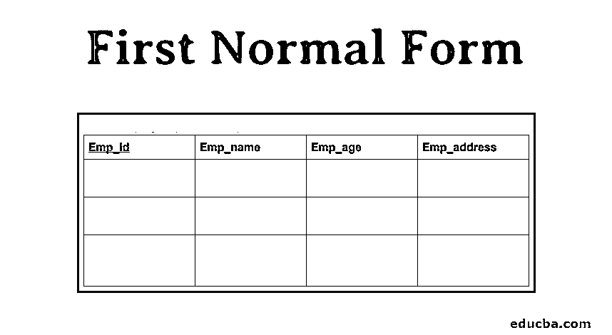

# 第一范式

> 原文：<https://www.educba.com/first-normal-form/>

## 第一范式是什么？

在理解第一范式之前，必须知道什么是规范化，为什么要这样做？概括地说，规范化是将数据组织到数据库中以减少插入、删除和更新异常并消除数据冗余的技术。这个过程将较大的表分成较小的表，并通过主键和外键的关系将它们相互链接起来。重复和非标准化的数据不仅消耗额外的内存，而且随着数据数量的增加，在插入、删除和更新表时，很难管理表。因此，在设计任何应用程序的数据库之前，规范化这些表是非常重要的。

第一范式，写为 1NF，设定了数据规范化的基本规则，是规范化表数据时使用的第一种形式。它规定了数据规范化的一些基本原则，每个表都需要遵循这些原则。以下是一些原则:

<small>Hadoop、数据科学、统计学&其他</small>

*   每一列都应该有单个原子(不能再分的值)值。
*   表中的每一列都没有复合值和重复值，因为这使得很难搜索具有多个值的列的值。所以每一列都必须有一个唯一的值。
*   存储在列中的值应该与 1NF 中的值属于同一个域。
*   表中的所有列都应该有唯一的名称。
*   一个表必须有一个唯一的主键，用于不同地标识每条记录。

### 第一范式是如何工作的？

根据上述 1NF 的主要原理，

*   一个列不应有可以进一步划分的复合值；如果表中某一列的值可以进一步划分，那么应该为该属性创建一个单独的表，该表中的不同列具有唯一的主键。例如，在一个 Employee 表中，对于可以进一步划分的 employee_address，应该有一个单独的 Employee_address 表，将 Employee_id 作为主键，将门牌号、城市和密码作为不同的列。

#### 员工表(1NF 之前)

| **<u>Emp_id</u>** | **雇员名称** | **雇员年龄** | **雇员地址** |
| One hundred and one | 拉古 | Twenty-five | Xyz 殖民地，阿格拉，258996 |
| One hundred and two | 拉凯什 | Twenty-eight | 勒克瑙 xyz 路 304 室，邮编 568975 |
| One hundred and three | 拉胡尔 | Forty-five | 瓦拉纳西医院附近的 123 号房，邮编 245687 |

由于 Emp_address 有如此多的数据，对于单个雇员来说，在 1NF 中，上表可以分解为下面给出的两个表:

#### 表 1:员工详细信息(1NF 之后)

| **<u>Emp_id</u>** | **雇员名称** | **雇员年龄** |
| One hundred and one | 拉古 | Twenty-five |
| One hundred and two | 拉凯什 | Twenty-eight |
| One hundred and three | 拉胡尔 | Forty-five |

#### 表 2:员工地址(1NF 之后)

| **雇员标识** | **员工 _ 房屋编号** | **Emp_city** | **EMP _ pin** |
| One hundred and one | Xyz 殖民地 564 号房子 | 阿格拉 | Two hundred and fifty-eight thousand nine hundred and ninety-six |
| One hundred and two | xyz 路 304 室 | 勒克瑙 | Five hundred and sixty-eight thousand nine hundred and seventy-five |
| One hundred and three | 医院附近的 123 号房子 | 瓦拉纳西 | Two hundred and forty-five thousand six hundred and eighty-seven |

对于在 1NF 中不可分割的列，应该有原子值。例如，到目前为止，他/她已经在一个 Employee 表中处理了多个 Emp_projects。为了记录该员工的所有项目，应该为具有独特价值的员工的每个项目单独记录，而不是用“，”分隔项目

#### 表:Emp _ projects(1NF 之前)

| **<u>Emp_id</u>** | **从业年限** | **员工部门** | **Emp_projects** |
| One hundred and one | Three | 信息技术 | abc，jkl |
| One hundred and two | Two | 信息技术 | bcd |
| One hundred and three | Five | 帐目 | Abc，cfg，xyz，hjk |

#### 表:Emp _ projects(1NF 之后)

| **<u>Emp_id</u>** | **从业年限** | **员工部门** | **Emp_projects** |
| One hundred and one | Three | 信息技术 | 字母表 |
| One hundred and one | Three | 信息技术 | jkl |
| One hundred and two | Two | 信息技术 | bcd |
| One hundred and three | Five | 帐目 | 字母表 |
| One hundred and three | Five | 帐目 | 稳频发电机（发生器）（constant frequency generator 的缩写） |
| One hundred and three | Five | 帐目 | xyz |
| One hundred and three | Five | 帐目 | hjk |

**表格:上例中有多个重复值的 Emp_projects 可以进一步分解为两个表格以减少重复:** 表格中不应出现重复值。重复的值会消耗大量额外的内存，使搜索和更新变得缓慢，并使数据库的维护变得困难。例如，在上面的 Employee_Projects 表中，Emp_id、Emp_years_of_experience 和 Emp_dept 有大量不必要的重复值，因此需要为此创建一个新表，以减少值的重复。

**表 1:**

| **<u>Emp_id</u>** | **从业经验年限** | **员工部门** |
| One hundred and one | Three | 信息技术 |
| One hundred and two | Two | 信息技术 |
| One hundred and three | Five | 帐目 |

**表二:**

| **<u>Emp_id</u>** | **Emp_projects** |
| One hundred and one | 字母表 |
| One hundred and one | jkl |
| One hundred and two | bcd |
| One hundred and three | 字母表 |
| One hundred and three | 稳频发电机（发生器）（constant frequency generator 的缩写） |
| One hundred and three | xyz |
| One hundred and three | hjk |

### 第一范式的优点

下面给出了第一范式(1NF)的一些优点:

*   1NF 的主要优点之一是，它通过创建一个单独的表来删除不必要的重复值，因此在插入、删除和更新数据库中的值时不会产生任何问题。
*   当在数据库中搜索特定值时，通过分割一列的所有值并再次将它们转换成特定格式来处理具有由“，”分隔的多个值的列的表是非常困难的，这浪费了大量的时间和内存。1NF 通过为不同的值创建不同的行来简化这一过程。
*   1NF 形成了基础，是创建数据库时遵循的首要原则，因此是表进一步用 2NF 和 3NF 规范化的最重要范式。
*   1NF 很重要，因为它在使用主键和外键的两个表之间创建了函数依赖关系，这在处理数据库的表时起着至关重要的作用。
*   1NF 允许用户有效地使用数据库查询，因为它通过删除一列的空值和多值来消除歧义，这在将来更新和提取数据库时会产生重大问题。

### 结论

在开始时使用数据库并为任何应用程序创建表时，规范化所有的表非常重要，因为这有助于消除插入、删除和更新异常。标准化还消除了未来的成本和时间。更少的空值和冗余数据使数据库更加紧凑。通过规范化，可以创建更多的表，这有助于轻松高效地维护数据。通过规范化，很明显，更好的搜索和排序性能是通过索引和键来保证的，1NF 在其中起着至关重要的作用。

### 推荐文章

这是第一范式的指南。在这里，我们讨论第一范式的定义、工作和优点，以及它的例子。您也可以阅读以下文章，了解更多信息——

1.  [什么是 MySQL？](https://www.educba.com/what-is-mysql/)
2.  [什么是 MySQL 模式？](https://www.educba.com/what-is-a-mysql-schema/)
3.  [MySQL 操作符](https://www.educba.com/mysql-operators/)
4.  [MySQL 服务器](https://www.educba.com/mysql-server/)

