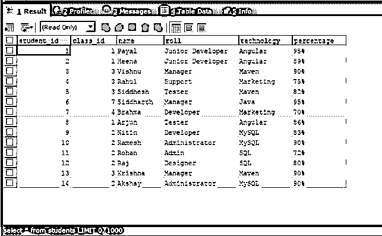
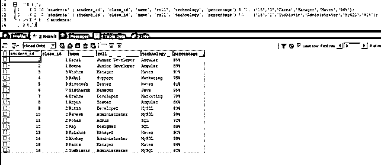

# 开始 SQL

> 原文：<https://www.educba.com/begin-sql/>

## 开始 SQL 简介

Begin SQL 是用于标记和指定事务或存储过程或函数的开始的关键字，或者只是逻辑块中多个语句的集合，其主体从 Begin 关键字的规范开始，到 END 关键字的使用结束。我们可以在 SQL 的 BEGIN 和 END 关键字中编写希望执行的语句序列。可以在同一个方法或存储过程中编写多个 BEGIN END 语句，等等。我们甚至可以在 SQL 中编写嵌套的 BEGIN END 语句，其中 BEGIN 和 END 关键字之间定义的语句逻辑块可以根据用例及需求在条件基础上或在循环和其他函数中执行。

在本文中，我们将学习在 SQL 中使用 BEGIN 关键字的语法，以及在语法和一些示例的帮助下帮助创建 SQL 语句逻辑块的 END 关键字。

<small>Hadoop、数据科学、统计学&其他</small>

**语法**

以下是在 SQL 中使用 BEGIN 关键字的语法，它伴随着 END，用于终止语句块–

`BEGIN
// Statements to be executed in the batch
END`

BEGIN 的使用主要在 Transact-SQL 中完成，在 Transact-SQL 中，多条语句完全以事务方式执行，以保持数据库操作和数据库 ACID 属性的一致性。我们可以在 BEGIN 和 END 关键字中提到我们希望以事务方式执行的语句，如上面的语法所示。BEGIN 和 END 中的语句也称为一起执行的批处理。我们可以在 BEGIN 和 END 关键字中提到 SQL 语句集。

让我们考虑几个例子，这些例子将使您清楚 BEGIN 在 SQL 中的实现。

### Begin SQL 的示例

我们将考虑一个名为 students 的现有表，它位于我的 SQL server 上名为 educba 的数据库中。从以下查询语句的输出中可以看到表 students 的结构和内容

`SELECT * FROM students;`

执行上述查询语句的输出如下

学生表中包含 14 条记录。现在，我们希望在 transact SQL 中执行三条语句，包括将名为 Karna 和 Yudhishthira 的两条记录添加到学生表中，并在添加后检索学生表中的记录。我们将把插入和选择查询的 SQL 查询语句放在 BEGIN 和 END 关键字内，如下面的代码所示

`BEGIN
INSERT INTO `students` (`student_id`, `class_id`, `name`, `roll`, `technology`, `percentage`) VALUES('15','3','Karna','Manager','Maven','96%');
INSERT INTO `students` (`student_id`, `class_id`, `name`, `roll`, `technology`, `percentage`) VALUES('16','2','Yudhistir','Administrator','MySQL','92%');
SELECT * FROM students;
END`

执行上述查询语句和块的输出如下

我们可以观察到两个额外的记录已经被插入到学生的表中，现在，学生的表总共包含 16 条记录，这些记录是从我们在 BEGIN 和 END 关键字之间的逻辑块中提到的第三个 SELECT 查询中检索到的。

现在让我们再考虑一个例子，在这个例子中，我们希望获得百分比大于 92 的学生姓名和 id 的记录，如果没有检索到记录，那么它应该给出输出“没有找到百分比大于 92 的学生”。为此，我们将首先使用 select 查询从学生的表中选择百分比大于 92 的记录，然后如果检索到的查询的行数为零，那么我们将选择字符串文字值，该值将包含找不到此类记录时所需的句子。

我们将使用 IF 语句来检查行计数条件，并将所有这些语句放在 BEGIN 和 END 中，使它们成为一个逻辑块，由下面所示的语句组成

`BEGIN
SELECT
student_id,
NAME
FROM
educba.students
WHERE
percentage > 92;
IF @@ROWCOUNT = 0
SELECT 'No students found that have achieved percentage greater than 92';
END`

执行上述查询语句和块的输出如下

### 嵌套的 BEGIN 和 END 关键字用法

我们甚至可以利用嵌套的 BEGIN END 块，创建不同的要执行的语句逻辑块。在 C、JAVA 或任何其他语言中，BEGIN 和 END 一起作为{和}工作。我们可以根据某些条件执行这些逻辑块，也可以在 SQL 的各种循环语句中重复执行。

让我们考虑一个简单的 SQL 嵌套 BEGIN END 块示例，它将检索按百分比降序排列的学生姓名，然后从查询中获取第一条记录的值，该查询检索学生姓名并将百分比最高的学生姓名存储在名为@name 的变量中。此外，我们希望检查查询语句的结果集的行数是否不等于零，然后打印字符串“得分最高的学生是学生的姓名”中的姓名值，否则执行另一个 BEGIN END 块，该块将获得字符串值“No student found”。为此，我们将使用以下代码

`BEGIN
DECLARE @name VARCHAR(100);
SELECT
@name = NAME
FROM
educba.students
ORDER BY
percentage DESC;
IF @@ROWCOUNT <> 0
BEGIN
SELECT 'The most highest scoring student is ' + @name;
END
ELSE
BEGIN
SELECT 'No student found';
END;
END`

下面是执行上述查询语句和块的输出，检索学生 Karna 的姓名，其百分比最高，为 96%

### 结论

我们可以在 SQL 中使用 BEGIN 关键字来标记我们需要指定的 transact SQL 语句的逻辑块的起始点，并使用 END 关键字来指定 SQL 中逻辑块的结束点。

### 推荐文章

这是 SQL 入门指南。这里我们讨论在 SQL 中使用 BEGIN 关键字和 END 关键字的语法，这有助于创建 SQL 语句的逻辑块。您也可以阅读以下文章，了解更多信息——

1.  [MySQL 同步](https://www.educba.com/mysql-sync/)
2.  [SQL 虚拟表](https://www.educba.com/sql-virtual-table/)
3.  [SQL 模式匹配](https://www.educba.com/sql-pattern-matching/)
4.  [除 Select 之外的 SQL](https://www.educba.com/sql-except-select/)

