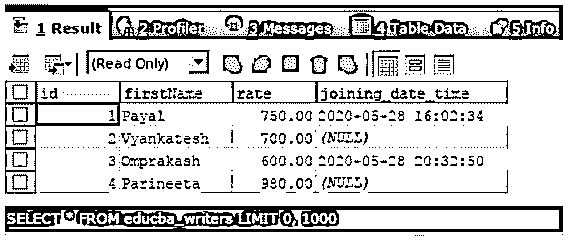
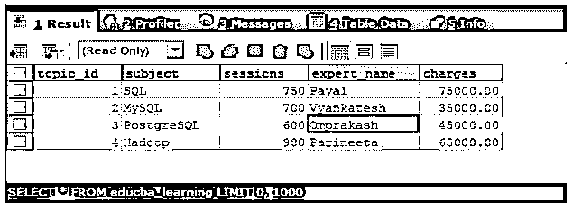
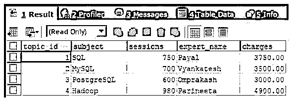

# SQL 更新联接

> 原文：<https://www.educba.com/sql-update-join/>

## SQL 更新联接简介

SQL Update Join 语句用于更新 SQL 中特定表的记录的列值，该表涉及在两个或多个表之间执行的交叉连接所产生的值，这两个或多个表使用 update query 语句中的 inner 或 left join 子句进行连接，其中为原始表更新的列值可以被分配来自其他表的列值的值，这些列值是在 Update query 的 query 语句中连接的表。

**语法:**

<small>Hadoop、数据科学、统计学&其他</small>

`UPDATE table_to_update
JOIN
another_table1
ON table_to_update.column_name1 = another_table2.column_name2
[JOIN
another_table 2
ON table_to_update.column_name3 = another_table2.column_name4 ....] SET table_to_update.column_name5 = another_table.column_name6
[WHERE any_restrictions];`

table_to_update 是我们希望更新其列值的原始表的名称。另一个 _table 是表的名称，我们必须根据某些匹配的列值将该表与原始表连接，这些值在连接的 on 子句中指定。该联接可以是内联接，也可以是左联接。在 query 语句中定义了与多个表的连接之后，应该在 SET 语句中指定我们希望分配给原始表的列的值。我们可以根据需要设置任意多的 table_to_update 表的列值，并将可能来自其他连接表的列值赋给它们。

### 在 SQL 中使用更新连接

*   当用 SQL 编写一个简单的 update 语句时，我们可以更新一个表的记录，并将我们想要的值分配给该表的列，在该表中，我们可以通过在 where 子句中指定条件来更新所有或部分列。
*   但是在我们希望将一个表的列值分配给另一个表的列值的情况下，我们可以使用 update join 语句。
*   请注意，在 update join 语句中，一次只能更新单个表中的列。优点在于分配不同表中的列值。
*   更新连接既可以使用考虑两个表的公共匹配记录的内部连接，也可以使用在更新时考虑左侧表和匹配记录的所有记录的左连接。
*   通过在 where 子句中指定条件，我们可以更新 update join 查询中的全部或部分记录。

### SQL 更新连接的示例

出于演示目的，让我们创建两个名为 educba_writers 和 educba_learning 的表。我们将使用下面的 create table 查询来创建表。educba_writers 表将包含所有作者的姓名，这些作者将编写学习 educba_learning 表中提到的科目所需的学习材料。

首先，我们将使用以下查询语句创建 educba_writers 表:

**代码:**

`CREATE TABLE `educba_writers` (
`id` int(11) NOT NULL,
`firstName` varchar(10) COLLATE latin1_danish_ci NOT NULL,
`rate` decimal(5,2) DEFAULT NULL,
`joining_date_time` datetime DEFAULT NULL
);`

**输出:**

现在，我们将使用以下查询语句创建 educba_ learning 表:

**代码:**

`CREATE TABLE `educba_learning` (
`topic_id` int(11) NOT NULL,
`subject` varchar(100) DEFAULT NULL,
`sessions` int(5) DEFAULT '0',
`expert_name` varchar(100) DEFAULT NULL,
`charges` decimal(7,2) DEFAULT '0.00'
);`

**输出:**

让我们在两个表中插入一些记录。出于演示目的，我们将在 educba_writers 表中插入以下记录。

**代码:**

`INSERT INTO `educba_writers` (`id`, `firstName`, `rate`, `joining_date_time`) VALUES
(1, 'Payal', '750.00', '2020-05-28 16:02:34'),
(2, 'Vyankatesh', '700.00', NULL),
(3, 'Omprakash', '600.00', '2020-05-28 20:32:50'),
(4, 'Parineeta', '980.00', NULL);`

**输出:**

现在，我们将借助以下查询语句在 educba_learning 表中插入一些记录:

**代码:**

`INSERT INTO `educba_learning` (`topic_id`, `subject`, `sessions`, `expert_name`, `charges`) VALUES
(1, 'SQL', 750, 'Payal', '75000.00'),
(2, 'MySQL', 700, 'Vyankatesh', '35000.00'),
(3, 'PostgreSQL', 600, 'Omprakash', '45000.00'),
(4, 'Hadoop', 980, 'Parineeta', '65000.00');`

**输出:**

让我们从两个表中检索记录，并研究它们的内容。为此，我们将使用下面提到的简单 select 语句:

**代码:**

`SELECT * FROM educba_writers;`

**输出:**

现在，我们将使用以下语句检索 educba_learning 表的记录:

**代码:**

`SELECT * FROM educba_learning;`

**输出:**

现在，假设我们想要用等于 educba_writers 表的 rate 列的列值乘以 5 的值来更新 educba_learning 表的 charges 列。为此，我们首先需要根据 educba_writers 表中作者的名字和 educba_learning 表中的专家姓名列来连接这两个表。然后我们可以看到 educba_writers 表的 rate 列值乘以 5，并将其设置为 educba_learning 表的 charges 列。我们将在这里使用 inner join 和 update join 语句，通过以下查询语句将 educba_writers 表列的值分配给 educba_learning 的列值:

**代码:**

`UPDATE educba_learning
INNER JOIN educba_writers
ON educba_learning.expert_name = educba_writers.firstName
SET educba_learning.charges = (educba_writers.rate * 5);`

**输出:**

让我们使用下面的 select 语句检索 educba_learning 表的记录，并观察更新查询引起的变化。

**代码:**

`SELECT * FROM educba_learning;`

**输出:**

我们可以从输出中看到，SQL subject 的费用是 Payal writer 的费率 750 * 5，相当于分配给 SQL subject 的 3750。同样，您可以交叉验证其他记录的费用列值。

### 结论

我们可以在 SQL 中使用 update join 语句来更新一个表的列的记录，并通过对它们执行 join 来为它们分配值，这些值可以是从其他表的记录的列值派生的列值或表达式。在本文中，我们已经看到了如何在 SQL 中使用 update join，它的实现，与简单的 update 语句的比较，以及将 update join 与 left join 和 inner join 一起使用，并通过一些示例来阐明实现概念。

### 推荐文章

这是一个 SQL 更新连接指南。这里我们分别用实例讨论 SQL 中 update join 的介绍、工作原理。您也可以看看以下文章，了解更多信息–

1.  [SQL 删除行](https://www.educba.com/sql-delete-row/)
2.  [SQL MID](https://www.educba.com/sql-mid/)
3.  [SQL 克隆表](https://www.educba.com/sql-clone-table/)
4.  [SQL 按多列分组](https://www.educba.com/sql-group-by-multiple-columns/)

