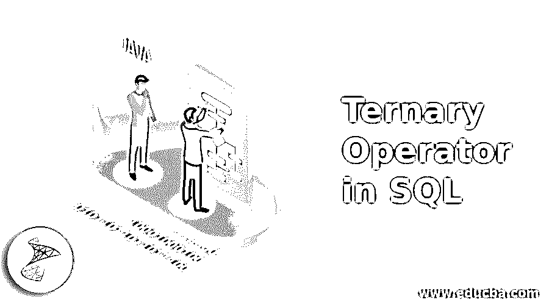
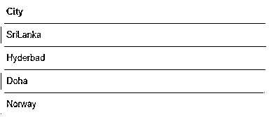

# SQL 中的三元运算符

> 原文：<https://www.educba.com/ternary-operator-in-sql/>

## SQL 中三元运算符简介

在本文中，我们将看到如何使用三元运算符，不幸的是，SQL 不支持三元运算符，因此我们将看到一种替代条件运算符的方法来处理 SQL。带有条件表达式的三元运算符执行现实生活中的场景，比如针对不同的条件执行不同的操作。SQL 中的三元运算符也称为条件运算符，可以定义为许多编程语言中的唯一决策运算符。Case 表达式可以扩展为三元运算符的推广。换句话说，我可以说这是在查询中使用 if-else 和嵌套 If-Else 语句的一种简化方式。它被称为三元的，因为它接受三个元素(条件、true 语句和 false 语句)，这三个元素接受一个条件并产生两个结果 true 或 False，它接受任何数据类型作为值。它带有 Select 语句以及 Where、Group By、Order By 子句。

### 句法

三元运算符的基本语法如下所示:

<small>Hadoop、数据科学、统计学&其他</small>

`(condition)? (First statement): (Second Statement);`

Where condition 表示在计算条件时，如果语句为 true，将执行第一条语句。

### 三元运算符在 SQL 中是如何工作的？

作为三元运算符替代的是 CASE 语句和 IF()，我们就用它吧。让我们在下一节中详细了解这个主题。有两种不同的情况可以实现三元运算符逻辑。有些版本会使用 case，if，when，then。基于相应条件的值进行选择。

这些案例是:

1.  使用 CASE 语句
2.  使用 IF 函数

`IF(Statement expression, Result for true ,  result)`

**Case 表达式:**这是一个简单的语句，在查询中至少使用一个 WHERE 和 THEN 语句，最后应该以 end 语句结束。默认组件被选择，在这种情况下进行得很好。该表达式检查表中的每一行，以满足条件 true。然而，SQL 的三元运算符有一个非常灵活的类似 Case 表达式。下面显示了语法的一般形式。这是单一 case when 语句的语法。

`CASE WHEN expression statement THEN <true statement result> ELSE <false statement _result> END`

上述语法将给定的表达式语句与 WHEN 子句的值进行比较，并在连续比较后显示第一个 true 语句。不计算下一条 ELSE 语句。在另一种情况下，当表达式语句返回 false 值或者在某些情况下对于 WHEN 子句为 NULL 时，它返回 else false 语句。

当扩展到 CASE 语句中的多个条件时也是如此，该语句给出如下语法:

`SELECT (CASE WHEN (condition 1 exp) THEN  ( true statement ) WHEN (condition2 exp) THEN ( true statement )  ELSE( false statement ) END) AS "Conditional_ex"  FROM table;`

它评估条件语句并执行第一个结果，剩余的 where 子句不执行。如果第一个 when 为假，则评估相应的条件 2。您还可以在 case 表达式中使用多个 when-then 对。

### 在 SQL 中实现三元运算符的例子

在本节的其余部分使用下表查看示例。

#### 示例#1

用于创建表以实现 CASE 和 IF 语句的查询。

**代码:**

`CREATE TABLE empdb (
ed_id INT NOT NULL,
ed_name VARCHAR(20) NOT NULL,
ed_gender varchar (2),
PRIMARY KEY (ed_id),
UNIQUE (ed_name)
);
INSERT INTO empdb   (ed_id, ed_name ,ed_gender) VALUES
(01,'leslia','F'),
(02,'Britan','M'),
(03,'Grim Jen','M'),
(04,'Papus','F');
select * from empdb;`

**查询:**

`SELECT ed_name, (CASE WHEN ed_gender = 'M' THEN 'Prince' ELSE 'Princess' END) AS ed_gender  FROM empdb`

**输出:**

#### 实施例 2

下一个例子考虑新的桌面航线。

**代码:**

`CREATE TABLE Airline (
Aid INT NOT NULL,
Airlinename VARCHAR(20) NOT NULL,
service INT,
City varchar (20),
PRIMARY KEY (Aid),
UNIQUE (Airlinename)
);
INSERT INTO Airline
(Aid, Airlinename , Service ,City)
VALUES
(01,'Indigo', 15,'SriLanka'),
(02,'SpiceJet',12,'Hyderbad'),
(03,'Lufthansa',08,'Doha'),
(04,'AirIndia',21,'Delhi') ,
(05,'Emirates',18,'Norway');
select * from Airline;`

**查询:**

`SELECT Airlinename, City,
CASE
WHEN Service> 15 THEN 'Book Next week'
WHEN Service = 21 THEN 'Book Immediately'
ELSE 'no booking'
END AS Booking
FROM Airline;`

**输出:**

#### 实施例 3

**使用 IF 函数:**

该函数被视为 CASE 表达式的扩展，如果条件为真，则返回 true，否则返回 false。这个 IF()函数与 SQL 的 IF 语句完全不同。

`IF((condition), <value true statement>, <value false statement>)`

如果条件表达式的计算结果为正，那么如果它不为空，则执行第一个表达式的“值真”语句，否则，它返回“假值”。

在下一节中，我们将通过各种示例来了解 if 函数是如何实现的。我们走吧。

*   检查数字条件并以字符串形式返回结果。检查数值 5 和 10。如果 5 小于 12，则执行第一条语句“True”。

**代码:**

`SELECT IF(5<12, 'TRUE', 'FALSE');`

**输出:**

*   用数值检查

**代码:**

`SELECT IF(5 != 3,'true','false');…………………. Returns TRUE
SELECT IF(5 = 3,'true','false');………………….. Returns FALSE`

用 IF()比较两个字符串

`SELECT IF(STRCMP('Welcome to the Blog', 'blg')=0, 'TRUE', 'FALSE');`
T2】

**输出:**

*   检查数值条件并返回数值作为结果。

**代码:**

`SELECT IF(12 != 4, '1', '0');`

**输出:**

#### 实施例 4

让我们通过使用 IF()获取航空公司数据库来看看实现。

**代码:**

`SELECT Airlinename, City, Service, IF(Service>15, "MORE", "LESS") As NewStatus
FROM Airline;`

**输出:**

**Where 子句:**在 IF()中使用 Where 子句检查条件的真/假。

**代码:**

`SELECT City
FROM Airline
WHERE IF(`Service` = '21', 1, 0) = 1`

**输出:**

*   如果我们用 where condition = '0 '更改上面的查询，那么除了德里以外，其他城市都显示为相应的 to false condition = 0。

**代码:**

`SELECT City
FROM Airline
WHERE IF(`Service` = '21', 1, 0) = 00`

**输出:**

### 结论

因此，在文章的最后部分，我们看到了如何将三元运算符与 CASE 语句和 IF 语句交替使用，以完全满足条件语句。此外，我们还回顾了一些评估条件的示例。

### 推荐文章

这是一个 SQL 中三元运算符的指南。这里我们讨论 SQL 中三元运算符的介绍，它是如何工作的，代码和输出的例子。您也可以浏览我们的其他相关文章，了解更多信息——

1.  [Swift 运营商](https://www.educba.com/swift-operators/)
2.  [Windows 操作人员](https://www.educba.com/windows-operators/)
3.  [PostgreSQL IN 运算符](https://www.educba.com/postgresql-in-operator/)
4.  [SQL 逻辑运算符](https://www.educba.com/sql-logical-operators/)**T3】**

