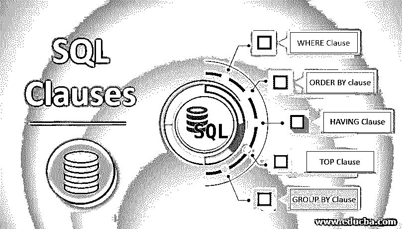
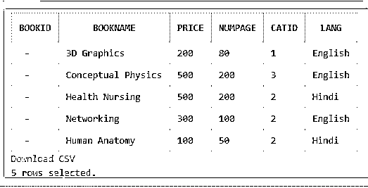
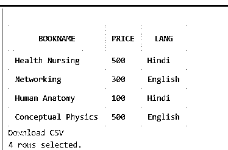
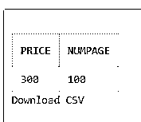
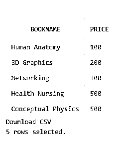
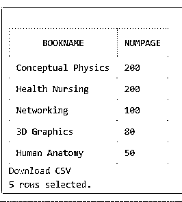
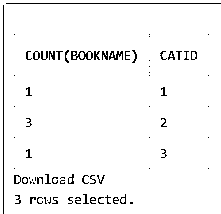
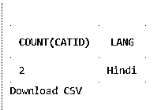
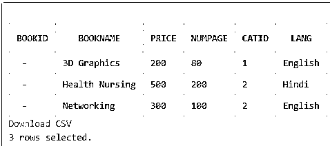

# SQL 子句

> 原文：<https://www.educba.com/sql-clauses/>

## SQL 子句介绍

MySQL 查询是帮助我们从数据库表中访问一组特定记录的 SQL 函数。我们可以使用子句或 SQL 语句从数据库中请求任何信息或数据。例如，SQL 子句接收一个条件表达式，该表达式可以是列名或涉及列的有效术语，它支持 MySQL 函数计算数据库中某个表的结果值。

MySQL 服务器中一般有五种 SQL 子句。它们列举如下:

<small>Hadoop、数据科学、统计学&其他</small>

*   WHERE 子句
*   ORDER BY 子句
*   HAVING 子句
*   顶部条款
*   GROUP BY 子句

### SQL 子句列表

下面给出了执行该语句的各种 SQL 子句:

#### 1.SQL WHERE 子句

在 MySQL 中，我们使用 SQL SELECT 语句从数据库的表中选择数据。这里，WHERE 子句允许过滤与指定条件完全匹配的某些记录。因此，它帮助我们从数据库中只获取满足给定表达式条件的必要数据。WHERE 子句与 SELECT 语句以及 UPDATE、DELETE type 语句和聚合函数一起使用，以限制表要检索的记录数。我们也可以使用逻辑或比较运算符，如 LIKE、、=等。用 WHERE 子句来满足某些条件。

**查询:**

`SELECT Column1,….ColumnN From Table_name WHERE [condition];`

例如，我们考虑将名为 Books 的表作为演示:

从该表中获取记录的查询:

**查询:**

`SELECT BookName, Price, Lang From Books WHERE CatID >1;`

**输出:**

在上面的示例中，我们使用 WHERE 子句从表中提取行，其中 CatID 大于 1。

**查询:**

`SELECT Price, NumPage From Books WHERE BookName=’Networking’;`

**输出:**

#### 2.SQL ORDER BY 子句

ORDER BY 子句在 SQL 中用于对记录进行排序。它用于按升序或降序排列结果集。当我们使用 SELECT 语句查询时，结果不是有序的。因此，当我们将 SELECT 语句与 ORDER BY 子句结合使用时，可以对结果行进行排序。

**查询:**

`SELECT column1, …,columnN FROM TableName ORDER BY column1,...,column  ASC|DESC;`

我们在查询中为列名添加 ASC 表示升序，DSC 表示降序，以有序的形式显示结果行。

**查询:**

`SELECT BookName, Price From Books ORDER BY Price ASC;`

**输出:**

结果表中的列按升序排序，下表按降序返回。

`SELECT BookName, NumPage From Books ORDER BY NumPage DESC;`

**输出:**

#### 3.SQL GROUP BY 子句

GROUP BY 子句用于对结果集中具有相同值的行进行分组。例如，如果我们从按 CatID 分组的表中找到书籍的名称。

**查询:**

`SELECT Column FROM Table WHERE condition GROUP BY Column [ORDER BY Column];`

该子句通常与允许按多列对查询结果行进行分组的聚合函数一起使用。聚合函数有计数、最大值、最小值、总和、AVG 等。

我们有以下例子:

`SELECT COUNT(BookName), CatID From Books GROUP BY CatID;`

**输出:**

SQL GROUP BY 子句通过对表的列应用函数来返回聚合值。上面的屏幕截图显示了按 CatID 分组返回的结果，其中获取了那些 CatID 中存在的图书名称的编号。

#### 4.SQL HAVING 子句

实际上，引入这个子句是为了在带有 WHERE 子句的查询中应用函数。在 SQL 中，添加了 HAVING 子句，因为 WHERE 子句不能应用于聚合函数。

**查询:**

`SELECT Column FROM Table WHERE condition GROUP BY Column HAVING condition [ORDER BY Column];`

我们还可以将 HAVING 子句与逻辑运算符一起使用，例如 OR 和 and。

让我们考虑下面的 SQL 语句来学习该子句:

`SELECT COUNT (CatID), Lang From Books GROUP BY Lang HAVING COUNT(CATID) <3;`

**输出:**

这里返回结果表，其中列按 Lang 分组，行数受 HAVING 子句的限制，条件是 CatID 应小于 3。

#### 5.SQL TOP 子句

TOP 子句用于确定结果中显示的记录行数。此 TOP 子句与 SELECT 语句一起使用，该语句专门在包含许多记录的大型表上实现。但是该子句在许多数据库系统中不被支持，例如 MySQL 支持 LIMIT 子句来选择有限的行数，而在 Oracle 中使用 ROWNUM。

**进行 SQL Server / MS 访问**查询** :**

`SELECT TOP no|percentage ColumName(s) FROM TableName WHERE condition;`

**MySQL **查询** :**

`SELECT ColumnName(s) FROM TableName WHERE condition LIMIT no;`

**甲骨文**查询** :**

`SELECT ColumnName(s) FROM TableName WHERE ROWNUM <= no;`

例如，我们可以通过这些 SQL 语句来解释该子句，其中我们可以使用带有 SELECT 和 where 的 TOP 子句针对不同的数据库平台返回行:

`SELECT TOP 3 * FROM Books;
SELECT * FROM Books LIMIT 3;
SELECT * FROM Books WHERE ROWNUM <= 3;`

**输出:**

### 结论

这些 SQL 子句通过应用描述条件的任何过滤器，以多种方式支持 MySQL 数据库访问和数据提取，如果条件符合要求，那么我们将获得特定的结果行。这里，不使用来自不满足条件的表的信息。我们不得不处理许多大型数据库，这些数据库如今用于许多领域，如电子商务购物、银行部门、管理、教育和其他数字领域，其中存储了大量信息，需要不时地检索。因此，通过 SQL 语句、函数、操作符和关键字与 SQL 子句的组合，使得信息访问适当且可管理，以处理数据库中的不同表。

### 推荐文章

这是 SQL 子句的指南。在这里，我们讨论介绍和各种 SQL 子句，以及各自的示例和实现。您也可以阅读以下文章，了解更多信息——

1.  [SQL WHERE 子句操作](https://www.educba.com/sql-where-clause/)
2.  [SQL HAVING 子句简介](https://www.educba.com/sql-having-clause/)
3.  [浏览 Oracle 子句列表](https://www.educba.com/oracle-clauses/)
4.  [MySQL 中插入命令的语法](https://www.educba.com/insert-in-mysql/)

