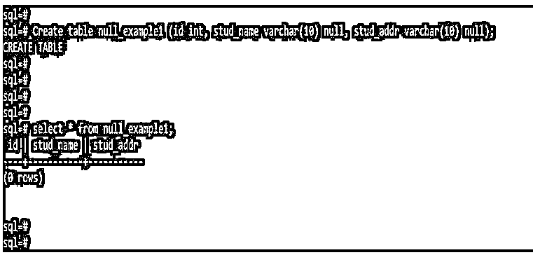

# SQL 空值

> 原文：<https://www.educba.com/sql-null-values/>


## SQL 空值简介

SQL 空值只是列字段，它不包含任何值。如果假设应用程序中有一个字段是可选的，我们将这个字段创建为 null，接受 null 值。这个空字段将在 SQL 中保存为空值。它不同于零或包含空格的域；它没有任何值。

### 什么是 SQL 空值？

*   SQL null values 关键字用于表示缺少的值。表中的 SQL 空值包含空白字段。我们可以说，如果一个字段不包含任何值，这个字段就有空值。
*   在 RDBMS 系统中，空值表示未知值。我们经常在 SQL 表中看到哪个字段不包含任何值；在录入的时候，我们还没有填写这个字段；此后，该字段将在数据库中显示为空值。SQL 支持空值。

### SQL 空值是如何工作的？

空值只是一个不包含任何数据的字段。

<small>Hadoop、数据科学、统计学&其他</small>

下面的语法显示了我们如何通过使用 sql 空值来处理选择查询:

**语法:**

```
Select name_of_column1, name_of_column2, …name_of_columnN from name_of_table where name_of_column = NULL;
```

在上面的语法中，我们可以看到我们已经定义了表中的所有列，并且在一个包含空值的列上使用了 where 条件。

**代码:**

```
select * from sql_insert1 where id = NULL;
```

**输出:**


而使用上述语法将返回空 resultset，因为所有字段在我们的列中都不包含空值。

我们可以使用 null 条件来返回包含 null 值的行。

下面是 SQL is null 值的语法如下:

**语法:**

```
Select name_of_column1, name_of_column2, …name_of_columnN from name_of_table where name_of_column is NULL;
```

在下面的查询中使用上述语法将返回其列包含空值的行。

在下面的示例中，我们使用 where 条件中的 stud_grade 列从 stud_grade 列中检索包含空值的行。

**代码:**

```
select * from sql_insert1 where stud_grade is NULL;
```

**输出:**


我们还可以通过使用 isnull 这样的函数来处理空值。该函数将两个参数作为输入。

下面是 IS null 函数的语法:

**语法:**

```
ISNULL(expr, replacement)
```

在处理空值时，我们也可以使用 coalesce 函数。该函数接受无限制参数的输入，并返回第一个非空值作为输出。

以下是 coalesce 函数的语法:

**语法:**

```
Coalesce(val1, val2, vale3, …, valN)
```

下面是 coalesce 函数的例子；使用 SQL 时，空值如下。

下面的示例将返回 5 作为输出，因为它首先作为非空值出现。5 不是我们用 coalesce 函数提供的列表中的空值。

**举例:**

**代码:**

```
select COALESCE(null, null, null, null, 5, null, 10, 15, null);
```

**输出:**


在下面的示例中，我们在 stud_grade 列上使用了 coalesce 函数。因此，我们可以看到它将返回如下非空值。

**代码:**

```
Select coalesce (stud_grade) from sql_insert1 where id = 1001;
```

**输出:**


如果假设我们在创建表时没有定义 not null 约束，默认情况下，表列是用 null 约束创建的。

以下示例显示了默认情况下使用空约束创建的表列。

**代码:**

```
Create table null_example (id int NOT NULL, name varchar(10));
Insert into null example values (101);
```

**输出:**


上面的例子表明我们在创建 name 列时没有使用任何约束。但是在向表中插入值时，我们没有使用任何值来命名列；行被插入到表中，因为默认情况下，表列是用 null 约束创建的。

下面的语法显示了我们如何在创建表时定义空约束，如下所示:

**语法:**

```
Create table name_of_table (name_of_column datatype NULL, name_of_column datatype NULL, name_of_column datatype NULL);
```

下面的示例显示了我们必须如何创建一个对列有 null 约束的表。

在下面的示例中，我们在 stud_name 和 stud_addr 列上创建了一个 null 约束。我们没有在 id 列上定义任何约束；该列将创建一个空约束。

**代码:**

```
Create table null_example1 (id int, stud_name varchar(10) null, stud_addr varchar(10) null);
```

**输出:**




### SQL 空值计数和列

众所周知，count 函数用于计算表中行数。此外，我们可以根据查询中使用的指定条件对行数进行计数。

我们使用下面的查询来计算表中的行数。

**代码:**

```
Select count(*) from sql_insert1;
```

**输出:**


上面的示例显示，它将检索所有非空行和空行的计数。假设我们想找到只有空值的计数；我们使用下面的查询。

以下查询正在检索 not null 的计数和 null 值的计数。

**代码:**

```
SELECT SUM (CASE WHEN stud_grade is null THEN 1 ELSE 0 END) AS Null_values , COUNT(stud_grade) AS Non_Null FROM sql_insert1;
```

**输出:**


上面的示例显示，它将检索 null 值的计数为 7，非 null 值的计数为 5。

在使用带有 null 约束的列时，我们检索包含 null 的所有值。

在下面的示例中，我们可以看到，我们正在从 stud_phone 和 stud_addr 列中检索 stud_grade 列的值为 null 的所有值。

**代码:**

```
SELECT stud_grade, stud_phone, stud_addr FROM sql_insert1 WHERE stud_grade IS NULL; 
```

**输出:**


### 结论

SQL null values 关键字用于表示缺少的值。SQL 空值只是不包含任何值的列字段。如果假设应用程序中有一个字段是可选的，我们将这个字段创建为 null，接受 null 值。

### 推荐文章

这是一个 SQL 空值指南。这里我们分别讨论简介、工作和 SQL 空值计数和列。您也可以看看以下文章，了解更多信息–

1.  [desc 的 SQL 订单](https://www.educba.com/sql-order-by-desc/)
2.  [SQL 执行](https://www.educba.com/sql-execute/)
3.  [SQL 排除](https://www.educba.com/sql-exclude/)
4.  [MySQL InnoDB 集群](https://www.educba.com/mysql-innodb-cluster/)


