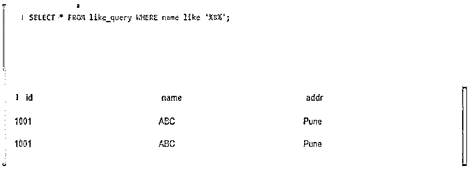
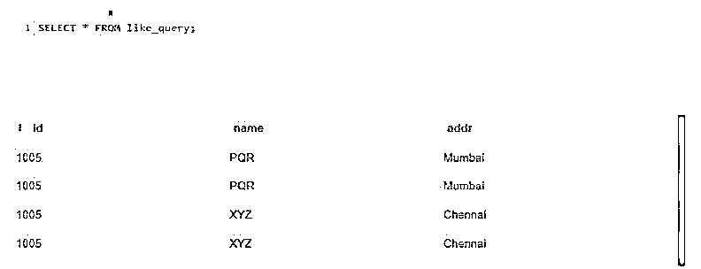
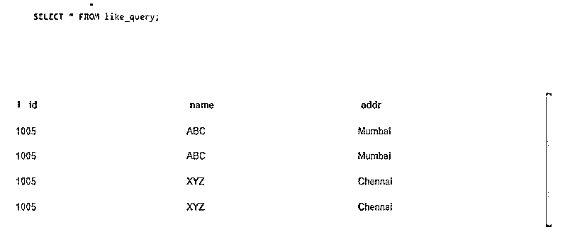
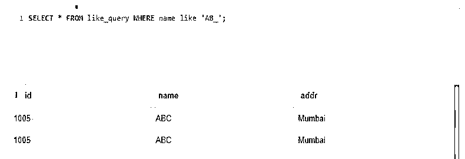
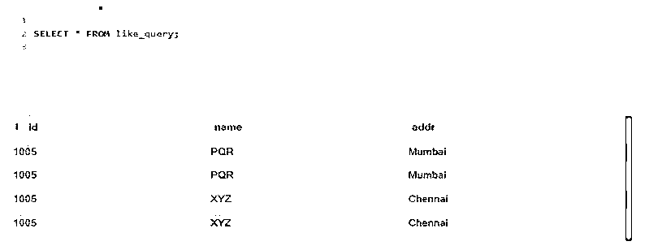

# 类似 SQL 的查询

> 原文：<https://www.educba.com/sql-like-query/>


## SQL LIKE 查询简介

SQL LIKE 查询在 where 子句中用于从表中查找指定的列数据。它将确定查询中使用的指定字符串将与指定模式匹配。我们可以包括像通配符和常规字符这样的模式。当匹配模式时，常规字符将匹配查询中使用的指定字符串。

### SQL LIKE 查询概述

我们大部分时间在 select 查询中使用它，根据我们在查询中使用的指定模式来查找记录。

<small>Hadoop、数据科学、统计学&其他</small>

我们使用类似 sql 的查询和不同类型的通配符操作符。我们通过使用 sql like 查询来使用下面的通配符运算符。

*   **百分比(%):** 这种类型的通配符表示一个、零个或多个字符。
*   **下划线(_):** 这种类型的通配符只代表一个字符。它将只接受我们在模式中使用的单个字符。
*   **[]:** 这种类型的通配符运算符来自指定范围的单个字符的值。
*   **^:** 这种类型的通配符用于我们尚未在范围列表中定义的单个字符。

下面是使用 select 查询的 SQL 的语法。

**语法:**

```
Select name_of_column from name_of_table where name_of_column like ‘xxx%’;
```

```
Select name_of_column from name_of_table where name_of_column like ‘%xxx%’;
```

```
Select name_of_column from name_of_table where name_of_column like ‘%xxx’;
```

```
Select name_of_column from name_of_table where name_of_column like ‘xxx_’;
```

```
Select name_of_column from name_of_table where name_of_column like ‘_xxx_’;
```

```
Select name_of_column from name_of_table where name_of_column like ‘_xxx’;
```

下面是使用删除查询的语法。

**语法:**

```
Delete from name_of_table where column_name like ‘xxx%’;
```

```
Delete from name_of_table where column_name like ‘%xxx%’;
```

```
Delete from name_of_table where column_name like ‘%xxx’;
```

```
Delete from name_of_table where column_name like ‘xxx_’;
```

```
Delete from name_of_table where column_name like ‘_xxx_’;
```

```
Delete from name_of_table where column_name like ‘_xxx’;
```

下面是使用更新查询的语法。

**语法:**

```
Update name_of_table set name_of_column = ‘values’ where name_of_column like ‘xxx%’;
```

```
Update name_of_table set name_of_column = ‘values’ where name_of_column like ‘%xxx%’;
```

```
Update name_of_table set name_of_column = ‘values’ where name_of_column like ‘%xxx’;
```

```
Update name_of_table set name_of_column = ‘values’ where name_of_column like ‘xxx_’;
```

```
Update name_of_table set name_of_column = ‘values’ where name_of_column like ‘_xxx_’;
```

```
Update name_of_table set name_of_column = ‘values’ where name_of_column like ‘_xxx’;
```

在上面的语法中，我们已经定义了 SQL，比如 select、update 和 delete 查询。与=和相比，选择、删除和更新查询非常容易使用 SQL！=比较运算符。

从表中找到指定的模式记录是有价值和必要的。

### 使用类似 SQL 的查询

我们可以用它通过使用指定的模式来找到匹配的字符串。

*   我们可以使用它来选择、删除和更新模式中指定的记录。
*   假设我们想从表中删除指定模式的记录，那么与=和相比，这是最佳选择！=运算符。
*   假设我们想从表中选择一个指定的记录模式，那么与=和相比，这是最佳选择！=运算符。
*   假设它与 where 子句和 select、delete 和 update 语句相结合。

在下面的例子中，我们使用一个类似 sql 的选择查询。

在下面的例子中，我们可以看到我们使用了一个带有 like 条件的 select 查询作为% B %它将显示中间字母包含 b 的所有结果。

**代码:**

```
select * from like_query where name like '%B%';
```

**输出:**




下面的例子显示了我们如何使用类似 sql 的查询。

在下面的例子中，我们使用一个类似 sql 的删除查询。在下面的例子中，我们可以看到我们使用了一个删除查询，like 条件为% B %它将删除中间字母包含 b 的所有结果。

**代码:**

```
Delete from like_query where name like '%B%';
Select * from like_query;
```

**输出:**





在下面的例子中，我们使用一个类似 sql 的更新查询。

在下面的例子中，我们可以看到我们使用了一个更新查询，like 条件为 P %；它将更新中间字母包含 p 的所有结果。

**代码:**

```
Update like_query set name = ‘ABC’ where name like 'P%';
Select * from like_query;
```

**输出:**





### 类似 SQL 的查询示例

下面提到了不同的例子:

#### 示例#1

下面是类似 SQL 的 select 查询示例。

在下面的例子中，我们使用了%和下划线通配符。

**代码:**

```
select * from like_query where name like '%B%';
select * from like_query where name like 'A%';
select * from like_query where name like '%C';
select * from like_query where name like '_B_';
select * from like_query where name like '_BC';
select * from like_query where name like 'AB_';
```

**输出:**





#### 实施例 2

下面是带有更新查询的类似 SQL 的示例。

在下面的例子中，我们使用了%和下划线通配符。

**代码:**

```
Update like_query set name = ‘PQR’ where name like 'A%';
Update like_query set name = ‘PQR’ where name like '%B%';
Update like_query set name = ‘PQR’ where name like '%C';
Update like_query set name = ‘PQR’ where name like 'AB_';
Update like_query set name = ‘PQR’ where name like '_BC';
Update like_query set name = ‘PQR’ where name like '_B_';
Select * from like_query;
```

**输出:**





#### 实施例 3

下面是带有删除查询的类似 SQL 的例子。

在下面的例子中，我们使用了%和下划线通配符。

**代码:**

```
Delete from like_query where name like '%Q%';
Delete from like_query where name like '_Q_';
Select * from like_query;
```

**输出:**


### 结论

我们在选择、更新和删除查询中使用它。它用于 where 子句从表中查找指定的列数据。它将确定查询中使用的指定字符串将与指定模式匹配。

### 推荐文章

这是一个类似 SQL 的查询指南。我们讨论了简介、概述和使用 SQL LIKE 查询的例子。您也可以看看以下文章，了解更多信息–

1.  [desc 的 SQL 订单](https://www.educba.com/sql-order-by-desc/)
2.  [SQL 执行](https://www.educba.com/sql-execute/)
3.  [PL/SQL 不等于](https://www.educba.com/pl-sql-not-equal/)
4.  [SQL 不在](https://www.educba.com/sql-not-in/)中


