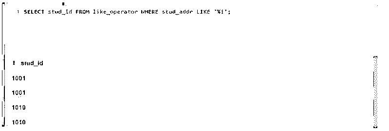
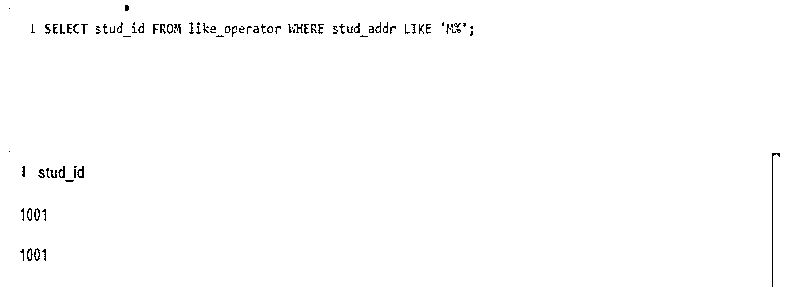
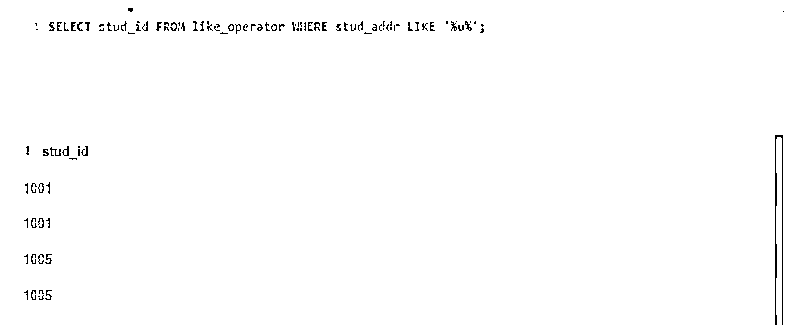
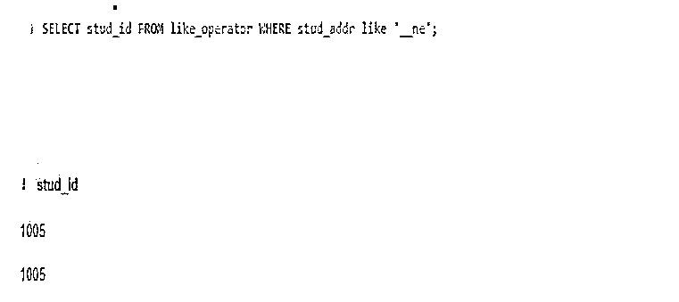
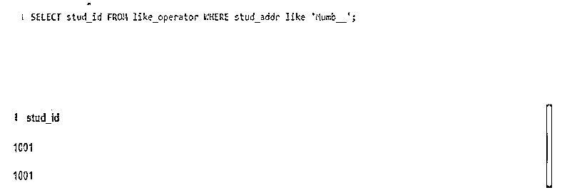
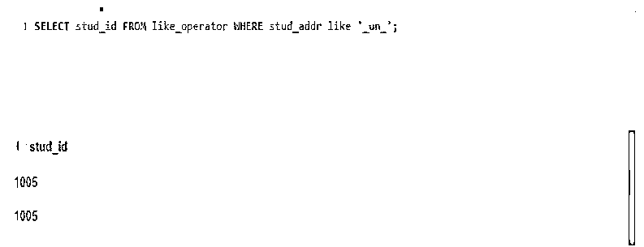
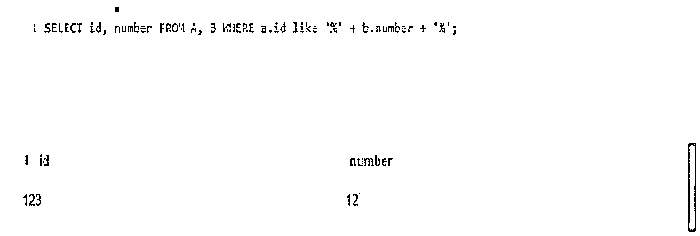

# SQL LIKE 运算符

> 原文：<https://www.educba.com/sql-like-operator/>


## SQL LIKE 运算符简介

SQL LIKE 运算符与 where 条件一起使用，通过使用我们在查询中定义的模式来过滤表数据。我们可以对日期、字符串和数字值使用类似 SQL 的操作符，但是 SQL 推荐的类似操作符需要对字符串值使用。like 运算符在 MySQL、MSSQL 和 SQLite 数据库中不区分大小写，但在 PostgreSQL 和 Oracle 数据库中区分大小写。

### SQL LIKE 运算符是什么？

*   ISO 和 ANSI 标准运算符将一列值与另一列值进行比较。我们还可以使用 like 操作符来比较引用的字符串。
*   它支持不同种类的引用字符串通配符。此外，它将允许我们搜索指定模式的基于文本的字符串。
*   它与 select、update 和 delete SQL 语句中的 where 子句一起使用。我们可以使用任何通配符从查询中定义的列中查找指定的模式数据。

### SQL LIKE 运算符模式

它使用以下通配符来指定 like 运算符的模式，如下所示。

<small>Hadoop、数据科学、统计学&其他</small>

#### 1.百分比(%)

该模式将匹配一个、零个或多个字符或数字。

下面是类似百分比运算符模式的语法。

**语法:**

```
Select name_of_column from name_of_table where name_of_column like ‘xxx%’;
```

```
Select name_of_column from name_of_table where name_of_column like ‘%xxx%’;
```

```
Select name_of_column from name_of_table where name_of_column like ‘%xxx’;
```

以下是百分比模式的示例。

**代码:**

```
Select stud_id from like_operator where stud_addr like ‘%i’;
Select stud_id from like_operator where stud_addr like ‘M%’;
Select stud_id from like_operator where stud_addr like ‘%U%’;
```

**输出:**










#### 2.下划线(_)

该模式将匹配一个字符或数字。

下面是类似下划线的操作符模式的语法。

**语法:**

```
Select name_of_column from name_of_table where name_of_column like ‘xxx_’;
```

```
Select name_of_column from name_of_table where name_of_column like ‘_xxx_’;
```

```
Select name_of_column from name_of_table where name_of_column like ‘_xxx’;
```

下面是下划线模式的示例。

**代码:**

```
Select stud_id from like_operator where stud_addr like ‘__ne’;
Select stud_id from like_operator where stud_addr like ‘Mumb__’;
Select stud_id from like_operator where stud_addr like ‘_un_’;
```

**输出:**










#### 3\. []

这个模式将匹配一个字符。所以，假设我们有一个定义好的模式，比如' P[e，n，u]，'这个字符串将匹配 Pune 字符串。

下面是[]模式的语法。

**语法:**

```
Select name_of_column from name_of_table where name_of_column like ‘P[e, n, u]’;
```

下面是[]模式的例子如下。

**代码:**

```
Select stud_id from like_operator where stud_addr like 'P[n, e, u]';
```

**输出:**


#### 4\. [^]

该模式将匹配除指定范围之外的每个字符。例如，'P[^u，e，n '该字符串匹配以 p 开头的所有内容，但不匹配包含 u，e 和 n 个字母的字符串。

下面是[]模式的语法。

**语法:**

```
Select name_of_column from name_of_table where name_of_column like ‘P[^e, n, u]’;
```

下面是[]模式的例子如下。

**代码:**

```
Select stud_id from like_operator where stud_addr like 'P[^n, e, u]';
```

**输出:**


### SQL LIKE 运算符表

它也用于两个表。我们可以连接两个表，并在连接后对其使用 like 操作符。该表与我们在单个列上使用的 normal-like 操作符略有不同。表在两个不同的表上定义查询 like 运算符。

下面是如下的语法。

**语法:**

```
Select name_of_column1, name_of_column2, …, name_of_columnN from name_of_table1, name_of_table2 where table_name.column_name like ‘%’ + table_name.column_name like ‘%’
```

在上面的语法中，我们使用了两个表。因此，我们匹配两个表中的标准列，以从两个表中检索记录。

我们还可以使用该列中的所有表从指定的列中检索匹配的记录，这将应用于两个表列。

下面是如下的例子。

**举例:**

**代码:**

```
select id, number from A, B where a.id like '%' + b.number + '%';
```

**输出:**




### 类似 SQL 脚本的运算符

SQL DB 系统中使用类似 SQL 脚本的操作符。类似 SQL 脚本的操作符将提取并匹配指定的模式数据。类似 SQL 脚本的操作符在我们的数据表上执行大型查询。我们可以通过使用类似 SQL 脚本的操作符来简化复杂的查询。我们使用类似 SQL 脚本的操作符来提高查询性能。当使用通配符时，结果明显更快。SQL 通配符已经在 SQL 中与类似脚本的运算符一起使用。我们的数据库中使用了类似 SQL 脚本的操作符来操作通配符。当搜索复杂数据时，我们使用 SQL 通配符。

下面是一个类似 SQL 脚本的运算符示例，如下所示。

**举例:**

**代码:**

```
DECLARE @RuleName NVARCHAR (MAX)= 'SQL script like operator';
IF @RuleName LIKE 'SQL script 'SQL%'
PRINT 'Input';
ELSE
PRINT 'Output';
```

**输出:**


### 目录

我们使用不同类型的类似 SQL 的操作符。通配符运算符主要用于类似 SQL 的运算符。

通配符在类似 SQL 的操作符中起着至关重要的作用。

下面是类似 SQL 的通配符运算符列表，如下所示:

*   百分比(%)
*   下划线(_)
*   []
*   [^]

在我们的查询中使用类似 SQL 的操作符时，我们使用了上面所有的操作符。假设我们有一个定义好的模式，比如‘AB % ’;这个字符串将匹配 AB 字符串和 AB 字符串之后的所有字符串。假设我们有一个像' AB_ '这样的定义模式，这个字符串将匹配 AB 字符串和 AB 字符串后的一个字符。

### 结论

它支持不同种类的引用字符串通配符。它将允许我们搜索特定模式的基于文本的字符串。它与 where 条件一起使用，通过使用我们在查询中定义的模式来过滤表数据。

### 推荐文章

这是一个 SQL 类操作符的指南。这里我们讨论一下简介、SQL 类操作符模式、表格、脚本类操作符和列表。您也可以看看以下文章，了解更多信息–

1.  [desc 的 SQL 订单](https://www.educba.com/sql-order-by-desc/)
2.  [SQL 执行](https://www.educba.com/sql-execute/)
3.  [PL/SQL 不等于](https://www.educba.com/pl-sql-not-equal/)
4.  [SQL 不在](https://www.educba.com/sql-not-in/)中


