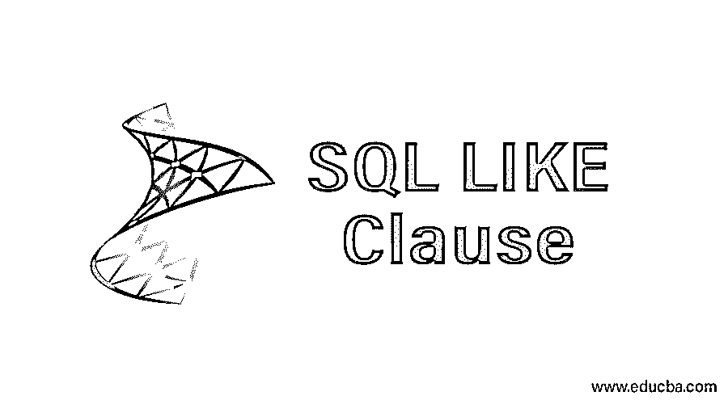
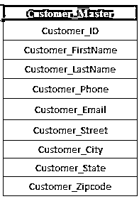
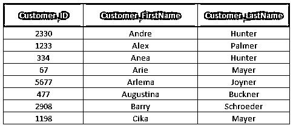
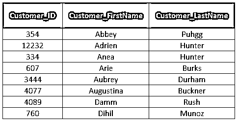
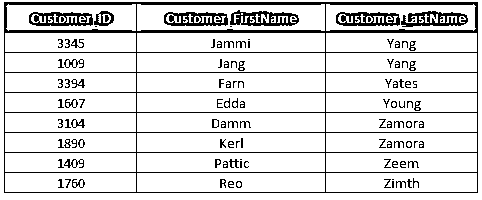
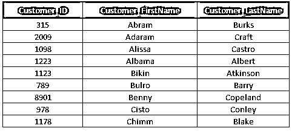
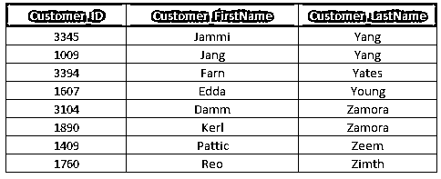
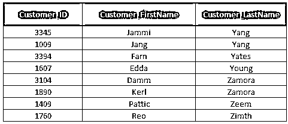

# SQL LIKE 子句

> 原文：<https://www.educba.com/sql-like-clause/>

## 什么是 SQL LIKE 子句？

一个 SQL 可以有多个条件语句，而“Like”就是这样一个可以与“Where”条件子句一起使用的条件。“Like”子句可以与两个运算符一起使用，即“%”和“_”。在某些应用中，可以用“？”代替“_”允许使用“*”，而不是“%”。这里，' % '用于代替一个或多个字符，而' _ '仅用于代替一个字符。

在 LIKE 子句中，有两个通配符组合使用，它们是

<small>Hadoop、数据科学、统计学&其他</small>

*   百分号(%)
*   下划线(_)

百分号代表零个、一个或几个字符。下划线代表不同的数字或字符。使用通配符是为了在查询中实现模式匹配。LIKE 条件将应用于 INSERT、DELETE、UPDATE 或 SELECT 语句的 WHERE 子句中。

**语法:**

LIKE 子句%和 _ 的基本语法如下

`SELECT * FROM table_name WHERE column LIKE 'X%'`

`SELECT * FROM table_name WHERE column LIKE '%X%'`

`SELECT * FROM table_name WHERE column LIKE 'X_'`

`SELECT * FROM table_name WHERE column LIKE '_X'`

`SELECT * FROM table_name WHERE column LIKE '_X_'`

通过使用 AND 或 or 运算符，我们可以组合许多条件，这里 X 可以是任何字符串或数值。

### LIKE 子句在 SQL 中是如何工作的？

LIKE 子句是一个逻辑运算符，它得出字符串与指定模式匹配的结论。模式匹配中包含常规字符和通配符。在 SQL Server 中，专门在 WHERE 子句中使用的 LIKE 运算符包括 SELECT、DELETE 和 UPDATE 语句，用于根据行模式匹配来检索数据。

**例题**

#### 1.类似 SQL SERVER

让我们看看 Customer_Master 的示例数据库，

#### 2.(百分比)%通配符

百分号通配符定义零个或多个字符的字符串。让我们看看例子

通过使用百分号通配符来查找或检索名字以字母 Z 开头的客户，

`Select Customer_Id, Customer_First Name,customer_Last Name
From Customer_Master
Where Customer_First Name Like 'z%'
Order by Customer_First Name;`

通过使用百分号通配符来查找或检索姓氏以字母结尾的客户，

`Select Customer_Id, Customer_First Name,customer_Last Name
From Customer_Master
Where Customer_Last Name Like '%er'
Order by Customer_First Name;`

要找出或检索姓氏以字母 t 开头、以字母 s 结尾的客户，

`Select Customer_Id, Customer_First Name,customer_Last Name
From Customer_Master
Where Customer_Last Name Like 't%s'
Order by Customer_First Name;`

#### 3.(下划线)_ 通配符

下划线定义单个字符。让我们看看下面的例子，

通过使用下划线通配符来检索第二个字符是字母 u 的客户，pattern _u%说明第一个下划线字符与单个字符匹配，第二个字母 u 与字母 u 完全匹配，第三个字符%表示字符序列。

`Select Customer_Id, Customer_First Name,customer_Last Name
From Customer_Master
Where Customer_Last Name Like '_U%'
Order by Customer_First Name;`

#### 4.[字符列表]通配符

字符列表指定特定集合内的单个字符，方括号与字符列表一起使用，例如[ABC]指定某个字符在哪个字符列表中出现。让我们看看这个例子，该语句返回客户的姓氏首字母以 Y 或 Z 开头的客户，

`Select Customer_Id, Customer_First Name,customer_Last Name
From Customer_Master
Where Customer_Last Name Like '[YZ]%'
Order by Customer_Last Name;`

#### 5.[字符-字符]通配符

字符到字符通配符指定指定范围内的字符。它只检索方括号内指定的字符范围，例如[A-C]显示范围内指定的字符。

让我们看看这个例子，该语句返回客户的姓氏首字母从 A 到 C 的客户，

`Select Customer_Id, Customer_First Name,customer_Last Name
From Customer_Master
Where Customer_Last Name Like '[A-C]%'
Order by Customer_First Name;`

#### 6.[^Character 列表或范围]通配符

带有(^)脱字符号的方括号中的字符列表或范围指定了不在字符列表或范围内的字符。让我们来看看这个例子，该语句返回客户记录，其中客户的姓氏首字母不应该是 A 到 X 范围内的字母，

`Select Customer_Id, Customer_First Name,customer_Last Name
From Customer_Master
Where Customer_Last Name Like '[^A-X]%'
Order by Customer_Last Name;`

**

** 

#### 7.不像操作员

NOT LIKE 运算符返回非字符的结果，例如，检索客户的记录，其中客户的名字不应以字母 A 开头，

`Select Customer_Id, Customer_First Name,customer_Last Name
From Customer_Master
Where Customer_First Name Not Like 'A%'
Order by Customer_First Name;`

### 优势和特点

*   LIKE 子句对于检索与特定模式匹配的记录很有用。
*   使用通配符“%”了解整个值。
*   百分比通配符(%)检索零个或多个字符的字符串。
*   下划线(_)通配符检索任意数量的单个字符。
*   [字符列表]通配符在指定的一组任意单个字符中进行检索。
*   [字符-字符]检索指定范围内的任何单个字符
*   [^Character 列表或范围]通配符检索不在字符列表或范围内的字符。

### 情况

*   SQL LIKE 条件允许您应用通配符来实现模式匹配语句。INSERT、DELETE、UPDATE 或 SELECT 语句的 WHERE 子句中应用的 LIKE 条件。
*   LIKE 条件在列匹配特定模式的情况下将结果返回为 TRUE。
*   若要反转 LIKE 条件的结果，请使用 NOT 运算符。

### 推荐文章

这是一个 SQL LIKE 子句的指南。这里我们讨论什么是 SQL LIKE 子句，SQL LIKE 子句的优点和特征，并给出例子。你也可以通过我们其他的推荐文章来了解更多。

1.  [SQL 中的表格](https://www.educba.com/table-in-sql/)
2.  [SQL 中的连接类型](https://www.educba.com/types-of-joins-in-sql/)
3.  [SQL 中的 Distinct 关键字](https://www.educba.com/distinct-keyword-in-sql/)
4.  [SQL 中的数据库](https://www.educba.com/database-in-sql/)

