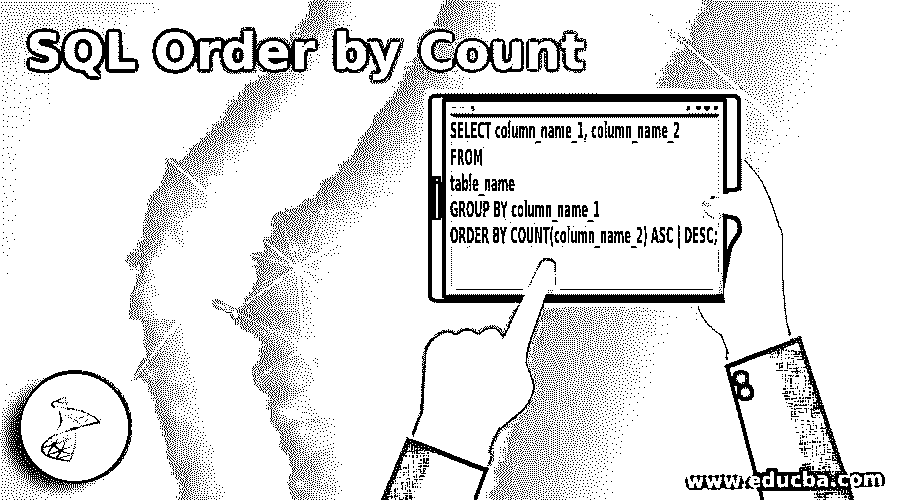
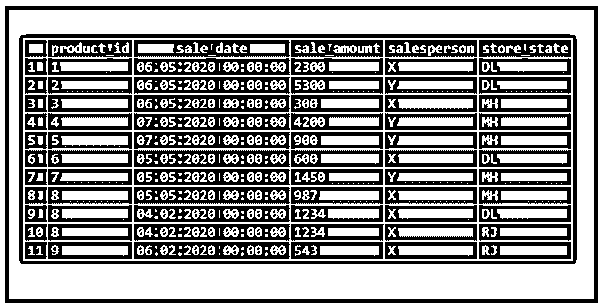
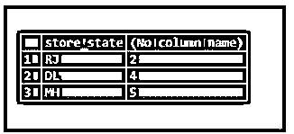
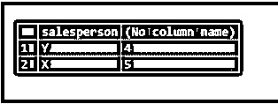

# SQL 按计数排序

> 原文：<https://www.educba.com/sql-order-by-count/>

## SQL Order by Count 简介

标准查询语言(SQL)中的 ORDER BY COUNT 子句用于根据从 COUNT 函数获得的值，按升序或降序对 SELECT 查询产生的结果集进行排序。对于外行来说，COUNT()函数用于查找结果集中的记录总数。它通常与 GROUP BY 子句结合使用，以准备每个组中记录总数的汇总。它还可以与 ORDER BY 子句一起使用，对获得的汇总表进行排序。

默认情况下，ORDER BY 语句按升序排列结果集。如果我们想按降序排序，那么我们可能必须特别提到 DESC 关键字。

<small>Hadoop、数据科学、统计学&其他</small>

尽管如此，我们将在后续部分中详细讨论 ORDER BY COUNT()。让我们从用于按 COUNT()对结果进行排序的语法和参数开始。

### 语法和参数

使用 ORDER BY COUNT()子句编写选择查询的基本语法如下:

`SELECT column_name_1, column_name_2
FROM
table_name
GROUP BY column_name_1
ORDER BY COUNT(column_name_2) ASC | DESC;`

上述语法中使用的参数如下:

`column_name_1, column_name_2, ..., column_name_n : columns or fields that have to be`

为最终结果集提取

*   **table_name:** 数据库表，必须从该表中提取上述列。
*   **GROUP BY column_name_1:** 结果集必须根据哪一列分组以便计数。
*   **COUNT(column_name_2):** 必须计算其值的列，然后将其用作 ORDER BY 子句的输入，以对结果集进行排序。
*   **ASC | DESC:** 按升序(ASC)或降序(DESC)排序的顺序

已经学习了用于编写 ORDER BY 子句的语法和参数，让我们尝试几个例子来详细理解这个概念。

### 按计数排序的 SQL 示例

为了说明 ORDER BY COUNT()语句的工作原理，让我们创建一个名为“product_details”的虚拟表。该表包含与销售相关的详细信息，如产品 id、销售日期等。一家百货商店。我们可以使用下面的 CREATE TABLE 语句来创建表。

`CREATE TABLE product_details
(
product_id integer NOT NULL,
sale_date date NOT NULL,
sale_amount numeric NOT NULL,
salesperson character varying(255) NOT NULL,
store_state character varying(255) NOT NULL,
);`

该表已成功创建。让我们在其中插入以下值来处理。使用给定的 insert 语句。

`INSERT INTO product_ details(
product_id, sale_date, sale_amount, salesperson, store_state)
VALUES (1,'2020-05-06', 2300,'X','DL'),
(2, '2020-05-06',5300,'Y','DL'),
(3, '2020-05-06',300,'X','MH'),
(4, '2020-05-07',4200,'Y','MH'),
(5, '2020-05-07',900,'Y','MH'),
(6, '2020-05-05',600,'X','DL'),
(7, '2020-05-05',1450,'Y','MH'),
(8, '2020-05-05',987,'X','MH'),
(8, '2020-02-04',1234,'X','DL'),
(8, '2020-02-04',1234,'X','RJ'),
(9, '2020-02-06',543,'X','RJ');
select * from product_details;`

现在，在 product_details 表的帮助下，我们将讨论几个基于 ORDER BY COUNT()的示例。

**COUNT()函数的基本功能**

`SELECT COUNT(*)
FROM product_details;`

COUNT()函数返回结果集中的总行数。

说明 ORDER BY COUNT()基本功能的 SQL 查询

#### 示例#1

找出每个销售人员的销售额，并从低到高排列。

`SELECT salesperson, count(product_id)
FROM product_details
GROUP BY salesperson
ORDER BY count(product_id);`

该查询首先按销售人员对结果进行分组，然后计算每个组对应的 product _ ids 的数量，最后根据 count()函数返回的值对结果集进行排序。

#### 实施例 2

找出每个销售人员的销售额，并从高到低排列结果。

`SELECT salesperson, count(product_id)
FROM product_details
GROUP BY salesperson
ORDER BY count(product_id) DESC;`

为了对给定的结果集进行降序排序，我们使用了 DESC 关键字。

#### 实施例 3

查找每个商店的销售数量，从低到高排列。

`SELECT store_state, count(product_id)
FROM product_details
GROUP BY store_state
ORDER BY count(product_id);`

带有 COUNT(DISTINCT field_name)函数的 ORDER BY COUNT()语句。

#### 实施例 4

找出每个销售人员销售的不同产品的数量，从低到高排列。

`SELECT salesperson, count( DISTINCT product_id)
FROM product_details
GROUP BY salesperson
ORDER BY count(DISTINCT product_id);`

当 DISTINCT 关键字与 COUNT 一起使用时，它返回指定列中唯一记录的数量。在这种情况下，尽管有 11 个 product _ ids，但只计算了 9 个唯一的。

具有多个 COUNT()函数的 ORDER BY COUNT()语句

#### 实施例 5

查找每个商店位置的销售和唯一销售人员的数量，按销售人员数量从高到低排列，如果出现平局，则按销售数量从低到高排列。

`SELECT store_state,
count(product_id) as "total_products",
count( DISTINCT salesperson) as "total_salespeople"
FROM product_details
GROUP BY store_state
ORDER BY count(DISTINCT salesperson) DESC, count(product_id) ASC;`

### 推荐文章

这是一个按计数排序的 SQL 指南。在这里，我们还将讨论 sql order by count 的语法和参数，以及不同的示例及其代码实现。您也可以看看以下文章，了解更多信息–

1.  [SQL 更新后触发器](https://www.educba.com/sql-after-update-trigger/)
2.  [SQL 表分区](https://www.educba.com/sql-table-partitioning/)
3.  [SQL NOT 运算符](https://www.educba.com/sql-not-operator/)
4.  [MySQL 锁表](https://www.educba.com/mysql-lock-table/)

