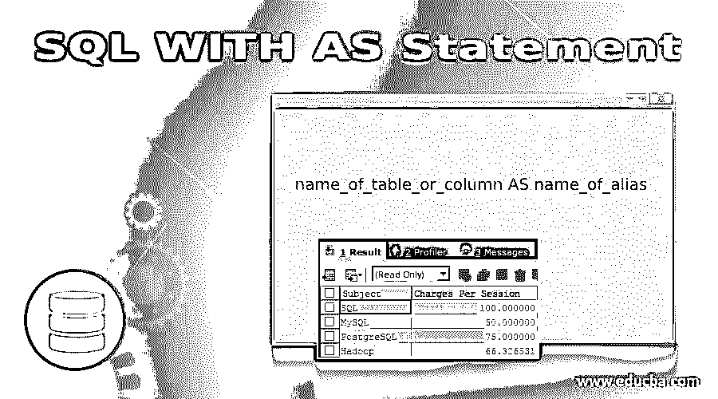
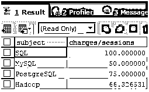
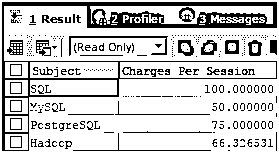

# 带 AS 语句的 SQL

> 原文：<https://www.educba.com/sql-with-as-statement/>

## 带 AS 语句的 SQL 简介

SQL AS 语句帮助我们指定表或列名的别名。别名是可以分配给 SQL 查询语句中任何对象的替代名称，包括表和列的名称，这些名称有助于用一个替代的小词(别名)访问和引用这些对象，这使得指定变得容易。在使用别名时，我们必须小心，只考虑用于指定别名的名称。别名的名称应该是有意义的，并且与它被分配到的对象相关。别名的使用范围仅限于使用它的查询语句。

**语法:**

<small>Hadoop、数据科学、统计学&其他</small>

`name_of_table_or_column AS name_of_alias`

其中，name_of_table_or_column 是我们必须为其分配替代名称的表名的列，name_of_alias 是替代或临时名称，使用该名称可以在查询语句中进一步引用它所分配到的列的表。我们可以为列和表使用别名。我们将以描述的方式进一步研究每个案例。

### 带 As 语句的 SQL 示例

下面是 SQL With As 语句的用法:

#### 示例# 1–使用列的 AS 语句

别名是替代名称，可以通过指定不同的列和列的组合，将别名分配给从查询语句中检索的值。别名也可以分配给表名。使用别名的优点是，当列名较大时，可以分配较短的名称当使用不同联接的查询中使用的多个表具有相同名称的列时，表的别名可以帮助确定应该检索哪个表的列或应用条件当执行聚合函数和列值的其他组合操作时，可以为检索的值分配名称，而不是执行整个表达式，这使得以有意义且更容易的方式读取结果记录以进行分析。

让我们使用以下查询语句创建一个名为 educba_learning 的表:

**查询:**

`CREATE TABLE `educba_learning` (
`topic_id` INT(11) NOT NULL IDENTITY,
`subject` VARCHAR(100) DEFAULT NULL,
`sessions` INT(5) DEFAULT '0',
`expert_name` VARCHAR(100) DEFAULT NULL,
`charges` DECIMAL(7,2) DEFAULT '0.00')`

让我们在 educba_learning 表中插入一些记录:

`INSERT INTO `educba_learning` (`topic_id`, `subject`, `sessions`, `expert_name`, `charges`) VALUES
(1, 'SQL', '750', 'Payal Udhani', 75000),
(2, 'MySQL', '700', 'Siddharth Udhani', 35000),
(3, 'PostgreSQL', '600', 'Sonam Udhani', 45000),
(4, 'Hadoop', '980', 'Heena Udhani', 65000);`

**输出:**

让我们首先通过简单地使用下面的查询语句来检索表中的所有记录，该查询语句检索表中的所有列和行:

**查询:**

`SELECT * FROM educba_learning;`

**输出:**

现在，假设我们想要检索记录，结果必须包含主题的名称和每次会话的费用。这可以通过简单地将费用列除以会话列来计算。我们的查询语句如下:

**查询:**

`SELECT subject, charges/sessions FROM educba_learning;`

**输出:**

如果我们不得不使用其他名称(比如“每次会话的费用”)和主题(如“主题”)来检索列，而不是收费/会话，则可以使用别名，如下所示:

**查询:**

`SELECT SUBJECT AS "Subject", charges/sessions AS "Charges Per Session" FROM educba_learning;`

**输出:**

#### 示例# 2–对表使用 AS 语句

当数据库中存在多个表时，会出现这样一种情况:您必须从涉及多个表的表中检索数据，并且这些表中可能有也可能没有名称相同的列，这时，通过为查询语句中的每个表分配一个别名，别名可用于识别查询语句中涉及的所有表。同样，对表名使用别名的优点是，如果表名非常大，那么一旦将别名分配给该表名，就可以在同一个查询中进一步使用短别名。

为表使用别名的一个重要用途是，当多个表中的列具有相同的名称，并且这些表在同一个查询中使用时，可以通过简单地指定别名而不是表名来指定要检索或应用限制的列。让我们再创建一个名为 educba_writers 的表，它包含以下列:

**查询:**

`CREATE TABLE `educba_writers` (
`id` INT(11) NOT NULL,
`expert_name` VARCHAR(10) NOT NULL,
`rate` DECIMAL(5,2) DEFAULT NULL,
`joining_date_time` DATETIME DEFAULT NULL
);`

**输出:**

**查询:**

`INSERT INTO `educba_writers` (`id`, `expert_name`, `rate`, `joining_date_time`) VALUES
(1, 'Payal', '750.00', '2020-05-28 16:02:34'),
(2, 'Vyankatesh', '700.00', NULL),
(3, 'Omprakash', '600.00', '2020-05-28 20:32:50'),
(4, 'Parineeta', '980.00', NULL);`

`select * from educba_writers;`

**输出:**

现在，我们想要编写一个查询来检索主题、会话、专家姓名和专家作者的比率，为此我们必须应用 educba_learning 和 educba_writers 表之间的连接。我们将为该表使用别名，因为这两个表的列名 expert_name 是相同的，因此我们必须应用连接。我们的查询语句如下:

**查询:**

`SELECT
learn.subject,
learn.sessions,
learn.expert_name,
writer.rate
FROM
educba_learning learn
JOIN educba_writers writer
ON learn.expert_name = writer.expert_name ;`

执行上述查询语句(其中 learn 和 writer 分别是 educba_learning 和 educba_writers 表的别名)将产生以下输出:

**输出:**

### 结论

SQL 中的 AS 语句有助于为表和列创建替代名称。这些别名也称为别名。别名使对列和表的引用更加容易，因为它们提供了一种工具，可以在查询语句的范围内临时使用替代名称来引用这些对象。当表名太大或者没有意义时，别名证明是有用的。

### 推荐文章

这是一个带 AS 语句的 SQL 指南。这里我们讨论 SQL WITH AS 语句的介绍以及实际例子和不同的子查询表达式。您也可以浏览我们推荐的文章，了解更多信息——

1.  [SQL Server 子字符串的前 5 个示例](https://www.educba.com/sql-server-substring/)
2.  [SQL 中触发器的概述](https://www.educba.com/triggers-in-sql/)
3.  [SQL 算术运算符简介](https://www.educba.com/sql-arithmetic-operators/)
4.  [SQL 中的任何|示例|语法](https://www.educba.com/any-in-sql/)

