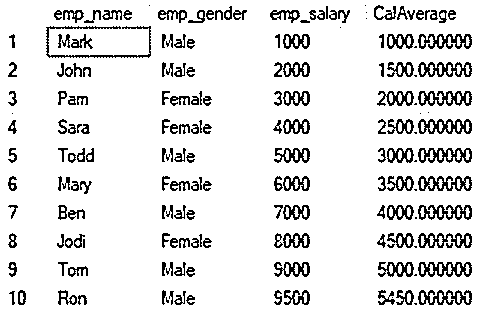
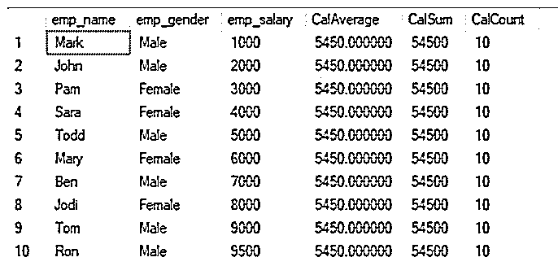
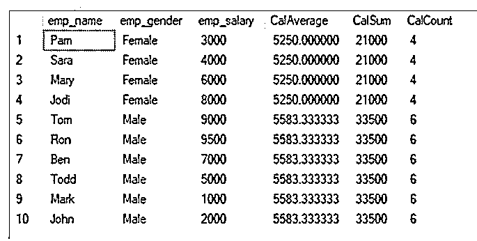
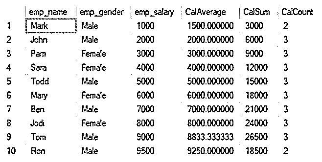
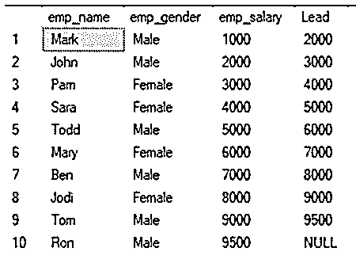
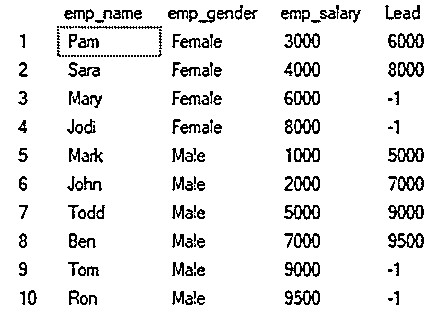

# SQL 窗口函数

> 原文：<https://www.educba.com/sql-window-functions/>

## SQL 窗口函数介绍

以下文章概述了 SQL 窗口函数。一个窗口函数得到一个对许多表格行的估计，这些表格行以某种方式与当前行标识在一起。这在某种程度上与我们习惯的聚合函数有关，但与聚合函数不同，窗口函数不会将结果分组到单个行中，而是每一行都有其单独的标识。因此，窗口函数访问的不仅仅是查询结果的当前行。这提供了极其强大和有用的特性，但是由于它们不同于标准的 SQL，它们很难掌握并且具有奇怪的语法，因此经常被避免。

有不同种类的窗口功能:

<small>Hadoop、数据科学、统计学&其他</small>

*   **聚合函数:**计数、AVG、求和、最大、最小等。
*   **排名函数:** RANK，ROW_NUMBER，DENSE_RANK 等。
*   **解析函数:**首值、末值、超前、滞后等。

行的划分和顺序由窗口中的 OVER 子句定义，因此它们被称为窗口函数，并且在该子句中使用了以下参数:

*   **ORDER BY:** 它定义了行的逻辑顺序。
*   **PARTITION BY:** 它将结果划分为单独的分区，窗口函数单独应用于每个分区。
*   **ROWS or RANGE 子句:**它通过指定分区内的起点和终点来限制分区内的行数。

如果未指定 ROWS 或 RANGE 子句，则默认值为未限定的前一行和当前行之间的范围。

### SQL 窗口函数的示例

下面是提到的例子:

#### 示例#1

AVG()函数的简单例子。

**代码:**

`SELECT emp_name, emp_gender, emp_salary,
AVG(emp_salary) OVER (ORDER BY emp_salary) AS CalAverage
from Employee;`

**输出:**

**说明:**

*   这是一个最基本的例子，我们从雇员表中选择姓名、性别和薪水，并使用 AVG 函数获得雇员的薪水。如你所见，马克的平均值是 1000，约翰的平均值是 1500。因为我们没有使用 ROWS 和 RANGE 子句，所以当前行之前的所有行将被视为平均值。
*   换句话说，在未绑定的前一行和当前行之间取平均值。类似地，计算所有其他值。请注意，最后一行具有真正的平均值，因为它计算了它上面的所有行。

#### 实施例 2

使用行或范围子句。

**代码:**

`SELECT emp_name, emp_gender, emp_salary,
AVG(emp_salary)OVER (ORDER BY emp_salary ROWS BETWEEN UNBOUNDED PRECEDING AND UNBOUNDED FOLLOWING) AS CalAverage,
SUM(emp_salary)OVER (ORDER BY emp_salary ROWS BETWEEN UNBOUNDED PRECEDING AND UNBOUNDED FOLLOWING) AS CalSum,
COUNT(emp_salary)OVER (ORDER BY emp_salary ROWS BETWEEN UNBOUNDED PRECEDING AND UNBOUNDED FOLLOWING) AS CalCount
from Employee;`

**输出:**

**说明:**

*   在本例中，我们从雇员表中选择姓名、性别和薪金，并使用 AVG、SUM、COUNT 函数进行一些计算，如您所见，聚合函数对整个结果集进行处理，得到相同的值，这有两个原因。
*   首先，我们在无界之前和无界之后之间使用行，这为我们提供了整个结果的值；其次，我们没有使用分区，因此整个结果被视为一个分区，因此我们得到了相同的结果。

#### 实施例 3

使用 PARTITION 子句。

**代码:**

`SELECT emp_name, emp_gender, emp_salary,
AVG (emp_salary) OVER (PARTITION BY emp_gender ORDER BY emp_salary ROWS BETWEEN UNBOUNDED PRECEDING AND UNBOUNDED FOLLOWING) AS CalAverage,
SUM (emp_salary) OVER (PARTITION BY emp_gender ORDER BY emp_salary ROWS BETWEEN UNBOUNDED PRECEDING AND UNBOUNDED FOLLOWING) AS CalSum,
COUNT (emp_salary) OVER (PARTITION BY emp_gender ORDER BY emp_salary ROWS BETWEEN UNBOUNDED PRECEDING AND UNBOUNDED FOLLOWING) AS CalCount
from Employee;`

**输出:**

**说明:**

*   这与上面的示例相同，唯一不同的是，在这个示例中，我们使用 PARTITION BY 子句按性别对数据进行分区，因此在分区中应用了窗口函数，并相应地计算平均值、总和以及计数。

#### 实施例 4

一个在前行和一个在后行。

**代码:**

`SELECT emp_name, emp_gender, emp_salary,
AVG (emp_salary) OVER (ORDER BY emp_salary ROWS BETWEEN 1 PRECEDING AND 1 FOLLOWING) AS CalAverage,
SUM (emp_salary) OVER (ORDER BY emp_salary ROWS BETWEEN 1 PRECEDING AND 1 FOLLOWING) AS CalSum,
COUNT (emp_salary) OVER (ORDER BY emp_salary ROWS BETWEEN 1 PRECEDING AND 1 FOLLOWING) AS CalCount from Employee;`

**输出:**

**说明:**

*   在这个查询示例中，我们已经计算了当前行、前一行和后一行的薪金。因此，Mark 的平均值是 1500，因为它没有前一行，只有后一行。
*   同样，John average 与 2000 相同，因为它有一个前一行和一个后一行。

#### 实施例 5

使用 LEAD()函数的简单示例。

**代码:**

`SELECT emp_name, emp_gender, emp_salary,
LEAD (emp_salary) OVER (ORDER BY emp_salary)as Lead
FROM Employee;`

**输出:**

下面显示了 SQL Server 中 LEAD()的常见语法:

`LEAD(return_value ,offset [,default])
OVER (
[PARTITION BY partition_expression, ... ] ORDER BY sort_expression [ASC or DESC], ...
)`

**说明:**

*   这是一个最基本的例子，我们从雇员表中选择姓名、性别和薪水，并使用 LEAD 函数获得下一个人的薪水。
*   正如您所看到的，Ron 得到 NULL，因为没有下一个薪金，而且我们没有指定任何默认值，offset 为 1，所以我们得到上一个值。

#### 实施例 6

带有 LEAD()函数的有点复杂的例子。

**代码:**

`SELECT emp_name, emp_gender, emp_salary,
LEAD (emp_salary, 2,-1) OVER (PARTITION BY emp_gender ORDER BY emp_salary) AS Lead
FROM Employee;`

**输出:**

**说明:**

*   在本例中，我们从 Employee 表中选择姓名、性别和薪金，并使用 Lead 函数获取 LEAD 列中下一个人的薪金，与上例一样，但我们也使用性别列对数据进行了分区。因此，LEAD 函数在分区的范围内工作。
*   我们所做的是将偏移量设置为 2，默认值设置为-1。正如我们在 Mary 和 Jodi 的示例中看到的，我们无法获取下一行的值，这是 2 行，因此我们得到默认值-1，类似地，在男性分区中我们得到结果。

### 结论

现在您知道了 SQL server 中有哪些窗口函数，以及如何使用它来计算多行结果而不进行分组。

### 推荐文章

这是一个 SQL 窗口函数的指南。在这里，我们讨论 SQL 窗口函数的介绍，并举例说明，以便更好地理解。您也可以看看以下文章，了解更多信息–

1.  [SQL 中的数组](https://www.educba.com/array-in-sql/)
2.  [SQL 批量插入](https://www.educba.com/sql-bulk-insert/)
3.  [Azure SQL 数据库](https://www.educba.com/azure-sql-database/)
4.  [SQL While 循环](https://www.educba.com/sql-while-loop/)

