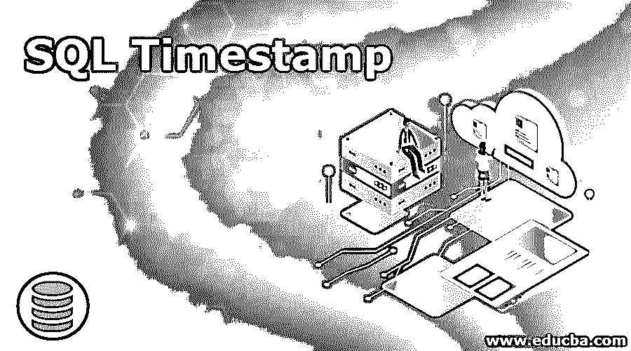
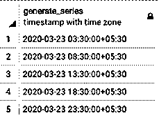
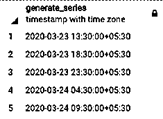

# SQL 时间戳

> 原文：<https://www.educba.com/sql-timestamp/>

## SQL 时间戳简介

时间戳是标准结构化查询语言(SQL)中的一种数据类型和函数，它允许我们存储和处理日期和时间数据值，通常没有指定的时区。时间戳的存储大小为 8 个字节，可以接受从公元前 4713 年到公元 294276 年的日期和时间值，并提供 1 微秒或 14 位的分辨率。一些 SQL 数据库允许对时间戳数据类型进行定制，我们可以为时间戳指定一个时区，这样每次在不同的时区使用数据库时，它都会显示并接受相应的日期和时间。例如，在 PostgreSQL 中，我们有一个“timestamptz”数据类型，它也负责时区的更改。Timestamptz 数据类型也具有类似于 8 字节时间戳的存储大小，可以接受从公元前 4713 年到公元 294276 年的日期和时间值，并提供 1 微秒或 14 位的分辨率。

在本文中，我们将借助一些例子来学习“timestamp”和“timestamptz”数据类型的功能和区别。

<small>Hadoop、数据科学、统计学&其他</small>

**语法和参数:**

SQL 中“时间戳”数据类型的基本语法如下:

`Timestamp ‘date_expression time_expression’;`

有效的时间戳数据表达式由日期和时间组成，后跟可选的 BC 或 AD。

`Timestamptz ‘date_expression time_expression +/- time_zone_expression ’;
2004-10-19 10:23:54;`

在这种情况下，一个有效的时间戳数据表达式由一个日期和一个时间组成，后跟一个 time_zone 表达式，根据时区相对于“GMT”的位置用一个“+/-”号连接，最后跟一个可选的 BC 或 AD。

### SQL 时间戳的实现示例

下面是理解 SQL 时间戳数据类型的几个示例:

**Note:** For the purpose of this article, we have used the PostgreSQL server.

#### 示例#1

了解 SQL 中 timestamp 和 timestamptz 数据类型的重要细节。

**代码:**

`SELECT typname, typlen, typtype, typcategory
FROM pg_type
WHERE typname ~ '^timestamp';`

#### 实施例 2

说明 timestamp 和 timestamptz 数据类型之间差异的 SQL 查询。

**代码:**

`SELECT TIMESTAMP '2020-03-23 00:00';`

`SELECT TIMESTAMPTZ '2020-03-23 00:00';`

#### 实施例 3

一些例子展示了 SQL 中与时间戳数据类型相关的函数。首先，让我们从将给定的日期转换或强制转换成时间戳格式开始，如下所示。

**代码:**

`SELECT '2020-03-23' :: timestamptz;`

假设如果我们想知道当前的时间戳，我们可以使用如下所示的 current_timestamp 函数。它将返回当前时间戳，即隐式转换为默认时区的当前日期和时间。

`SELECT current_timestamp;`

此外，我们还可以使用下面的 SHOW timezone 语句来检查我们当前工作的时区。当你在世界各地都有业务时，这变得非常有用。

`SHOW timezone;`

接下来，我们甚至可以使用 SET timezone 语句将当前时区更改为不同的时区。在这里，您可以从各种时区中进行选择，如“亚洲/加尔各答”、“欧洲/苏黎世”、“美国/太平洋”等。在本例中，我们已将时区从“亚洲/加尔各答”更改为“美国/太平洋”。

`SET timezone = 'US/Pacific';`

像 SQL 中的 EXTRACT 这样的函数让我们从时间戳中提取特定的信息。例如，我们可以提取日、月、年、小时、分钟、秒等。，从时间戳开始。

在下面的例子中，我们试图从时间戳中提取日期和月份。

`SELECT EXTRACT(DAY FROM '2020-03-23 00:00':: timestamp);`

`SELECT EXTRACT(MONTH FROM '2020-03-23 00:00':: timestamp);`

#### 实施例 4

用于在指定时区生成一系列时间戳的 SQL 查询。在本例中，我们在两个时区(即“印度标准时间”和“太平洋标准时间”)生成了一系列间隔为 5 小时的时间戳。我们可以通过仔细观察输出来观察两个系列之间的差异。

**代码:**

`SELECT generate_series(
timezone('IST', '2020-03-23 00:00'::timestamp),
timezone('IST', '2020-03-23 23:00'::timestamp),
'5 hour'::interval
);`

`SELECT generate_series(
timezone('PST', '2020-03-23 00:00'::timestamp),
timezone('PST', '2020-03-23 23:00'::timestamp),
'5 hour'::interval
);`

#### 实施例 5

一个说明在 SQL 中使用 timestamp 或 timestamptz 数据类型的实例。让我们以一个业务案例为例，一家跨国银行希望根据客户的当地时间祝其客户“生日快乐”。银行的数据库里有一份客户名单，上面有他们的出生日期。因此，客户表可以这样创建:

**代码:**

`CREATE TABLE Customers (
customer_id int,
customer_name varchar(255),
city varchar(255),
date_of_birth timestamptz
);`

插入相关信息后，表中的数据将如下所示:

假设我们希望伦敦的客户今天过生日，即印度标准时间的“2020 年 3 月 24 日”；我们可能需要编写如下所示的 SQL 查询:

`SELECT customer_name, date_of_birth
FROM customers
WHERE EXTRACT(DAY FROM date_of_birth) = '24'
AND EXTRACT(MONTH FROM date_of_birth) = '03';`

但是在上面的例子中，我们可以看到，由于客户来自伦敦，而且那里不是 3 月 24 日，所以第一个查询可能不是最佳选择。因此，我们可以通过将时区称为“GMT”来改进查询，如下面的查询所示。

`SELECT customer_name, date_of_birth
FROM customers
WHERE EXTRACT(DAY FROM date_of_birth at time zone 'GMT') = '24'
AND EXTRACT(MONTH FROM date_of_birth at time zone 'GMT') = '03';`

### 结论

SQL timestamp 是一种数据类型和函数，用于存储和处理日期和时间格式的数据值，有时还包括时区和 AD/BCs。当我们在世界各地开展业务时，他们非常有帮助。

### 推荐文章

这是一个 SQL 时间戳指南。这里我们讨论 SQL Timestamp 的介绍和实际例子以及不同的子查询表达式。您也可以浏览我们推荐的文章，了解更多信息——

1.  [SQL Server 子字符串的前 5 个示例](https://www.educba.com/sql-server-substring/)
2.  [SQL 中触发器的概述](https://www.educba.com/triggers-in-sql/)
3.  [什么是 SQL 子查询？](https://www.educba.com/sql-subquery/)
4.  [SQL 算术运算符简介](https://www.educba.com/sql-arithmetic-operators/)
5.  [SQL 中的任何|示例|语法](https://www.educba.com/any-in-sql/)

