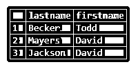

# SQL 中的任何

> 原文：<https://www.educba.com/any-in-sql/>

## SQL 中的 ANY 简介

结构化查询语言(SQL)中的 ANY 是一种表达式运算符，通常用在 SQL INSERT、SELECT、DELETE 和 UPDATE 查询的 WHERE 或 HAVING 子句中，它将列的值与子查询中获得的每个值进行比较，如果子查询结果中任何一行的结果满足上述条件，则评估结果是否为 TRUE。

ANY 主要用于将列的值与子查询的值进行比较。像 ALL 和 SOME 一样属于其他运营商的家族。任何表达式运算符后面都跟有比较运算符，如“>”、“

<small>Hadoop、数据科学、统计学&其他</small>

### **语法**

在 WHERE 子句中使用 ANY 的基本语法如下:

`SELECT column_name(s)
FROM table_name
WHERE test_expression comparison_operator {ANY | ALL | SOME } (SQL subquery);`

#### **参数**

上述语法中使用的参数是:

*   **选择列名:**用于从数据库中选择需要的数据。提及您希望在结果集中出现的列名。
*   **FROM table_name:** 提及将从中提取列的表名或源。
*   **其中:**用于指定过滤记录的条件。
*   **Test_expression:** 它是要对其执行测试的表达式，或者是要将其值与子查询中的值进行比较的列名。
*   **Comparison_operator:** 从集合标准运算符中提及比较运算符，如{ =，<，！=、>、> =、<或< = }。
*   **{ ANY | ALL | SOME }:** ANY 是表达式运算符，如果至少有一行满足上述条件，则返回 TRUE。ALL 与 ANY 正好相反，只有当所有行都满足上述条件时，它才返回 TRUE。SOME 也是一个表达式运算符，如果有多行满足上述条件，它将返回 TRUE。

上述参数，所有的参数都是强制性的。您可以根据需要使用 GROUP BY、ORDER BY 和 HAVING 子句。接下来，我们将详细讨论上述任何操作符。为了更好地理解这个概念，我们将借助于三个表:雇员(包含所有雇员的个人详细信息)、部门(包含部门 id、名称及其负责人等详细信息)和任务(包含项目的详细信息和状态)。

“部门”表中的数据如下所示:

“雇员”表中的数据如下:

“任务”表中的数据如下所示:

### SQL 中 ANY 的示例

以下是一些例子:

#### 示例#1

基本的 sql 查询来说明任何表达式操作符的使用。

**查询:**

`SELECT *
FROM employees
WHERE employeeid = ANY (select head from department);`

**输出:**

在上面的例子中，我们试图获取同时也是部门主管的任何雇员的详细信息。

#### 实施例 2

使用任何运算符以及附加的 WHERE 条件。

查找来自“曼哈顿”并且也是部门主管的雇员的姓名。

**查询:**

`SELECT lastname,firstname
FROM employees
WHERE city = 'Manhattan' AND employeeid = ANY (select head
from department);`

**输出:**

#### 实施例 3

查找同时担任部门主管且收入低于 16000 英镑的员工的详细信息。

**查询:**

`SELECT *
FROM employees
WHERE salary < '16000' AND employeeid = ANY (select employeeid
from department);`

**输出:**

在上面的例子中，我们期望结果中只有两行，但是因为我们使用了任何操作符，所以即使有一行满足条件，它也返回 TRUE。这说明了 ANY 运算符的错误使用。

#### 实施例 4

与 GROUP BY 和 HAVING 子句一起使用任何运算符。

找出每个城市的雇员人数，确保每个雇员都完成了分配给他们的项目。

**查询:**

`SELECT city, COUNT(employeeid)as 'No of employees'
FROM employees
WHERE employeeid = ANY (SELECT employeeid FROM tasks WHERE status = 'Completed')
GROUP BY city;`

**输出:**

#### 实施例 5

找出每个部门的雇员数，使得任何部门的雇员数都应该大于某个城市的雇员数。

**查询:**

`SELECT departmentid, COUNT(employeeid) as 'no of employees'
FROM employees
GROUP BY departmentid
HAVING COUNT(employeeid) > ANY (select count(employeeid) from employees group by city)
ORDER BY COUNT(employeeid) DESC;`

**输出:**

这个例子对你来说可能没什么意义。但是，此示例主要是为了说明 ANY 与 GROUP BY、HAVING 和 ORDER BY 子句的用法。

#### 实施例 6

**结合连接查询使用任意运算符**

找出每个部门的员工人数，确保每个员工都完成了分配给他们的项目。

**查询:**

`SELECT d.departmentname, COUNT(employeeid)as 'No of employees'
FROM employees as e INNER JOIN department as d
ON e.departmentid = d.departmentid
WHERE employeeid = ANY (SELECT employeeid
FROM tasks WHERE
status = 'Completed')
GROUP BY d.departmentname;`

**输出:**

### 推荐文章

这是一个指南，任何在 SQL。在这里，我们将讨论 sql 中 any 的介绍和语法，以及不同的示例及其代码实现。您也可以阅读以下文章，了解更多信息——

1.  [用 SQL 解释](https://www.educba.com/explain-in-sql/)
2.  [SQL 变量](https://www.educba.com/sql-variables/)
3.  [SQL 中的数组](https://www.educba.com/array-in-sql/)
4.  [SQL 批量插入](https://www.educba.com/sql-bulk-insert/)

