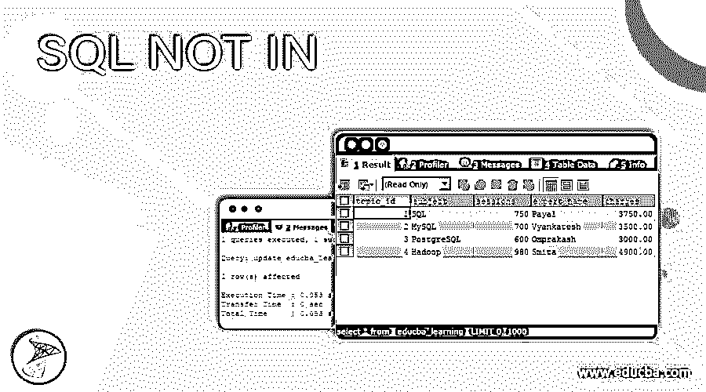
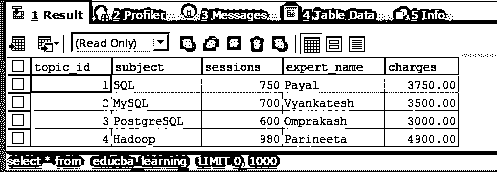
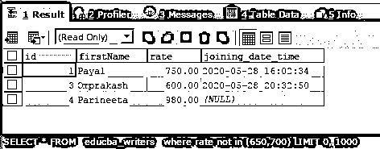
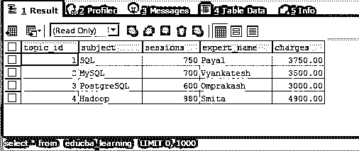
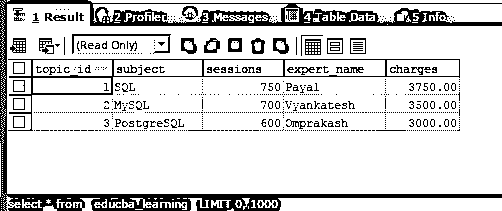

# SQL 不在

> 原文：<https://www.educba.com/sql-not-in/>

## SQL 简介不在

SQL NOT IN 语句在 SQL 中用于将多个参数指定为函数的参数，以便生成的记录不会包含任何具有 NOT IN 语句中指定的列值的记录。SQL 的 NOT IN 语句的工作方式类似于在 WHERE 子句中的特定列上指定多个 OR 条件。NOT IN 是 multiple 或 in WHERE 子句的缩写形式。在本文中，我们将了解 SQL 中 NOT IN 语句的语法和用法，然后借助示例，进一步了解如何在 SQL 中使用 NOT IN 语句来指定条件，该条件涉及如何排除特定值的记录。

### 语法和用法

SQL 中 NOT IN 语句的语法如下所示

<small>Hadoop、数据科学、统计学&其他</small>

`column_name NOT IN (expression1, expression2, ...);`

我们可以在 WHERE 子句中使用上述语法，同时使用 SQL 的任何 DML 语句，例如 SELECT、UPDATE、INSERT 和 DELETE。语法中的 column_name 是应用查询的表的列名，我们必须指定一个条件，即列值不应包含列表中提到的表达式值，该列表包含逗号分隔的表达式，其计算结果为需要排除的列值。

NOT IN 子句的参数中提到的表达式可以是文字值、变量、其他表的列名，或者是一个完全不同的子查询，该子查询生成的记录包含要在查询中名为 column_name 的列中排除的值。我们将学习如何在对表进行操作的查询中实现 NOT IN 语句，并使用示例逐个获取、更新、插入和删除记录。

### 例子

我们将通过在 SQL 的不同 DML 语句(如 SELECT、INSERT、UPDATE 和 DELETE)中使用 NOT IN constraint 来研究它的工作原理。

让我们使用下面的 create table 语句创建两个名为 educba_learning 和 educba_writers 的表。

`CREATE TABLE `educba_writers` (
`id` INT(11) NOT NULL,
`firstName` VARCHAR(10) NOT NULL,
`rate` DECIMAL(5,2) DEFAULT NULL,
`joining_date_time` DATETIME DEFAULT NULL
);`

上述查询语句的执行将产生以下输出

`CREATE TABLE `educba_learning` (
`topic_id` INT(11) NOT NULL IDENTITY,
`subject` VARCHAR(100) DEFAULT NULL,
`sessions` INT(5) DEFAULT '0',
`expert_name` VARCHAR(100) DEFAULT NULL,
`charges` DECIMAL(7,2) DEFAULT '0.00'
);`

上述查询语句的执行将产生以下输出

现在，我们将在两个表中插入一些记录

`INSERT INTO `educba_learning` (`topic_id`, `subject`, `sessions`, `expert_name`, `charges`) VALUES
(1, 'SQL', 750, 'Payal', '3750.00'),
(2, 'MySQL', 700, 'Vyankatesh', '3500.00'),
(3, 'PostgreSQL', 600, 'Omprakash', '3000.00'),
(4, 'Hadoop', 980, 'Parineeta', '4900.00');`

上述查询语句的执行将产生以下输出

`INSERT INTO `educba_writers` (`id`, `firstName`, `rate`, `joining_date_time`) VALUES
(1, 'Payal', '750.00', '2020-05-28 16:02:34'),
(2, 'Vyankatesh', '700.00', NULL),
(3, 'Omprakash', '600.00', '2020-05-28 20:32:50'),
(4, 'Parineeta', '980.00', NULL);`

上述查询语句的执行将产生以下输出

如您所见，我们在两个表中都插入了一些记录。

#### 让我们检索两个表的内容。

对 educba_learning 表执行下面提到的选择查询会产生以下输出—

`SELECT * FROM `educba_learning``

对 educba_writers 表执行 select 查询会产生以下输出

现在，我们准备在上面的表上使用 NOT IN 约束。我们将逐一查看每个 DML 语句的示例。

#### 在 select 查询中使用 NOT IN 约束

让我们考虑一个使用上述表的示例，并使用 SELECT 查询语句中的 NOT IN 子句检索表 educba_writers 中没有 rate 650 或 700 作为 rate 列的列值的记录。我们的查询语句如下所示。

`SELECT * FROM `educba_writers` WHERE rate NOT IN (650,700);`

执行上述查询语句的输出如下，其中包含表 educba_writers 的记录，该表的 rate 列中没有值 650 或 750

#### 在更新查询中使用 NOT IN 约束

在更新记录时，可能会有这样一种情况，您希望只更新那些某些列的值没有设置为某些指定值的记录。现在，我们必须将表 educba_learning 中专家的姓名改为“Smita ”,其中主题值不包含 SQL、MySQL 和 PostgreSQL 的值。我们将在更新查询的 where 子句中使用 NOT IN 运算符，以满足我们使用以下查询语句的条件

`UPDATE educba_learning
SET expert_name = "Smita"
WHERE SUBJECT NOT IN ("SQL" , "MySQL" , "PostgreSQL");`

上述查询语句的执行将产生以下输出

让我们在更新后检查表 educba_writers 的内容，看看哪些记录被更新了。

`SELECT * FROM `educba_learning` ;`

上述查询语句的执行将产生以下输出，记录主题 Hadoop 的专家名称为 Smita——

#### 在删除查询中使用 NOT IN 约束

现在让我们使用子查询，而不是在 NOT IN 语句中指定文字值。我们必须使用 delete 查询语句来删除 educba_learning 表中的值，该表的专家姓名字段的值不是 educba_writers 表中的名字。为此，我们将使用子查询从 educba_writers 表中检索所有的 writers，我们的查询语句如下

`DELETE FROM educba_learning
WHERE expert_name
NOT IN (SELECT firstName FROM educba_writers);`

上述查询语句的执行将产生以下输出

让我们检索 educba_learning 表的值，并查看将 Smita 作为专家姓名的记录是否被删除

`SELECT * FROM `educba_learning`;`

上述查询语句的执行将产生以下输出，其中包含预期的记录

### 结论–SQL 不在

我们可以对一个或多个列应用约束，以指出该列的值不应该出现在 NOT IN 语句中提到的值列表中。该约束可用于 SQL 中的任一 DML 语句:SELECT、INSERT、UPDATE 和 DELETE。

### 推荐文章

这是 SQL 的指南，不在。在这里，我们将讨论 NOT IN 语句在 SQL 中的用法，然后借助示例进一步理解如何在 SQL 中使用该语句。您也可以看看以下文章，了解更多信息–

1.  [SQL NOT 运算符](https://www.educba.com/sql-not-operator/)
2.  [SQL 按字母顺序排序](https://www.educba.com/sql-order-by-alphabetical/)
3.  [MySQL 主键](https://www.educba.com/mysql-primary-key/)
4.  [SQL 升序排序](https://www.educba.com/sql-order-by-ascending/)

