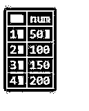
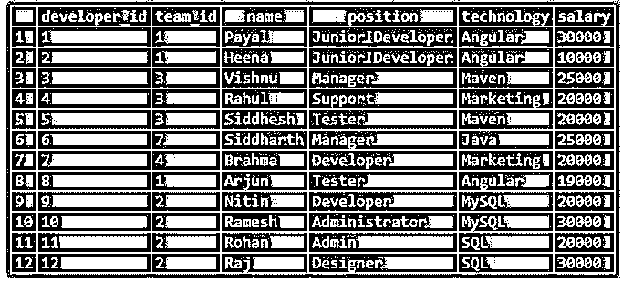
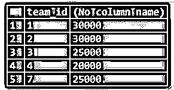

# SQL MAX()

> 原文：<https://www.educba.com/sql-max/>

## SQL MAX()简介

SQL MAX()是 SQL 中可用的聚合函数之一，它帮助我们从记录的列值(由提到的列组成的表达式)中指定的多个值中获取最大值。当查询用于检索与报表相关并包含 group by 语句的数据时，MAX()函数用于根据分组函数获取特定一列或多列的最大值。

### 语法和用法

SQL 中 MAX 函数的语法如下所示:

<small>Hadoop、数据科学、统计学&其他</small>

`SELECT MAX(expression)
FROM table_name
[WHERE restriction];`

其中，expression 可以是表中任何列的名称，也可以是使用列名和静态文字值或变量构建的公式，table_name 是要从中检索记录并计算其中一列的最大值的表的名称。需要使用 FROM table name 子句。一个可选的事情是使用 where 子句来提及表的记录应该满足的条件和限制，以考虑该记录的列值来获取最大值。

当使用 where 子句时，对于 MAX()函数的最大计算，只考虑筛选出的数据。MAX()函数收集其中提到的表达式的所有值，并将它们相加，然后除以相加的值或表达式的数量，以找出最终的最大值。例如，考虑我们必须找出 50、100、150 和 200 中的最大值。然后，max 函数将在内部比较它们的每个值，最后得出 200 作为最大的最大值。

### SQL MAX()的示例

以下是 SQL MAX()的示例:

#### 示例# 1–使用单个色谱柱。

让我们首先考虑我们上面使用的一个简单的例子。我们将使用 MAX()函数计算 SQL 数字的最大值。让我们创建一个名为 numbers 的简单表，并在其中存储 num 列值。

我们将使用下面的查询语句来创建我们的表。

**代码:**

`CREATE TABLE numbers (num INT) ;`

现在，我们将在表中插入上述记录。

**代码:**

`INSERT INTO numbers(num) VALUES (50), (100), (150), (200);`

现在让我们检索一次记录。

**代码:**

`SELECT * FROM numbers ;`

**输出:**

现在，我们将使用 MAX()函数通过以下查询语句计算 numbers 表中 num 列的最大值。

**代码:**

`SELECT MAX(num) FROM numbers ;`

**输出:**

#### 示例 2–使用 distinct 函数。

我们可以在 MAX()函数中使用 distinct 函数，在获取最大值时只考虑一次列的重复值。假设我们使用下面的查询语句在 numbers 表中插入更多的记录。

**代码:**

`INSERT INTO numbers(num) VALUES (350), (800), (150), (300),(450), (100), (250);
select * from numbers;`

**输出:**

如果我们使用 SELECT MAX(num)FROM numbers；语句来计算 num 列的最大值，那么在获取最大值时将考虑每个值。

**代码:**

`SELECT MAX(DISTINCT(num)) FROM numbers ;`

输出将与第一个查询的输出相同，但没有明显的函数，但在内部，MAX()函数对最大值的计算将只考虑重复一次的列值，如 100 和 150。

以上两个查询的输出如下所示。

**输出:**

#### 示例 3–使用公式。

我们可以使用 MAX()函数表达式来考虑通过获取包含列值的每个公式或表达式值来计算最大值的值。

让我们考虑一个例子；我们将计算所有列中最大的一列乘以 10 再加 1。

**代码:**

`SELECT MAX((num * 10) + 1) FROM numbers ;`

**输出:**

我们甚至可以在 MAX()函数中使用 SUM()和 COUNT()等现有函数。

#### 示例# 4–使用分组依据。

当我们有复杂的表和多个表之间的关系时，我们必须使用连接来查询这些表以检索数据，通常是为了报告包含汇总数据的目的。甚至在某些场景中，需要操作单个表中的数据来获得汇总数据。假设我们有一个名为 workers 的表，其中包含以下记录，通过对该表执行简单的 select 查询可以检索到这些记录。

**代码:**

`SELECT * FROM workers;`

**输出:**

现在，情况是这样的，我们必须计算每个团队工人的最高工资。输出应该由团队 id 和该团队的最高工资组成。为此，我们必须使用 group by 语句，根据团队 id 对记录进行分组，并使用 MAX()函数计算最大工资。

**代码:**

`SELECT
team_id,
MAX(salary)
FROM
workers
GROUP BY team_id ;`

上述查询语句的执行将给出以下输出以及团队 id 和他们各自的最高工资。

**输出:**

### 结论

我们可以使用 SQL 中的 MAX()函数来获取表中各列的最大值或涉及列值的最大表达式，甚至可以使用 GROUP BY 语句以分组方式计算各列的最大值。

### 推荐文章

这是一个 SQL MAX()的指南。在这里，我们讨论 SQL MAX()的介绍，并通过例子来更好地理解。您也可以看看以下文章，了解更多信息–

1.  [SQL 升序排序](https://www.educba.com/sql-order-by-ascending/)
2.  [SQL 按字母顺序排序](https://www.educba.com/sql-order-by-alphabetical/)
3.  [SQL NOT 运算符](https://www.educba.com/sql-not-operator/)
4.  [SQL 临时表](https://www.educba.com/sql-temporary-table/)

