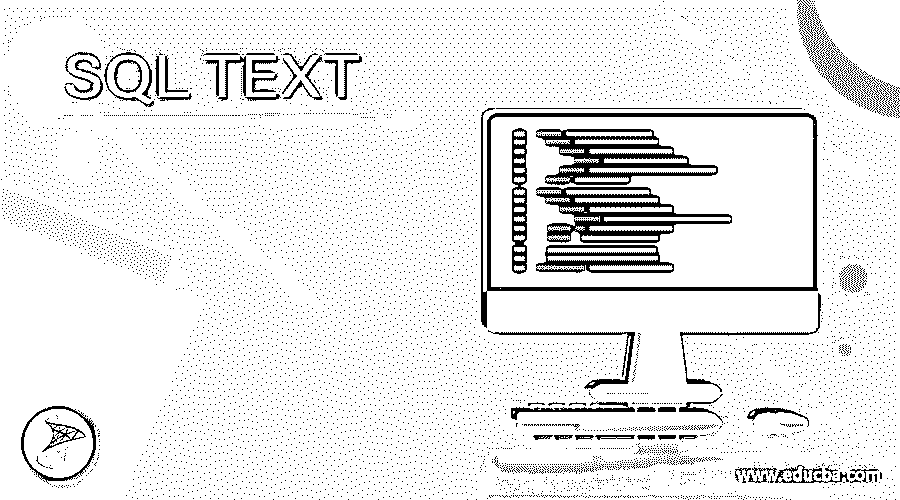
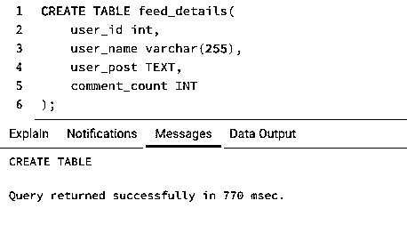
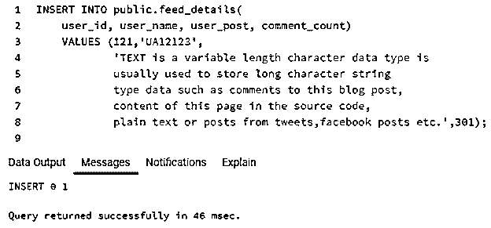

# SQL 文本

> 原文：<https://www.educba.com/sql-text/>

## SQL 文本介绍

TEXT 是一种可变宽度字符串数据类型，支持 SQL 数据库服务器代码页中的非 Unicode 数据，最大字符串长度为 2，147，483，647。这种数据类型用于存储大量的字符串数据值。当数据超过指定的阈值时，包含文本数据类型数据值的列存储在单独的大型对象(LOB)数据页的行外。具有所述列的数据库表中的行将具有指向 LOB 数据页的 16 字节指针。

文本数据类型通常用于存储长字符串类型的数据，例如对这篇博客文章的评论、源代码中该页面的内容、纯文本或来自 tweets 的文章、脸书文章等。不要被这里使用的所有术语弄得不知所措，我们将在后面的章节中详细讨论数据类型。

<small>Hadoop、数据科学、统计学&其他</small>

**语法和参数**

创建包含文本数据类型列的数据库表的基本语法如下:

`CREATE TABLE table_name (
column_name_1 ID,
column_name_2 TEXT,
.
.
.
column_name_n TEXT
);`

上述语法中使用的参数如下:

column_name_1，column_name_2:这些是我们希望用特定数据类型创建的列或字段的名称。例如，column_name_2 和 column_name_n 可以存储文本数据类型的值。

讨论了创建可以存储可变长度字符类型文本的列的语法之后，让我们讨论几个说明其用法的示例。

### 例子

下面举几个例子

#### 示例 1–创建文本数据类型的字段名称或列名称

为了说明如何使用 TEXT 数据类型，让我们创建一个名为“feed_details”的虚拟表，其中包含社交媒体网站用户发布的帖子的详细信息，并使用它。用于创建 feed_details 表的简单 CREATE 语句如下:

`CREATE TABLE feed_details(
user_id int,
user_name varchar(255),
user_post TEXT,
comment_count INT
);`

我们已经成功地创建了上述表格。这里“user_post”列用于存储文本数据类型值。现在，让我们在其中插入一些记录。

#### 示例 2–向文本数据类型的列中插入值

`INSERT INTO public.feed_details(
user_id, user_name, user_post, comment_count)
VALUES (121,'UA12123',`

文本是可变长度字符数据类型是
通常用于存储长字符串
类型数据，如对这篇博客文章的评论、
源代码中该页面的内容、
纯文本或来自推文的帖子、脸书帖子等,301);

在 feed_details 表中，文本数据类型的数据记录如下所示:

#### 示例 3–对文本数据类型使用 WHERE 子句的 SQL 查询

执行比较时很难使用文本数据类型。例如，看看下面给出的查询。

`SELECT * FROM feed_details
WHERE user_post = 'TEXT is a variable length'`

查询成功返回，但未获取任何结果。该查询可能会在某些数据库服务器中引发错误。因此，您可能必须将文本数据类型转换为 VARCHAR(max)。现在，观察下一个查询。

`SELECT * FROM feed_details
WHERE user_post LIKE 'TEXT is a variable length%'`

在第二种情况下，查询成功返回，并且也获取了所需的结果。因此，使用像 LIKE 这样的通配符来比较文本数据类型更明智。

您可能已经在上面的插入查询和这个示例中观察到，VARCHAR 数据类型和 TEXT 数据类型中的值以相似的方式存储，即在一对引号中。这两种数据类型都具有“扩展”存储属性。你的观察很中肯。这两种数据类型相似，都用于存储字符类型的值。

### VARCHAR 和 TEXT 数据类型的区别

首先，VARCHAR 和 TEXT 数据类型之间没有太大的区别。根据文档，它们都是变长数组，在 C 数据结构中称为 varlena。尽管如此，还是有一些不同，比如 VARCHAR(n)为限制 VARCHAR 字段的最大长度提供了空间。例如，VARCHAR(255)不允许您插入超过 255 个字符的字符串。在文本中没有这样的限制。最重要的是，数据类型之间没有性能差异。

但是，开发人员和数据工程师更喜欢在需要存储更多数据(如段落或长句)的情况下使用文本，在需要存储少量单词(如用户名)的列中使用 VARCHAR，并进一步使用这些列来执行连接、外键约束和索引。文本不是索引和连接表的首选类型，因为它不能完全成为索引的一部分。尽管如此，当使用它进行索引时，我们总是可以指定文本列的前缀长度。

### 结论–SQL 文本

SQL 中的文本数据类型用于存储可变长度的字符串数据值。它可以存储高达 1 Gb 的数据。它用于存储长句和类似段落的数据值，如评论、社交媒体提要、页面源代码中的网页文本内容等。

### 推荐文章

这是 SQL 文本指南。这里我们讨论 VARCHAR 和 TEXT 数据类型的例子和区别。您也可以看看以下文章，了解更多信息–

1.  [SQL MID](https://www.educba.com/sql-mid/)
2.  [SQL 按月分组](https://www.educba.com/sql-group-by-month/)
3.  [PostgreSQL 或](https://www.educba.com/postgresql-or/)
4.  [MySQL 拆分](https://www.educba.com/mysql-split/)

