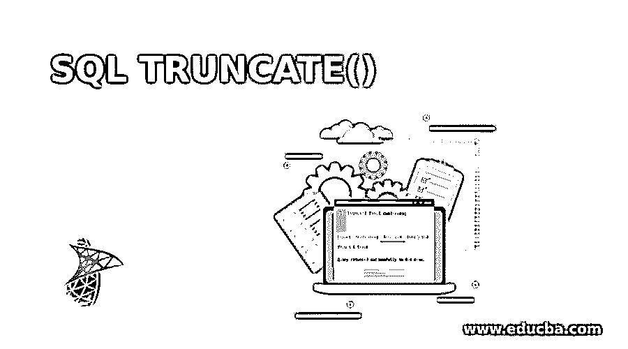
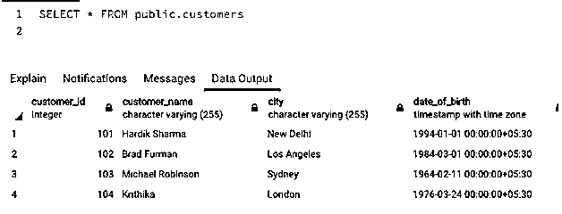
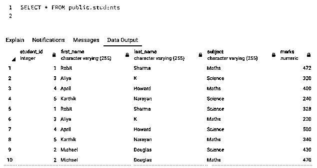
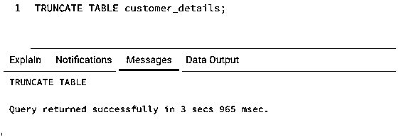
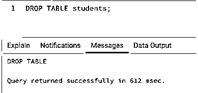
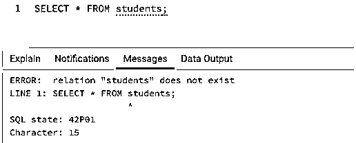

# SQL TRUNCATE()

> 原文：<https://www.educba.com/sql-truncate/>

## SQL TRUNCATE()简介

标准查询语言(SQL)中的 TRUNCATE 是一种数据定义语言(DDL)语句，用于从数据库表中删除完整的数据，而不删除表本身。它释放空间或清空表中的空间。但是，我们应该注意，在许多 SQL 数据库中，TRUNCATE TABLE 语句可能不可回滚。同样作为 DDL 语句，TRUNCATE table 语句不需要在每个步骤都提交，它会在语句执行结束时自动触发提交。因此，我们应该小心使用它。

我们经常混淆 SQL 中的 TRUNCATE TABLE、DELETE TABLE 和 DROP TABLE 语句。所以在继续之前，让我们先检查并了解它们三者之间的区别。

<small>Hadoop、数据科学、统计学&其他</small>

**SQL TRUNCATE TABLE、SQL DELETE TABLE 语句和 SQL DROP TABLE 语句的区别**

| **下降表** | **截断表格** | **删除表格** |
| 删除表中所有数据并销毁表本身的 SQL 语句。 | 从表中删除数据行的 SQL 语句。 | 从表中删除数据行的 SQL 语句。 |
| 它是一种数据定义语言(DDL)语句。 | 它是一种数据定义语言(DDL)语句。 | 它是一种数据操作语言(DML)语句。 |
| 我们不能使用 WHERE 条件。 | 我们不能使用 WHERE 条件。 | 我们可以使用 WHERE 条件。 |
| 我们不能执行回滚操作来撤消 DROP table 语句。 | 我们不能执行回滚操作来撤消 TRUNCATE table 语句。 | 我们可以执行回滚操作来撤消 DELETE table 语句。 |
| 表及其所有关系、索引、特权等将被永久删除。 | 表格行被永久删除。 | 表格行不会被永久删除。 |

**语法和参数**

使用 SQL TRUNCATE TABLE 语句的基本语法如下:

`TRUNCATE TABLE table_name;`

上述语法中使用的参数是:

Table_name:它是要永久删除其记录或行的表的名称。

### TRUNCATE TABLE 语句在 SQL 中是如何工作的？

SQL 中的 TRUNCATE TABLE 语句的工作原理是将数据库中的文件清零，即在现有表上运行 TRUNCATE 语句后，该表变成空的，因此不保存任何行记录。它将表重置为零条目。

但是，在截断表之后，它的结构、列、索引、约束、关系、视图等都会保留。整个操作就像从表中删除数据，但保持表不变。

数据定义语言(DDL)中的 TRUNCATE 等效于数据操作语言(DML)中的 DELETE。两者的唯一区别是，后者可以回滚，但前者不能。但是，TRUNCATE 比 DELETE 快，因为它通常绕过事务系统。它不被记录(在不同的 SQL 数据库中会有所不同)，也不跟在谓词后面，因此似乎比删除操作更快。删除是一种更安全、更慢的操作。

### SQL TRUNCATE()示例

这里有几个例子来详细解释 TRUNCATE TABLE 语句。

#### 示例#1

简单的 SQL 查询来说明 TRUNCATE TABLE 语句的功能。

为了理解 SQL 截断表，让我们考虑一个“customers”表。表格中的数据是这样的。

`SELECT * FROM public.customers`

接下来，让我们对客户的表运行 TRUNCATE TABLE 语句来删除它的所有记录。我们可以使用下面的 SQL 查询来做到这一点。

`TRUNCATE TABLE customers;`

我们可以在下图中看到，TRUNCATE TABLE 语句删除了客户表中的所有记录。但是，所有的列、关系、索引、表结构都被安全地保存了下来。

`SELECT * FROM customers;`

#### 实施例 2

SQL 查询来说明 SQL DROP TABLE 和 TRUNCATE TABLE 语句之间的区别。

为此，我们考虑两个表“customer_details”和“students”。表结构和其中的数据看起来像这样。“客户详细信息”表中的记录如下:

`SELECT * FROM public.customers_details`

“学生”表中的记录如下:

`SELECT * FROM public.students`

接下来，我们将对 customer_details 表运行 TRUNCATE 表，对 student 表运行 DROP 表，然后我们将检查差异。

`TRUNCATE TABLE customer_details;`

`DROP TABLE students;`

我们可以从上面的图片中观察到，在 SQL 中，DROP TABLE 语句比 TRUNCATE TABLE 语句更快。

现在让我们分别检查截断和删除后两个表发生了什么。

`SELECT * FROM customer_details;`

`SELECT * FROM students;`

从上面的两幅图中，我们可以观察到，在 TRUNCATE 语句中，表结构被保留，只有表中的数据/记录被删除。而在使用 DROP TABLE 语句的情况下，整个表都已从数据库中删除。它的所有列、索引、关系、特权等。都被移除了。

### 结论

SQL 中的 TRUNCATE TABLE 是一个数据定义语言(DDL)语句，它通过删除所有记录来清空现有的表，同时保留表列、权限、索引、视图、约束、关系等。它与 SQL 中的 DELETE 语句等效，但速度更快。但是，与删除不同，它不能回滚。

### 推荐文章

这是 SQL TRUNCATE()的指南。在这里，我们讨论示例来详细解释 TRUNCATE TABLE 语句以及语法和参数。您也可以浏览我们推荐的其他文章，了解更多信息——

1.  [SQL 选择随机](https://www.educba.com/sql-select-random/)
2.  [SQL 中的 roll up](https://www.educba.com/rollup-in-sql/)
3.  [SQL 中的 JSON](https://www.educba.com/json-in-sql/)
4.  [在 PostgreSQL 中强制转换](https://www.educba.com/cast-in-postgresql/)

