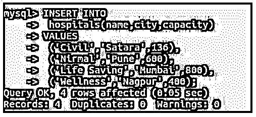
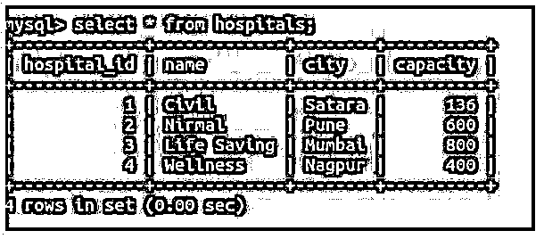
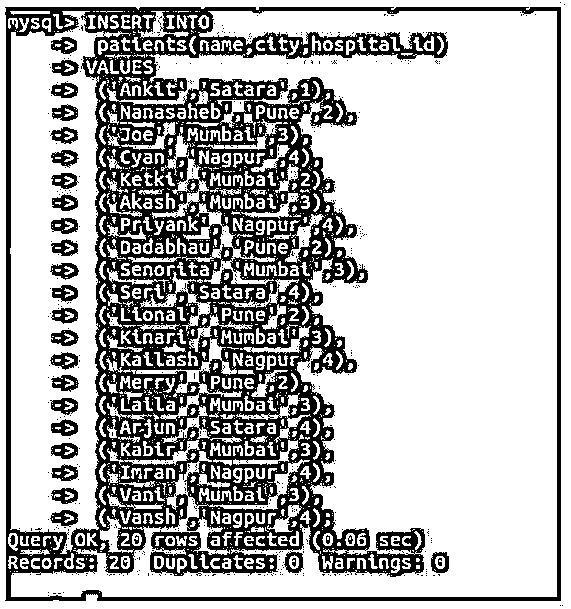
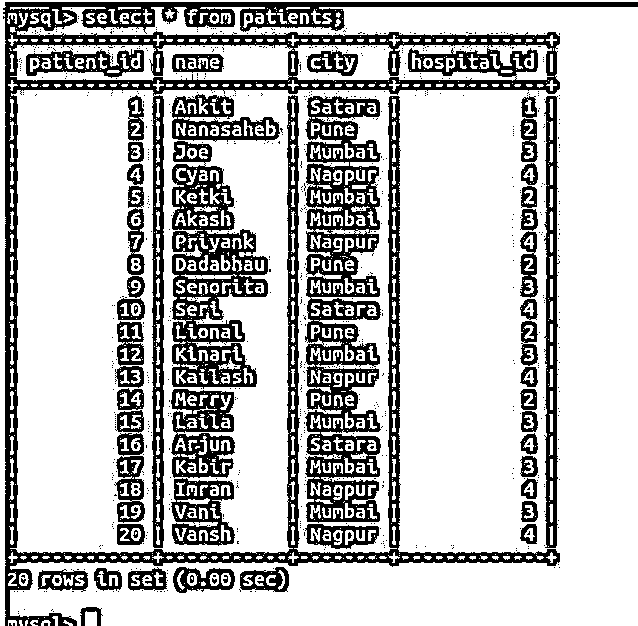
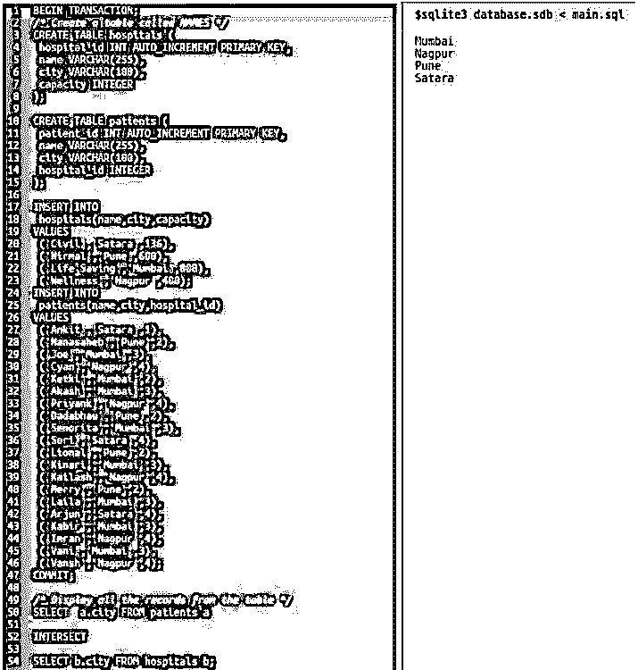
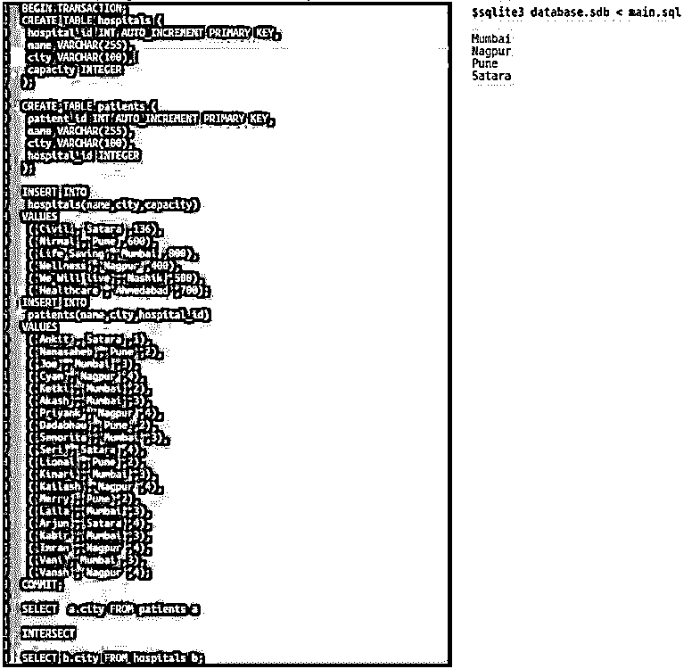
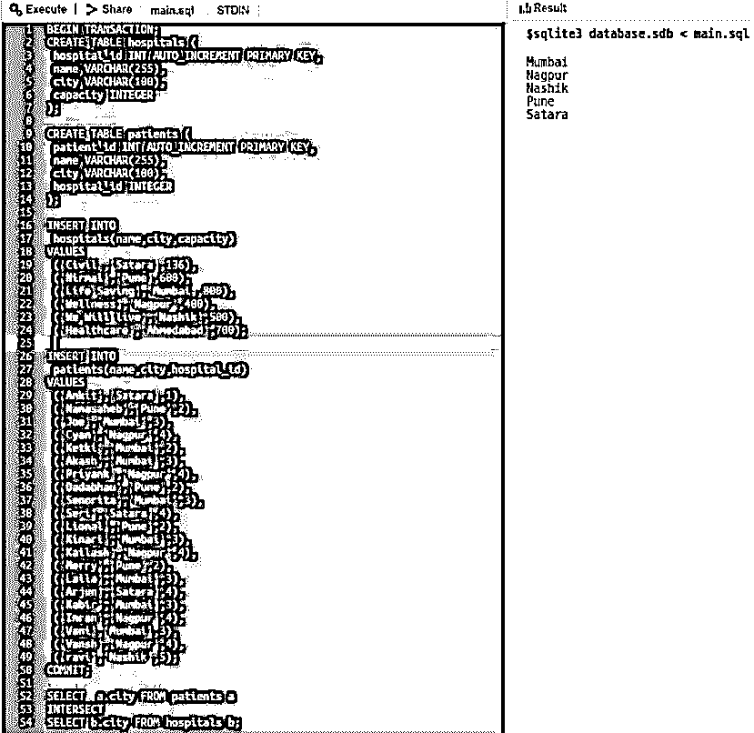

# SQL INTERSECT

> 原文：<https://www.educba.com/sql-intersect/>

## SQL INTERSECT 简介

SQL 中的 INTERSECT 运算符用于仅获取公共的结果集，并且也是从所有查询中检索的。SQL 中有一些运算符可以帮助我们组合两个或更多查询的结果集，从而从两个或更多查询的结果集中获得所需的结果集。这些是并集、交集和例外运算符。它们中的每一个都有不同的表现，可以根据我们的目的和需要来使用。注意 MySQL 不支持 intersect，但是 SQL 支持。

### SQL INTERSECT 语法

下面给出了语法:

<small>Hadoop、数据科学、统计学&其他</small>

`SELECT colOrExpr1, colOrExpr2, ... colOrExpr_n
FROM name_of_table1
[WHERE conditionsOrRestrictions] INTERSECT
SELECT colOrExpr1, colOrExpr2, ... colOrExpr_n
FROM name_of_table2
[WHERE conditionsOrRestrictions];`

*   **colOrExpr:** 这些是从表的列值中检索的列或任何其他表达式的名称。请注意，从每个选择查询中检索到的列或表达式的数量应该相同，并且它们的检索顺序也需要相同。从每个表中检索的列的数据类型应该相似且兼容。
*   **name_of_table1 和 name_of_table2:** 这是要从中检索包含列值和表达式值的结果集的表的名称。使用 INTERSECT 运算符时，可以有一个或多个 select 语句。
*   **conditionsOrRestrictions:**这些是我们希望应用于表的列值的条件，以过滤出结果集，并仅应用表中所需的结果。

### 交集运算符的结果

*   当两个查询结果集相交时，最终结果集由从两个查询的结果集中检索到的公共和唯一记录组成。
*   为了知道如何使用维恩图，假设从查询 1 中检索到某个结果集，比如 T1，而从查询 2 中检索到的其他结果集是 T2。
*   结果集的内容显示在下面的维恩图中。当两个查询相交时，则在数据 T1 相交 T2 中仅获得 T1 和 T2 结果中存在的公共数据。
*   因为 B 和 C 在 T1 和 T2 中都是常见的，所以这两个记录都在交集结果中提取。
*   由于 A 不在 T2 中，D 也不在 T1 中，所以在 T1 与 T2 相交的结果集中，A 和 D 都被跳过。

### 使用 INTERSECT 运算符的必要性

在使用 INTERSECT 运算符之前，您需要确保以下几点:

*   两个 select 语句应该包含相同数量的列或表达式。此外，它们被提及的顺序应该是相同的。
*   两个表的列的数据类型或相应列的表达式的值应该相似，并且彼此兼容。

### SQL INTERSECT 示例

下面是提到的例子:

让我们考虑一个例子，假设有两个名为医院和病人的表，它们具有在创建表查询中提到的以下结构:

**医院表:**

**代码:**

`CREATE TABLE hospitals (
hospital_id INT AUTO_INCREMENT PRIMARY KEY,
name VARCHAR(255),
city VARCHAR(100),
capacity INTEGER
);`

**输出:**

**病床:**

**代码:**

`CREATE TABLE patients (
patient_id INT AUTO_INCREMENT PRIMARY KEY,
name VARCHAR(255),
city VARCHAR(100),
hospital_id INTEGER
);`

**输出:**

让我们使用以下查询在两个表中插入一些记录:

**代码:**

`INSERT INTO
hospitals(name,city,capacity)
VALUES
('Civil','Satara',136),
('Nirmal','Pune',600),
('Life Saving','Mumbai',800),
('Wellness','Nagpur',400);`

**输出:**

让我们选择插入的医院记录表:

**代码:**

`SELECT * FROM hospitals ;`

**输出:**

让我们在患者表中插入一些记录:

**代码:**

`INSERT INTO
patients(name,city,hospital_id)
VALUES
('Ankit','Satara',1),
('Nanasaheb','Pune',2),
('Joe','Mumbai',3),
('Cyan','Nagpur',4),
('Ketki','Mumbai',2),
('Akash','Mumbai',3),
('Priyank','Nagpur',4),
('Dadabhau','Pune',2),
('Senorita','Mumbai',3),
('Seri','Satara',4),
('Lional','Pune',2),
('Kinari','Mumbai',3),
('Kailash','Nagpur',4),
('Merry','Pune',2),
('Laila','Mumbai',3),
('Arjun','Satara',4),
('Kabir','Mumbai',3),
('Imran','Nagpur',4),
('Vani','Mumbai',3),
('Vansh','Nagpur',4);`

**输出:**

让我们从患者表中检索所有记录:

**代码:**

`select * from patients;`

**输出:**

让我们将涉及患者和医院的查询的结果集相交:

**代码:**

`SELECT  a.city FROM patients a
INTERSECT
SELECT  b.city FROM hospitals b;`

**输出:**

它在 MySQL 中给出错误，因为 MySQL 不支持 intersect。让我们在 SQL lite 数据库上尝试一下。这里，我们将使用一个在线 SQL 编辑器。您可以安装它并检查运行所有这些命令，从而在 SQL lite 中创建和插入表和记录。

这是我们运行 main.sql 得到的输出。

**输出:**

我们可以看到，我们只得到在医院表和患者表中都有条目的城市。

让我们通过保持患者表记录不变，在医院表中插入一些额外的城市，并观察结果。

我们添加了两条记录:

**(《我们会活下去》，《纳什克》，500)，**

**(‘医疗’，‘艾哈迈达巴德’，700)**

在我的 SQLite 脚本中的医院表中。交叉点的输出似乎仍然相同，因为在患者表中没有城市为 Ahmedabad 或 Nashik 的条目:

**输出:**

现在，让我们用 Nashik city 添加一个患者，并观察输出。

我们在 main.sql 文件的 patients 表中添加了以下记录。

**('拉维'，'纳西克'，5)**

现在让我们执行并观察相交操作的结果:

**输出:**

我们可以看到，Nashik 市也被添加到输出中，因为它在患者和医院两个表中都有条目，而 Ahmedabad 市只在医院表中有条目。

### 结论

我们可以使用 INTERSECT 操作符来获取 SQL 语言中两个或更多查询中常见的所有唯一记录。MySQL 不支持 intersect 运算符。我们在使用它时应该小心，因为使用 INTERSECT 运算符要求两个查询都应该检索相同的列或表达式，并且具有相似的兼容数据类型。

### 推荐文章

这是一个 SQL INTERSECT 的指南。这里我们讨论 SQL INTERSECT 的介绍，在查询示例中使用这个操作符的必要性。您也可以看看以下文章，了解更多信息–

1.  [SQL 窗口函数](https://www.educba.com/sql-window-functions/)
2.  [SQL SELECT DISTINCT](https://www.educba.com/sql-select-distinct/)
3.  [SQL DATEPART()](https://www.educba.com/sql-datepart/)
4.  [SQL 用户](https://www.educba.com/sql-users/)

