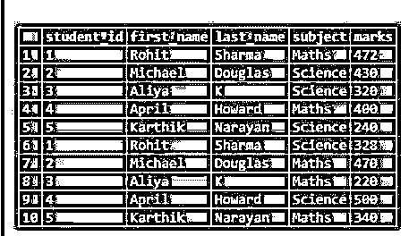
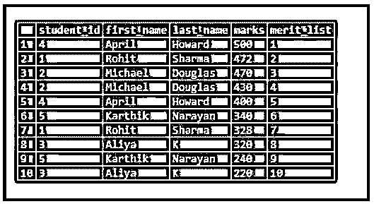
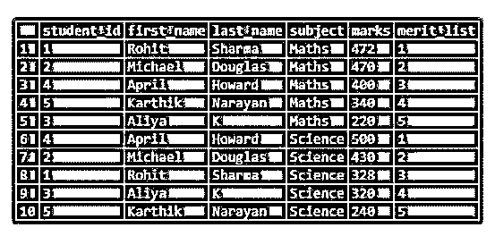
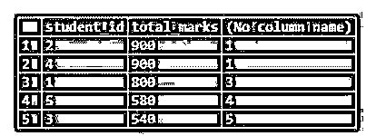

# SQL 排名()

> 原文：<https://www.educba.com/sql-rank/>

## SQL RANK()简介

标准查询语言(SQL)中的 RANK()是一个窗口函数，它在查询运行时，根据指定列的值，为结果集分区内从 1 开始的每一行返回一个临时的唯一排名。行的等级是它在分区集中的序号。RANK()函数在出现平局的情况下为多行提供相同的排名。例如，它提供 1、2、2、4、5 等等级。SQL RANK()函数类似于关系 SQL 数据库中的其他窗口函数，如 ROW_NUMBER()、DENSE_RANK()、NTILE()等。

**语法和参数:**

<small>Hadoop、数据科学、统计学&其他</small>

使用 RANK()函数的基本语法如下:

`RANK ( ) OVER ( [ partition_by_clause ] order_by_clause )`

**参数:**

**1。partition _ by _ clause:**partition by 子句用于将结果集划分为多个组。提及将基于其创建组的列名。如果您没有提及任何内容，那么结果集中的整行将被视为一个分区。

**2。order_by_clause:** order by 子句用于对分区集中的值进行排序。根据您希望对分区集进行排序的值来指定列名。

**3。RANK()** 函数被用作 SELECT 语句的一部分。

### SQL RANK()的示例

为了说明 SQL 中 RANK()函数的功能和应用，让我们创建一个假想的“学生”表。该表将包含学生的详细信息，如他们的学号、名、姓、分数、科目等。

可以通过以下方式创建“学生”表。

**代码:**

`CREATE TABLE students(
student_id int,
first_name varchar(255),
last_name varchar(255),
subject varchar(255),
marks numeric
);`

让我们使用 insert 语句在表中插入一些值来填充数据集。

**代码:**

`INSERT INTO Students VALUES
(1,'Rohit','Sharma','Maths', 472),
(2,'Michael','Douglas','Science', 430),
(3,'Aliya','K','Science', 320),
(4,'April', 'Howard','Maths',400),
(5,'Karthik','Narayan', 'Science', 240),
(1,'Rohit','Sharma','Science', 328),
(2,'Michael','Douglas','Maths', 470),
(3,'Aliya','K','Maths', 220),
(4,'April', 'Howard','Science',500),
(5,'Karthik','Narayan', 'Maths', 340);`

插入后“学生”表中的数据如下所示:

**代码:**

`select * from Students;`

**输出:**

#### 示例#1

基于学生获得的分数来说明学生排名的 SQL 查询。

**案例 1:**

没有 partition by 子句的秩。

**代码:。**

`SELECT
student_id,
first_name,
last_name,
marks,
RANK() OVER (ORDER BY marks DESC) merit_list
FROM
students;`

**输出:**

在这种情况下，我们可以看到，当我们在没有分区函数的情况下进行排序时，结果集中的所有行都被视为一个组，因此不会产生有意义的结果。

**案例二:**

用 partition by 子句进行排序。

**代码:**

`SELECT
student_id,
first_name,
last_name,
subject,
marks,
RANK() OVER (PARTITION BY subject ORDER BY marks DESC) merit_list
FROM students;`

**输出:**

在这种情况下，partition by 子句将结果集中的行分成两部分，一部分用于数学，另一部分用于科学，并根据科目进行更合理的排序。

#### 实施例 2

根据学生获得的总分数准备一份学生成绩表。

**代码:**

`SELECT
student_id,
SUM(marks) as total_marks,
RANK() OVER (ORDER BY SUM(marks) DESC)
FROM students
GROUP BY student_id;`

**输出:**

上面的例子提供了一个基于学生获得的总分数的成绩列表。但是它可能会让一些学生感到困惑，因为它没有学生的姓和名。让我们准备一份学生名单，包括他们的学生证，姓名和总成绩。

**代码:**

`SELECT
student_id,
first_name,
last_name,
SUM(marks) as total_marks,
RANK() OVER (ORDER BY SUM(marks) DESC)
FROM students
GROUP BY student_id,first_name,last_name;`

**输出:**

在这种情况下，我们可以看到该学生已经被清楚地标识出来，以及他或她在列表中的排名。

#### 实施例 3

查找最后三名总体得分最低的学生的详细信息。

**代码:**

`SELECT
student_id,
first_name,
last_name,
SUM(marks) as total_marks,
RANK() OVER (ORDER BY SUM(marks) ASC)
FROM students
GROUP BY student_id,first_name,last_name
LIMIT 3;`

**输出:**

#### 实施例 4

找出得分第三高的学生的名字和姓氏。

**代码:**

`WITH student_details
AS (SELECT student_id,first_name,last_name,
SUM(marks) as total_marks,
RANK() OVER (ORDER BY SUM(marks) DESC) as rank
FROM students
GROUP BY student_id,first_name,last_name)
SELECT first_name, last_name
FROM student_details
WHERE rank = 3;`

**输出:**

上面的例子教我们如何在 WHERE 子句中使用 rank 或任何窗口函数。我们不能直接使用 WHERE 子句中的 rank 列，因为 rank 是 SELECT 语句的一部分，并且在选择之前会进行 WHERE 过滤。因此，为了使用任何窗口函数的结果，我们可以使用 CTE 或 WITH 表达式来创建临时表。

#### 实施例 5

找出数学分数第三低的学生的名字和姓氏。

**代码:**

`WITH student_details
AS (SELECT student_id,first_name,last_name,
SUM(marks) as total_marks,
RANK() OVER (ORDER BY SUM(marks) ASC) as rank
FROM students
WHERE subject = 'Maths'
GROUP BY student_id,first_name,last_name)
SELECT first_name, last_name
FROM student_details
WHERE rank = 3;`

**输出:**

### 结论

RANK()是一个窗口函数，它根据指定列的值对行进行排序。在出现平局的情况下，它给予多行相同的等级。这是非常有用的，当我们想找到排名，如第三高，倒数第二等。

### 推荐文章

这是一个 SQL RANK()的指南。这里我们讨论一下 SQL RANK()的介绍和例子。您也可以看看以下文章，了解更多信息–

1.  [PySpark SQL](https://www.educba.com/pyspark-sql/)
2.  [SQL 中的 BETWEEN](https://www.educba.com/between-in-sql/)
3.  [SQL 中的触发器](https://www.educba.com/triggers-in-sql/)
4.  [SQL 子查询](https://www.educba.com/sql-subquery/)
5.  [SQL 中的任意指南](https://www.educba.com/any-in-sql/)

