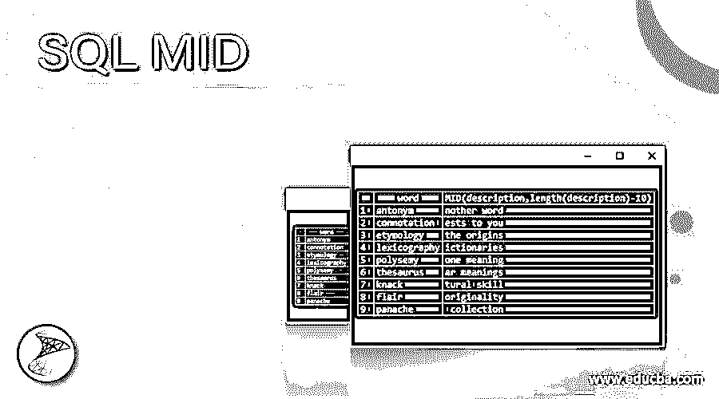
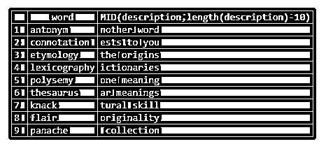

# SQL MID

> 原文：<https://www.educba.com/sql-mid/>

## SQL MID 简介

当处理 SQL 中的字符串时，我们必须对这些字符串执行各种操作，以得到所需格式的结果字符串。很多时候，我们会遇到这样的情况，我们必须从原始字符串中获取字符串的特定部分，无论是开始部分、结束部分还是中间部分。在所有这些情况下，SQL 函数 MID()都起了作用。我们可以使用 MID()函数从原始字符串中检索字符串的一部分，在 SQL 中也可以称为原始字符串的子字符串。

在本文中，我们将了解 SQL MID()函数的一般语法及其工作原理，然后举例说明几个更易于理解的实现该函数的示例。

<small>Hadoop、数据科学、统计学&其他</small>

**语法:**

SQL 的 MID()函数的语法如下:

`SELECT MID(original string, starting point, number of characters)`

在上面的语法中，原始字符串是字符串值变量、列或任何其他字符串格式的表达式，您希望对其进行分析以获取该字符串值的一部分。起点是索引+1，我们将从这里开始计数并从原始字符串中检索子字符串。原始字符串和起始点都是必需的参数，在 SQL 中使用 MID()函数时必须指定。字符数是一个可选参数，它决定了我们要检索的子字符串部分的长度。如果未指定，则起点后的整个字符串将作为子字符串进行检索。在这种情况下，我们指定的长度是字符的数量，那么只有从起始点开始的字符才会作为子串被检索，作为 MID()函数的返回值。MID()函数的返回值是一个新字符串，它是在考虑了起点和字符数(如果提到的话)之后形成的子字符串。

### 工作

MID()函数通过从头开始遍历字符串字符来开始解析过程，当它到达起始点时，它开始将该字符添加到结果字符串值中。当没有提到可选的字符数参数时，被添加的字符数一直到原始字符串的末尾，而如果提到了可选的字符数参数，那么起点之后的许多字符被添加到要返回的最终结果字符串中。MID()函数的工作原理与 SQL 函数 SUBSTRING()相同，后者用于从原始字符串中找出子字符串。

### SQL MID 示例

让我们考虑一些简单的例子，首先获取一个静态字符串，并从该字符串中仅检索该字符串的一部分。考虑一个静态字符串“嘿！大家早上好！”我们只需从中检索“GOOD MORNING”文本，该文本只是字符串的一部分，然后我们可以开始决定起点，该起点将是 5，作为 G 字符的起点，因为它的起始值始终是 1，而不是 0，就像数组索引一样。“早安”文本由 12 个字符组成。因此，我们将字符数参数指定为 12。我们的查询语句如下

`SELECT MID("HEY!GOOD MORNING EVERYONE!", 5, 12);`

上述查询语句执行后的输出如下:

正如我们所看到的，我们指定的 MID()函数的返回值是“GOOD MORNING”文本，这是我们所期望的。

让我们再考虑一个例子，创建一个名为 dictionary 的新表，该表包含存储字符串值的列。我们将使用下面的查询语句来创建包含所需列的表。

`CREATE TABLE `dictionary` (
`word` varchar(100) DEFAULT NULL,
`meaning` varchar(5000) DEFAULT NULL,
`description` varchar(5000) DEFAULT NULL
) ENGINE=InnoDB DEFAULT CHARSET=latin1;`

让我们在表字典中插入一些记录，进一步使用它们来操作字符串值和从中检索子字符串。我们将使用以下查询在字典表中插入记录

`INSERT INTO `dictionary` (`word`, `meaning`, `description`) VALUES
('antonym', NULL, 'a word that means the opposite of another word'),
('connotation', NULL, 'an additional idea or emotion that a word suggests to you'),
('etymology', 'the study of the origins of words; the origins of a particular word', 'the study of the origins'),
('lexicography', 'the job or skill of writing dictionaries', 'writing dictionaries'),
('polysemy', NULL, 'the fact that some words can have more than one meaning'),
('thesaurus', 'a reference tool which shows groups of words that have similar meanings', 'representation of groups of words that have similar meanings'),
('knack', 'an acquired or natural skill at doing something.', 'natural skill'),
('flair', 'stylishness and originality.', 'originality'),
('panache', 'a tuft or plume of feathers', 'feather collection');
select * from dictionary;`

在执行查询后，它会给出以下输出

现在让我们应用 mid 函数从 description 列中只检索最后 10 个字符的字符串。为此，我们必须首先找到列的长度，然后从长度中减去 10 个字符来定义起点。我们的查询语句如下

`SELECT word, MID(description,length(description)-10) from dictionary;`

这给出了以下输出:

### 结论

我们可以利用 SQL 的 MID()函数从原始字符串中检索子字符串部分。该函数可用于字符串、字符串值、变量以及字符串类型的列。这个函数可以根据我们提到的起始点来检索字符串的一部分。我们想要检索的字符数可以随意指定，这将导致结果子串仅包含该数量的字符，而如果没有指定，则检索从起始点开始的剩余字符串。

### 推荐文章

这是一个 SQL MID 的指南。这里我们分别讨论简介、SQL MID 如何工作以及代码实现的例子。您也可以看看以下文章，了解更多信息–

1.  [SQL ORDER BY CASE](https://www.educba.com/sql-order-by-case/)
2.  [SQL 克隆表](https://www.educba.com/sql-clone-table/)
3.  [SQL ORDER BY DATE](https://www.educba.com/sql-order-by-date/)
4.  [SQL 升序排序](https://www.educba.com/sql-order-by-ascending/)

