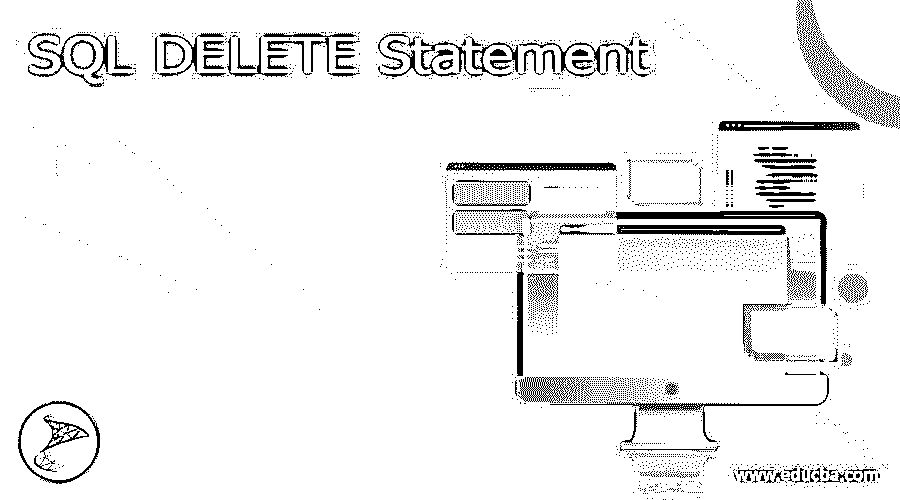
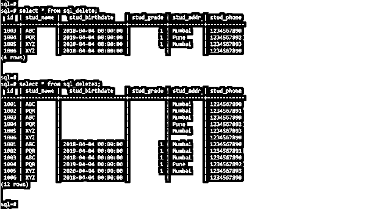
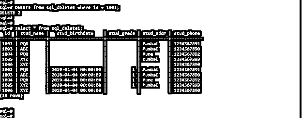
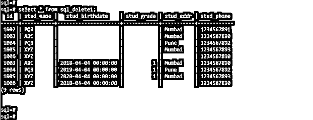
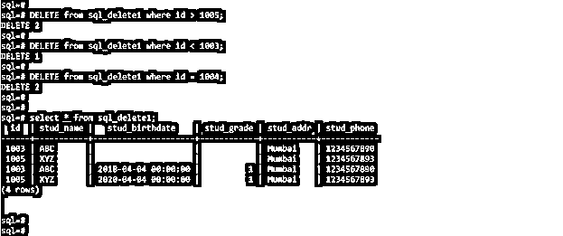

# SQL 删除语句

> 原文：<https://www.educba.com/sql-delete-statement/>




## SQL DELETE 语句简介

SQL DELETE 语句是一个数据操作语言(DML)命令，用于从 SQL 数据库服务器的数据库表或视图中删除一行或多行数据记录。DELETE 命令可以在用户定义的函数体中使用。因为它不会永久删除行，所以删除事务可以回滚。

DELETE 语句可以与条件子句和限制子句(如 TOP 和 WHERE)一起使用，以便只筛选和删除特定的行。尽管 DELETE 现在听起来可能更好，因为它具有更高的互操作性，并且提供了对删除和回滚的行的过滤，但是当从数据库表中删除所有行时，它的性能会受到影响。因此，在这种情况下，我们应该使用 TRUNCATE 命令，因为它比 DELETE 快。

<small>Hadoop、数据科学、统计学&其他</small>

SQL 中还有一些其他命令，如 DROP 和 TRUNCATE table，也用于从数据库对象中删除数据。但是它们在以下方面略有不同:

**DELETE、TRUNCATE 和 DROP TABLE 语句的区别**

| **删除表格** | **截断表格** | **下降表** |
| DELETE 语句从数据库对象中移除一行或多行。 | 从数据库对象中移除所有数据行的 TRUNCATE 语句。 | 删除表中所有记录并破坏表结构的 DROP 语句。 |
| 它是一种数据操作语言(DML)语句。 | 它是一种数据定义语言(DDL)语句。 | 它是一种数据定义语言(DDL)语句。 |
| 我们可以使用 WHERE 或 TOP 子句。 | 我们不能使用 WHERE 或 TOP 子句。 | 我们不能使用 WHERE 或 TOP 子句。 |
| 我们可以执行回滚操作来撤消 DELETE table 语句。 | 我们不能执行回滚操作来撤消 TRUNCATE table 语句。 | 我们不能执行回滚操作来撤消 DROP table 语句。 |
| 表格行不会被永久删除。 | 表格行被永久删除。 | 表及其所有关系、索引、特权等将被永久删除。 |

**语法:**

用 SQL 编写 DELETE 语句的基本语法如下:

`DELETE FROM table_name;`

**参数:**

*   **table_name:** 必须删除的表或视图的名称。

DELETE 语句的好处是它允许我们限制必须从表中删除的行。对于相同的，请遵循以下语法。

`DELETE [TOP (expression | percentage)] FROM table_name
WHERE condition;`

这段语法中使用的参数如下:

*   **Expression | percentage:**Expression 代表必须删除的顶部行数。如果我们没有任何具体的数字，我们可以使用百分比来限制要删除的行数。
*   **条件:**仅选择特定数量的行进行删除的过滤条件。

讨论了语法和语法中使用的参数后，我们准备尝试几个基于 SQL 中 DELETE 语句的示例。

### SQL DELETE 语句的示例

为了说明 SQL DELETE 语句的基本功能，还有什么比在虚拟表的数据记录上尝试几个例子更好的呢？因此，让我们首先创建一个名为“customer_june”的表。我们可以使用下面的代码片段来执行上述任务。

`CREATE TABLE customer_june
(
customer_id integer,
customer_name character varying(255),
city character varying(255),
contact_no character varying(255),
email_address character varying(255)
);`

在成功创建表之后，让我们首先在表中插入一些数据记录来使用。使用下面的 insert 语句。对于外行来说，INSERT 语句用于在数据库表中插入新的数据行。

`INSERT INTO customer_june(
customer_id, customer_name, city, contact_no, email_address)
VALUES (1001,'Rahul Sharma','Mumbai','9878987823','rs12@gmail.com'),
(1004,'Ronda Floyd','Florida','8787878787','rfloyd@gmail.com'),
(1002,'George Cooper','Kanhas City','9090909089','NULL'),
(1003,'Mithika Kapoor','Mumbai','9876547823','m1kapoor@yahoomail.com'),
(1005,'Gloria Gonsalez','New York','7545754535','gloria.gon@rediffmail.com'),
(1006,'Rahul Kashyap','New Delhi','9876504321','rk89@gmail.com');
select * from customer_june;`


现在我们准备尝试几个例子来说明 DELETE 语句的基本功能。

#### 示例 1:基本删除查询，用于从数据库对象(如数据库表或视图)中删除或移除记录。

`DELETE FROM customer_details;`

查询已成功返回。该语句将删除 customer_details 表中的所有行，同时保持表结构不变。

#### 示例 2: DELETE 语句，其中只从数据库表中删除特定的行。

`DELETE FROM customer_june
WHERE city = 'Kanhas City';`

现在，我们已经成功地从“customer_june”表中删除了城市名称拼写错误的行。修改后的最终数据如下所示。

`SELECT * FROM customer_june;`


#### 示例 3:带有子查询的 DELETE 语句只从数据库表中删除特定的行。

`DELETE FROM customer_june
WHERE EXISTS (SELECT * FROM customer_june
WHERE city LIKE '%New%'
ORDER BY customer_id DESC
LIMIT 1) ;`

查询已成功返回。该查询的目的是说明 DELETE 语句中子查询的用法。在筛选记录时，我们可以在条件表达式部分尝试许多子查询排列和组合。

### SQL 删除语句

*   基本上，该语句用于从表中删除现有记录。我们需要定义从中删除记录的表名。
*   在下面的第一个语法中，我们没有使用 where 条件，所以表中的所有记录都将被删除。在第四个语法中，我们只使用了 on where 条件，因此所有符合该条件的行将被删除。在第二个语法中，我们在 where 子句中使用了两个条件，因此在同时满足两个条件时删除数据。

**语法—**

*   从 name_of_table 中删除；
*   Delete from name_of_table 其中 name_of_column1 = value，name _ of _ column = values
*   从列名中删除列名中的<comparison operator="">值；</comparison>
*   从 name_of_table where 条件中删除；

下面是语法的参数描述如下。

*   **Delete–**该语句用于从表中删除行。我们可以使用带或不带 where 条件的 delete 语句从表中删除行。
*   **From–**这是 SQL 关键字，用于定义我们已从中删除记录的表名。
*   **表名–**这只是我们已经从中删除记录的表名。在删除记录或执行查询时，我们需要定义表名。
*   **Where condition—**这是执行时最重要的参数。SQL 的 delete 语句中的 where 条件将用于删除我们在 where 条件中定义的指定行。Where condition 对于使用 sql delete 语句删除特定的条件行非常有用。
*   **列名–**这是用于从表格中删除数据的表格列。如果假设我们对指定的列使用了 delete 语句，它将从表中删除记录。
*   **和–**这个关键字用在 delete 语句中，从我们在查询中定义的指定列中删除行。
*   通过使用 delete query 在 where 条件中使用单个列时，它将删除与条件匹配的指定行。

### SQL 删除查询

*   sql 删除查询不区分大小写，我们可以使用 delete 或 DELETE 来执行 SQL 删除查询。
*   以下示例显示查询不区分大小写。在下面的第一个例子中，我们使用了小写字母的 sql delete 查询，在使用 sql delete 查询后，它将执行而不会发出任何错误。在第二个示例中，我们使用了大写字母的 sql delete 查询，在使用大写字母的 delete 查询后，它也将执行而不会发出任何错误。因此，我们可以说 SQL delete 查询不区分大小写。

```
delete from sql_insert where id = 1001;
DELETE from sql_insert where id = 1001;
```


*   在生产数据库服务器上执行任何删除查询时，我们需要非常小心，因为这可能会导致系统停机。
*   假设我们的应用程序只需要包含新记录，而我们需要删除旧记录，同时我们可以使用这个语句从表中删除旧记录。
*   要从表中删除记录，我们还可以使用比较运算符，使用比较运算符后，匹配的行将被删除。

### 例子

*   下面是 SQL delete 语句的例子如下。我们使用 sql_delete 和 sql_delete1 表来定义 sql 删除示例，如下所示。

```
Select * from sql_delete;
Select * from sql_delete1;
```




1.  在下面的示例中，我们使用 where 条件删除了指定的记录。我们在 id 列上使用了 where 条件。我们可以看到两条记录将被删除，因为 where 条件将匹配这两行。

```
DELETE from sql_delete1 where id = 1001;
Select * from sql_delete1;
```




2.在下面的例子中，我们使用带有 where 条件的两列从表中删除记录。我们将 id 和 stud_grade 列与 where 条件一起使用。

```
DELETE from sql_delete1 where id = 1002 and stud_grade = 1;
Select * from sql_delete1;
```




3.在下面的例子中，我们使用比较运算符从表中删除记录。我们使用>、

```
DELETE from sql_delete1 where id > 1005;
DELETE from sql_delete1 where id < 1003;
```

```
DELETE from sql_delete1 where id = 1004;
Select * from sql_delete1;
```




4.在下面的示例中，我们根据 varchar 数据类型列删除记录，如下所示。

```
Delete from sql_delete1 where stud_name = ‘ABC’;
Select * from sql_delete1;
```


5.在下面的示例中，我们从 sql_delete1 表中删除了所有记录，如下所示。

```
Delete from sql_delete1;
Select * from sql_delete1;
```


### 结论

SQL 中的 DELETE 语句用于从数据库表或视图中删除一行或多行。这是一个 DML 命令。我们可以在删除查询中使用 WHERE 和 TOP 之类的条件子句来过滤和删除特定的行。

### 推荐文章

这是一个 SQL 删除语句的指南。这里我们分别用例子讨论介绍、区别、语法和参数。您也可以看看以下文章，了解更多信息–

1.  [SQL MID](https://www.educba.com/sql-mid/)
2.  [用于循环的 SQL](https://www.educba.com/sql-for-loop/)
3.  [SQL 克隆表](https://www.educba.com/sql-clone-table/)
4.  [SQL ORDER BY CASE](https://www.educba.com/sql-order-by-case/)


