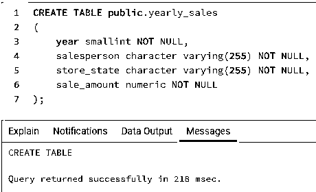
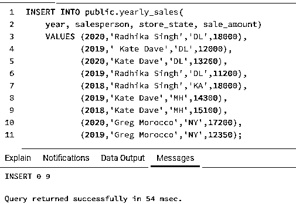
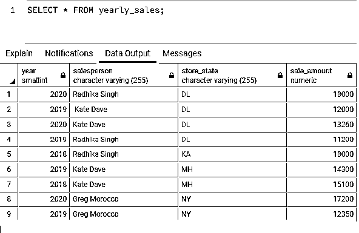
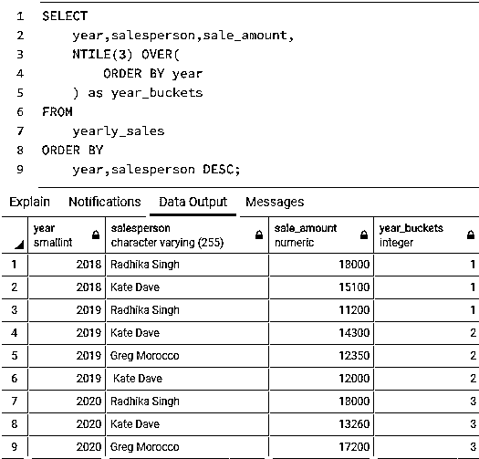
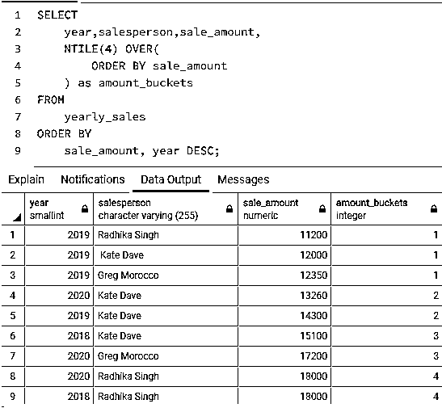
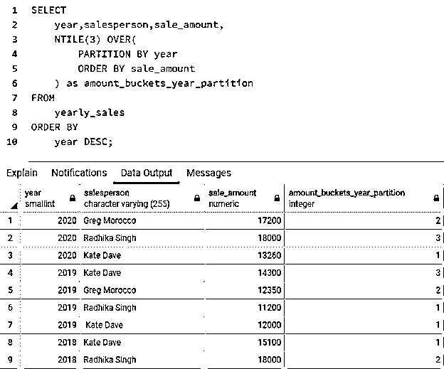

# SQL NTILE()

> 原文：<https://www.educba.com/sql-ntile/>

## SQL NTILE()简介

标准查询语言(SQL)中的 NTILE()是一个窗口函数，用于将分区中已排序的行划分为指定数量的相等大小的桶或组。每个存储桶被分配一个从 1 开始的等级。分区中的每一行都根据其所属的组被分配一个存储桶编号。

为了进一步理解，NTILE()功能可以被认为是将 10 个字母放入三个信封中。它是一个排名函数，将 m 行或记录的结果集分成 n 个组或桶，每个桶中有 m/n 个记录。如果结果集不能被分成相等数量的行，那么它会将更多的记录分配给起始存储桶，而将更少的记录分配给后面的存储桶。

<small>Hadoop、数据科学、统计学&其他</small>

**语法和参数:**

用 SQL 编写 NTILE()函数的基本语法如下:

`NTILE(buckets) OVER (
[PARTITION BY partition_expression ] [ORDER BY order_expression [ASC | DESC] ] )`

上述语法中使用的变量或参数如下:

*   **桶:**我们想要的组数在这里指定。它是正整数或返回正整数的表达式。存储桶数量不能为空值。
*   **partition_expression:** 对整个数据集进行划分所依据的列。默认情况下，整个结果集被视为一个分区。
*   **order_expression:** 对分区集中的行按特定的升序或降序进行排序的列。

### 例子

为了更详细地理解 SQL NTILE()函数，为了便于说明，让我们创建一个名为“yearly_sales”的表。该表包含与商店每笔销售相关的详细信息，如年份、金额和销售人员。我们可以使用下面的代码片段来创建上述表格。

`CREATE TABLE public.yearly_sales
(
year smallint NOT NULL,
salesperson character varying(255) NOT NULL,
store_state character varying(255) NOT NULL,
sale_amount numeric NOT NULL
);`

现在我们已经成功地创建了表。让我们在其中插入一些随机数据来处理。

`INSERT INTO public.yearly_sales(
year, salesperson, store_state, sale_amount)
VALUES (2020,'Radhika Singh','DL',18000),
(2019,' Kate Dave','DL',12000),
(2020,'Kate Dave','DL',13260),
(2019,'Radhika Singh','DL',11200),
(2018,'Radhika Singh','KA',18000),
(2019,'Kate Dave','MH',14300),
(2018,'Kate Dave','MH',15100),
(2020,'Greg Morocco','NY',17200),
(2019,'Greg Morocco','NY',12350);`

终于！在几次插入操作之后，上面提到的“yearly_sales”表中的数据看起来像这样:

`SELECT * FROM yearly_sales;`

下面根据上表举几个例子来详细解释 NTILE()函数。

#### 示例#1

说明如何使用 NTILE()函数将 yearly_sales 表中的记录分成 3 个时段的 SQL 查询。

`SELECT
year,salesperson,sale_amount,
NTILE(3) OVER(
ORDER BY year
) as year_buckets
FROM
yearly_sales
ORDER BY
year,salesperson DESC;`

在上面的例子中，我们可以看到 yearly_sales 表中提到的年度数据或行被分成了三个桶:1、2 和 3。第一桶有(2018，2018，2019)，第二桶有(2019，2019，2019)，第三桶有(2020，2020，2020)。由于有 9 条记录，它们被平均分配到 3 个存储桶中。

#### 实施例 2

说明如何使用 NTILE()函数将 yearly_sales 表中的记录分成 4 个时段的 SQL 查询。

`SELECT
year,salesperson,sale_amount,
NTILE(4) OVER(
ORDER BY sale_amount
) as amount_buckets
FROM
yearly_sales
ORDER BY
sale_amount, year DESC;`

在本例中，我们观察到 NTILE(4)将 9 条记录分成了 4 个存储桶。但是我们可以看到第一个桶有 3 行，而其余的每个桶有 2 行。这是因为在记录集不能平均划分的情况下，NTILE()向起始存储桶分配更多的记录，而向后面的存储桶分配更少的记录。

#### 实施例 3

SQL 查询演示了如何使用 NTILE()函数将 yearly_sales 表中的记录按年份划分为多个分区，然后划分为 3 个时段。

`SELECT
year,salesperson,sale_amount,
NTILE(3) OVER(
PARTITION BY year
ORDER BY sale_amount
) as amount_buckets_year_partition
FROM
yearly_sales
ORDER BY
year DESC;`

在本例中，我们可以看到已经创建了三个按年份划分的分区。现在，在这三个分区的每一个中，行被分配给三个桶，即 1、2 和 3。

#### 实施例 4

SQL 查询说明了如何使用 NTILE()函数按销售人员将 yearly_sales 表中的记录划分为多个分区，然后划分为 3 个时段。

`SELECT
year,salesperson,sale_amount,
NTILE(3) OVER(
PARTITION BY salesperson
ORDER BY year
) as year_buckets_salesperson_partition
FROM
yearly_sales
ORDER BY
sale_amount, year DESC;`

在本例中，我们可以看到已经创建了三个按销售人员划分的分区。现在，在这三个分区的每一个中，行被分配给三个桶，即 1、2 和 3。

### 结论

SQL NTILE()是一个窗口函数，主要用于将窗口或记录集中的分区划分为特定数量的桶。这有助于将已排序的数据分组在一起，以便进行数据分析。

### 推荐文章

这是 SQL NTILE()的指南。这里我们讨论介绍、语法、参数和代码实现的例子。您也可以浏览我们的其他相关文章，了解更多信息——

1.  [SQL 滞后()](https://www.educba.com/sql-lag/)
2.  [SQL 更新触发器](https://www.educba.com/sql-update-trigger/)
3.  [SQL 删除](https://www.educba.com/sql-delete/)
4.  [SQL 比较字符串](https://www.educba.com/sql-compare-string/)

