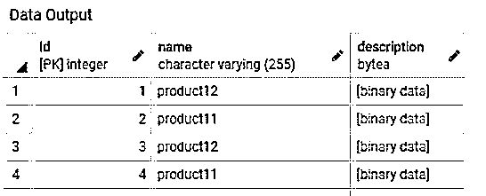

# SQL BLOB

> 原文：<https://www.educba.com/sql-blob/>

## SQL BLOB 简介

BLOB(二进制大型对象)是标准 SQL 中用于存储大量数据的数据类型。它基本上是一个可变长度的二进制字符串，存储为一个字节或八位字节序列。BLOB 数据类型通常用于在数据库中存储大型文件(如图像)、媒体文件(如视频和音频剪辑)。根据文件或需求，我们可以将 BLOB 值作为二进制或字符串写入数据库。

**语法和参数:**

<small>Hadoop、数据科学、统计学&其他</small>

创建包含 BLOB 数据类型列的数据库表的基本语法如下:

`CREATE TABLE tablename (
Column_name1 BLOB CONSTRAINT,
column_name2 data type CONSTRAINT,
.
.
.
);`

上述语法中使用的参数类似于 CREATE TABLE 语句。唯一的区别是使用了 BLOB 数据类型，而不是任何其他数据类型。我们可以简单地使用关键字 BLOB 在 MySQL 和 ORACLE 数据库中使用二进制大对象数据类型。但是，其他数据库(如 PostgreSQL 和 SQL SERVER)将二进制大型对象数据类型称为 BYTEA，而不是 binary。

### SQL BLOB 的示例

以下是 SQL BLOB 的示例:

#### 示例#1

说明创建 blob 类型字段的 SQL 查询。

**代码:**

`CREATE TABLE product_details_oracle
(
id INT PRIMARY KEY,
name VARCHAR(255),
description BLOB
);`

**输出:**

已使用 BLOB 数据类型的描述字段成功创建了 product_details_oracle 表。

#### 实施例 2

说明在 BLOB 数据类型字段中插入值的 SQL 查询。

接下来，让我们使用以下 insert 语句在 product_details_oracle 中插入一些记录。

**代码:**

`INSERT INTO product_details_oracle VALUES(1,'product12', utl_raw.cast_to_raw('This is a blob description'));`

**输出:**

**代码:**

`INSERT INTO product_details_oracle VALUES
(2,'product11', utl_raw.cast_to_raw ('This is a new blob description'));`

**输出:**

我们已经成功地在表中插入了两条记录。在上面提到的 insert 语句中，您可能已经观察到了 utl_raw.cast_to_raw 函数。该函数主要用于将值转换为原始数据类型。

#### 实施例 3

说明 BLOB 数据类型字段中值更新的 SQL 查询。

我们可以简单地使用如下所示的通用 update 语句来更新 BLOB 列。

**代码:**

`UPDATE table_name SET BLOBColumn = ‘New Value’ WHERE condition_expression;`

但是如果你想清空 blob 存储并返回 BLOB 定位器来进一步初始化它，你可以使用 empty_blob()函数。在这种情况下，我们已经更新了 id = 2 的记录的 BLOB 列。

**代码:**

`UPDATE product_details_oracle SET description = EMPTY_BLOB()
WHERE id = 2;`

**输出:**

**其他 SQL 数据库中的 BLOB 数据类型:**

如果您无法访问 ORACLE 或 MySQL 数据库，但仍然希望创建二进制大型对象数据类型，该怎么办？这里，我们使用 postgreSQL 进行说明。在 postgreSQL 中，我们使用 BYTEA 关键字代替 BLOB，如下面的 CREATE TABLE 语句所示。

**代码:**

`CREATE TABLE product_details(
id SERIAL PRIMARY KEY,
name VARCHAR(255),
description BYTEA
);`

**输出:**

该命令已成功创建 product_details 表。与 oracle 数据库中的表类似，description 字段保留为 BYTEA 类型。

接下来，让我们在表中插入一些记录。在 MySQL 和 PostgreSQL 中，与 ORACLE 不同，我们不需要任何 hex_to_raw()或 cast_to_raw()函数。

**代码:**

`INSERT INTO product_details VALUES(1,'product12', ('This is a blob description'));`

**输出:**

记录已成功插入表中。我们从 SELECT 语句的数据输出中观察到，description 字段没有显示为文本，而是被转换为二进制数据。

**代码:**

`SELECT * FROM product_details;`

**输出:**

让我们再插入一些记录来处理 BLOB 数据类型。

**代码:**

`INSERT INTO product_details VALUES(2,'product11','This is a new blob description'),
(3,'product12','This is a blob description'),
(4,'product11','This is a newer blob description');`

**输出:**

product_details 表中插入的行如下所示。

**代码:**

`SELECT * FROM product_details;`

**输出:**

**

** 

**WHERE 子句比较中的二进制数据:**

如果您想在 SQL 查询中比较 BLOB 或 BYTEA 数据类型，该怎么办？我们可以使用类似于其他数据类型的 BLOB 进行比较。

#### 实施例 4

查找描述完全相同的产品的 id、名称和描述。

**代码:**

`SELECT p1.id, p1.name, p1.description
FROM product_details as p1, product_details as p2
WHERE p1.description = p2.description  AND p1.id != p2.id;`

**输出:**

在这个查询中，我们试图通过比较 WHERE 子句中的描述字段来筛选记录。

**Note:** Fields of BLOB data type can only be read in SQL databases. We cannot use database search engine functions like filtering and sorting for specific values within the BLOB values.

### 使用 BLOB 数据类型的优势

 ***   在存储电影、歌曲、电视节目等大数据文件时，BLOB 是非常方便的数据类型。它们很容易被加密和引用。
*   但是，并不是所有的 SQL 数据库都支持 BLOB 数据类型。它们需要大量的存储空间，因此返回时间较慢。

### 结论

在本文中，我们看到了 BLOB 数据类型。BLOB 是标准查询语言(SQL)中的二进制对象数据类型，用于在数据库中存储大型文件，如图像、电影、音频剪辑等。

### 推荐文章

这是一个 SQL BLOB 的指南。在这里，我们将分别讨论 SQL BLOB 的介绍以及示例和优点。您也可以看看以下文章，了解更多信息–

1.  [SQL TRUNCATE()](https://www.educba.com/sql-truncate/)
2.  [带 AS 语句的 SQL](https://www.educba.com/sql-with-as-statement/)
3.  [SQL DML 命令](https://www.educba.com/sql-dml-commands/)
4.  [SQL 中的游标](https://www.educba.com/cursors-in-sql/)

**