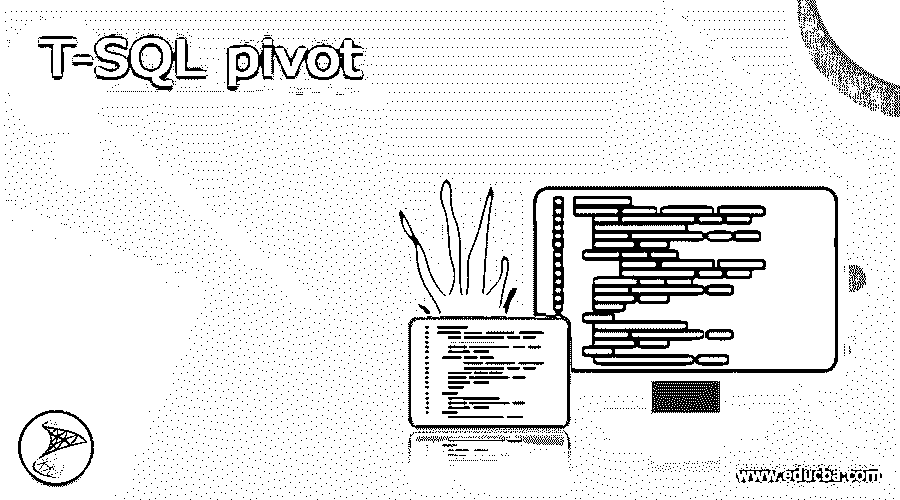
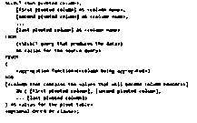
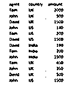
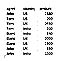

# T-SQL 透视

> 原文：<https://www.educba.com/t-sql-pivot/>




## T-SQL 透视简介

T-SQL pivot 是一个关系运算符，可用于将一个表表达式转换为另一个表表达式。它可用于创建多功能报告。如果我们想将数据从行级别转换到列级别，就需要使用透视。它允许旋转具有值的表的表达式，方法是将表达式中一列的唯一值转换到输出中的各个列。此外，在 pivot 的帮助下，我们可以在需要的地方执行聚合操作。

### 什么是 T-SQL 透视？

T-SQL pivot 是关系运算符，可用于将表值表达式转换为另一个表；透视可用于将表值表达式从一列的唯一值转换为表达式输出中的各列的唯一值，如果我们希望在输出中保留所需的列值，这可以通过使用聚合来实现，并且当我们希望将数据从行级别转换为列级别时，可以使用透视，在 T-SQL 透视中，from 子句可以与“SELECT”、“UPDATE”和“DELETE”语句一起使用。通常,“SELECT”子句可以与 pivot 运算符可以使用的“FROM”子句一起使用。

<small>Hadoop、数据科学、统计学&其他</small>

在 T-SQL 中，还使用了动态表和操作符，数据透视表可以概括来自大量数据集的信息，这些信息可用于创建报表。运算符可用于将唯一值从一列转换到另一列。

### 使用 T-SQL 透视

让我们看看可以在 T-SQL 中使用的过程，通过使用 pivot 获得结果，因为 pivot 和 value 列是集群列，

*   它在与分组列相反的 input_table 上完成 GROUP BY，并为每个组生成一个输出行。

分组列的输出行可以获取 input_table 中该集合的通信列值。

*   我们必须执行一些步骤来为每个输出在列列表中创建值，
*   在分组中，第一步中在 GROUP BY 中创建了一个额外的行，与透视中的列相对。

对于列列表中的每个输出列，它可以选择能够满足下面给出的给定条件的子组，

```
pivot_column = CONVERT(<data_type of pivot column>, ‘output_column’)
```

*   则已经在子组上计算了与 value_column 相反的 aggregate _ function 然后我们就可以得到与 output_column 保持联系的结果；如果我们在子组中没有任何值，那么服务器可以为 output_column 创建一个空值。

如果我们有一个 COUNT 聚合函数和一个空的子组，我们得到零输出。

*   让我们看看上面的解释使用的语法，我们可以阅读复杂的系列选择…简单地说，




### T-SQL 透视动态表

让我们看看如何在 T-SQL 中生成动态数据透视表，其中数据透视表是可以从庞大的基础数据集创建的压缩信息段；基本上，它已被用于报告大量数据集中的特定维度，基本上，用户可以将行转换为列，因为它可以向用户提供以简单的方式将列从服务器转换为表的能力，并且它可以根据需求生成报告。

数据透视表还可以帮助生成数据分析，如切片和切块，这可以创建查询，让我们了解数据透视表，


在上图中，我们有两个表，左边的表有原始记录，右边的表是通过将原始表中的行转换为列而创建的数据透视表；通常数据透视表可以有行、列和值，其中数据透视表中的行来自学生列，列来自主题列。这些值是通过聚合左表的 Marks 列生成的；我们必须执行创建数据透视表的脚本。

### T-SQL 透视运算符

*   pivot 运算符可以将每一行转换为聚合输出，在聚合输出中，它可以将通信列放入结果集中，此运算符已用于将一列中的唯一值转换为各列中的值，我们可以说，如下图所示，通过旋转列，


*   让我们看看我们能够引用的查询的结构，


*   让我们看看如何使用下面的“销售”表来实现 pivot 运算符，




因此，通过这种方式，可以使用 pivot 运算符来获取数据。

*   我们想编写查询，以获得每个国家的每个代理的总量；然后，我们可以通过使用，
*   聚合和 GROUP BY 子句:

使用聚合和 GROUP BY 子句，我们能够编写以下查询，

```
“SELECT AGENT, COUNTRY, SUM(AMOUNT) AS TOTAL
FROM SALES
GROUP BY AGENT, COUNTRY
ORDER BY SUM(AMOUNT);”
```

然后我们得到如下截图所示的输出，




*   聚集和透视运算符:

让我们通过使用 pivot 操作符来查看查询，

```
“SELECT AGENT, INDIA, US, UK FROM SALES
PIVOT
(SUM(AMOUNT)
FOR COUNTRY
IN ([INDIA], [US], [UK])
)
```

作为数据透视表

印度、美国、英国的订单；"

我们将得到如下输出:


### 结论

在本文中，我们得出结论，T-SQL 中的 pivot 已经被用来将表值表达式转换为另一个表；它可以在任何需要的时候运行聚合函数；我们还讨论了 pivot 操作符、动态表以及 pivot 操作符在 T-SQL 中的使用。

### 推荐文章

这是一个 T-SQL 透视的指南。这里我们讨论一下 T-SQL pivot 的定义、简介、什么是 T-SQL pivot、它的用途以及 T-SQL pivot 的操作符。您也可以看看以下文章，了解更多信息–

1.  [T-SQL 插入](https://www.educba.com/t-sql-insert/)
2.  [T-SQL 字符串函数](https://www.educba.com/t-sql-string-functions/)
3.  [什么是 T-SQL？](https://www.educba.com/what-is-t-sql/)
4.  [T-SQL 命令](https://www.educba.com/t-sql-commands/)


