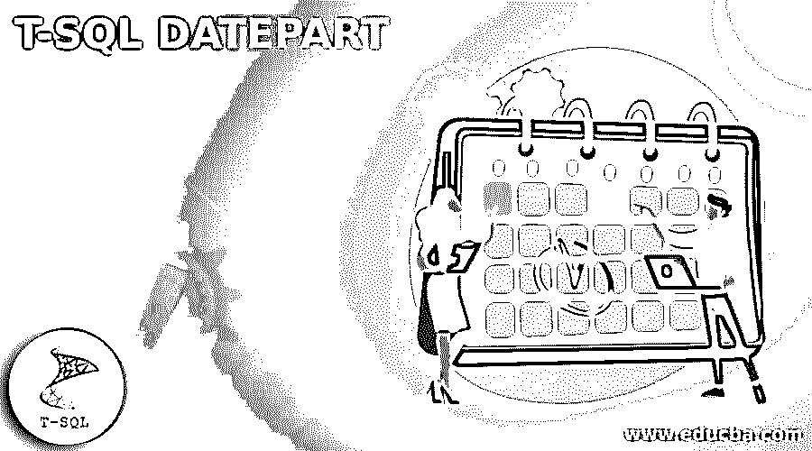
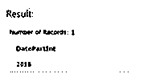

# T-SQL 日期部分

> 原文：<https://www.educba.com/t-sql-datepart/>




## T-SQL DATEPART 简介

T-SQL DATEPART 是一个函数，它可以返回一个特定的日期段，其中它以整数值的形式提供结果，并且它给出的日期段是我们想要返回的日期段。所以我们可以说，如果我们有条件获取特定的日期部分，那么 DATEPART()函数已经被使用。它接受两个参数，date_part 和 input_date，其中 date_part 是要提取的日期部分，input_date 是我们可以从中获取日期部分的日期。

### 什么是 T-SQL DATEPART？

DATEPART()是 T-SQL 中的函数，可用于提取可通过参数指定的日期段；它接受两个参数，比如 interval 作为 date_part，date 作为输入日期，所以如果我们在 date-part 中提供一个日期。我们必须从中提取年份，并在区间或输入部分指定 YY。它将从提供的值中给出相关的年份，其中我们只能获得整数格式的值，因为该部分的日期部分已经接受了提取方法的缩写，例如，year 的缩写为 yy，yyyy，moth 的缩写为 mm，m，这样我们就可以使用所有其他 date_part 的缩写。

<small>Hadoop、数据科学、统计学&其他</small>

### T-SQL 日期部分函数

DATEPART()函数可以返回日期的特定部分和整数格式的结果；它可以接受两个参数，间隔和日期。

**语法:**

```
“DATEPART (interval, date)”
```

在哪里，

*   **interval:** 这是一个部分，从中我们可以得到一个可以是特定日期的日期部分，因为它返回特定间隔的整数值。
*   **date:** 是要提取的一段日期，我们可以在其中描述日期，以获得特定的区间值；它允许我们定义直接值，以便从给定的数据类型(如 Date、DateTime、Datetimeoffset、Datetime2、Smalldatetime 和 Time)中返回值。

DATEPART()中的 interval 参数是必需的部分，因为我们可以说它是 input_part，所以它可以接受各种输入参数，如日期、月份、年份、分钟等。，在下面的参数部分给出。date_part 也是一个必需的值，其中它可以是已经使用的日期，并且可以具有诸如 date、DateTime、dateTimeoffset、datetime2 和 smalldatetime 或 time 之类的数据类型。

让我们看一个 DATEPART()函数的例子，它可以返回一段特定的日期；它可以使用 SELECT 语句来编写查询，如下所示:

**代码:**

```
“SELECT DATEPART (yy, ‘2018/07/21’) AS DatePartInt”
```

**输出:**




在本例中，我们尝试从提供的值中获取年份；正如我们所看到的，date_part 是输入部分，我们可以从中获取 input_part 中指定的值，因为我们可以将 date 作为输入。我们必须从给定的日期中提取出表示“yy”的年份，这样我们就可以看到输出，即输入部分中提供的 2018 年。

让我们看看另一个获取给定日期的月份部分的示例:

**代码:**

```
“SELECT DATEPART(month, '2018/07/22') AS DatePartInt;”
```

**输出:**


### T-SQL 日期部分参数

主要有两个参数 interval/input_part 和 date _ part 让我们看看 DATEPART 的参数及其缩写:

**Interval:** 它有各种带缩写的参数，所以让我们讨论一下具体参数使用了哪个缩写:

*   **year，yyyy，yy = Year:** 从定义的日期开始修正年份。
*   **quarter，qq，q = Quarter:** 固定从指定日期开始的季度。
*   **month，mm，m = Month:** 从定义的日期开始固定月份。
*   **dayofyear，dy，y =一年中的某一天:**我们可以获得一年中指定日期的某一天。
*   **day，dd，d =一个月中的某一天:**它获取一个月中的某一天作为定义的日期。
*   **week，ww，wk = Week:** 提供定义日期中当前日期的周数，一年有多少周。
*   **hour，hh = hour:** 提供定义日期的小时部分。
*   **分钟，mm，n =分钟:**我们可以得到特定日期的分钟部分。
*   **秒，ss，s =秒:**我们可以获得定义日期的分钟部分。
*   **毫秒，ms =毫秒:**从指定日期开始获取毫秒值。
*   **微秒，mcs =微秒:**它从定义的集合中获取一个微秒值。
*   **纳秒，ns =纳秒:**接收指定日期的纳秒值。
*   **tzoffset，tz =时区偏移量:**获取当地时区和 GMT 内的时区偏移量。
*   iso_week，isowk，isoww = ISO week

**Date:** 这也是我们必须提供的必填字段，以便使用 interval 参数提取结果。

**T-SQL DATEPART 日期/时间:**DateTime 是 T-SQL 的数据类型，格式为 YYYY-MM-DD (hh:mm: ss[。nnn])；它具有范围内的 8 字节存储容量，

**举例:**

**代码:**

```
DECLARE @date DATETIME= GETDATE();
SELECT @date;
SELECT DATEPART(YY, @date) AS Year,
DATEPART(QQ, @date) AS Quarter,
DATEPART(WK, @date) AS Week;
```

**输出:**


在上面的例子中，我们使用了 DateTime 数据类型和 datepart，在其中我们可以得到日期和时间的结果。

### 结论

在本文中，我们得出结论，DATEPART()是可以接受 interval 和 date_part 参数的函数。而且，它可以将一段日期作为整数值返回；我们还看到了有助于我们理解这个概念的各种参数和函数。

### 推荐文章

这是一个 T-SQL 数据部分的指南。这里我们讨论一下简介、T-SQL DATEPART 函数和参数。您也可以看看以下文章，了解更多信息–

1.  [desc 的 SQL 订单](https://www.educba.com/sql-order-by-desc/)
2.  [SQL 执行](https://www.educba.com/sql-execute/)
3.  [SQL 排除](https://www.educba.com/sql-exclude/)
4.  [MySQL InnoDB 集群](https://www.educba.com/mysql-innodb-cluster/)


