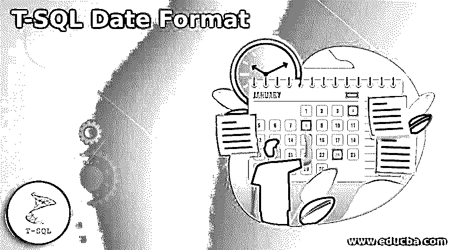
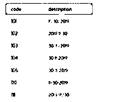
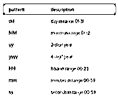

# T-SQL 日期格式

> 原文：<https://www.educba.com/t-sql-date-format/>




## T-SQL 日期格式介绍

T-SQL 日期格式被定义为，它是用于排列字段的函数，这些字段被直接引导为显示格式，并且它的格式能够在所有的可能性中保留数据库中的日期或时间值。我们可以说，日期格式已经被用于查看格式为 MM-DD-YYYY 或月份的日期将首先被显示为 DD-MM-YYYY， 当日期字段被保留为字符串时，它不会按历史顺序排序，因为我们需要使用“ORDER BY”语句，该语句不会创建历史列表。

### T-SQL 日期格式概述

我们来看一下日期格式的概述，其中 DATE_FORMAT()是可以指定日期的函数格式；日期格式函数已被用于以各种形式显示日期/时间数据，在这些形式中，它具有特定的格式和可选的区域性，以利用格式函数将日期或时间以及数字值作为字符串进行区域设置格式设置。

<small>Hadoop、数据科学、统计学&其他</small>

**语法:**

```
FORMAT (value, format [, culture])
```

在哪里，

*   值是辅助数据类型格式化的表达式。
*   format 是包含有效格式字符串的参数，该格式字符串可以是标准格式，也可以是日期的自定义字符模式。它也可以携带分数实用程序，如“MMMM DD，yyyy (dddd)”
*   Culture 是可以描述区域性的可选“nvarchar”参数；如果未给定区域性，它可以使用当前会话的语言。它可以接受任何可以辅助的文化作为论据。

它可以返回一个返回类型为“nvarchar 或 null”的值，返回值的长度由格式设置。

### 如何 T-SQL 日期格式？

让我们看看如何以另一种格式显示日期值:

假设我们有一个名为“office”的表，它可以包含列 id、名称和开始日期的信息。

| **id** | **名称** | **开始日期** |
| One | 维贾亚银行 | 20-01-2019 |
| Two | 自由研究所 | 14-03-2018 |
| Three | 格雷斯控股公司 | 28-10-2019 |

对于每个“office”字母，我们可以将它们的开始日期转换为新格式 YYYY/MM/DD，其中 YYYY 可以是四位数的年份，MM 是两位数的月份，DD 是两位数的日期。

让我们使用 CONVERT()函数；我们可以使用下面的查询进行转换。

**代码:**

```
“SELECT CONVERT (NVARCHAR, begin_date, 111) AS new_date FROM office;”
```


**输出:**


在本例中，我们尝试将 Vijaya Bank 的日期格式“2019-01-20”更改为“2019/01/20”；我们使用 CONVERT()函数来转换所提供的列中的日期，这些列可以接受三个参数作为 NVARCHAR 数据类型，列“name”具有表达式和“begin_date”列，我们使用的样式代码可以是整数。

下表给出了著名的风格代码。




让我们使用 FORMAT()函数来改变日期/时间格式；我们可以使用下表中的字符。




现在让我们看看可以与 FORMAT()函数一起使用的查询。

**代码:**

```
“SELECT FORMAT (begin_date, ‘yyyy-MM-dd’) AS new_date FROM office;”
```

**输出:**


在上面的查询中，第一个参数是要格式化的 DateTime/date/time 值，第二个参数是该函数可以返回 NVARCHAR 数据类型的字符串。

### T-SQL 日期格式函数

输入日期格式中的日期格式功能将类似于列格式，因为匹配两种格式至关重要。

*   **NOW():** 这是一个日期格式函数，可以返回当前的日期和时间。
*   **CURTIME():** 这也是可以返回当前时间的日期格式函数。
*   **EXTRACT():** 此函数可以返回单个部分或时间。
*   **DATE_SUB():** 这个函数可以从日期中减去特定的时间间隔。
*   **DATE_FORMAT():** 可以以多种格式显示日期或时间。
*   **DATEDIFF ():** 这个函数可以帮助返回两个不同日子之间的天数。
*   **DATE_ADD():** 该函数用于向日期添加特定的时间间隔。
*   **DATE():** 该函数可以取出日期和日期或时间表达式中的日期部分。
*   **CURDATE():** 这个函数可以返回当前日期。

### T-SQL 日期格式的提示和技巧

以下是提到的提示和技巧:

*   **逗号分隔输出:**可以返回一个逗号分隔的值，其中不使用游标。
*   **确定丢失的标识值:**它可以简单地识别我们表中放错位置的值。
*   **生成随机数:**这是 SQL server 数学函数的另一个选项。
*   **生成随机记录:**它可以从我们的表中创建一定数量的随机记录。
*   **分类 IP 地址:**可以用数值分类为 VARCHAR。
*   **拆分姓名/拆分字符串:**这是另一种拆分全名以接收名和姓的方式。
*   **查询/读取并导入 excel 文件:**这可以利用 DTS，不需要将数据加载到 SQL 表中。
*   **执行一批 SQL 脚本:**这个可以在某个特定的目录下有，不需要手动打开，每隔一段时间就可以打开。SQL 脚本及其在查询分析器中的实现。
*   **SQL server 日期格式:**它列出了如何将日期时间值转换成各种日期格式。
*   **给变量赋值时 SET vs . SELECT:**在给局部变量赋值时，它可以显示 SET 命令和 SELECT 语句的区别。

### 结论

在本文中，我们得出结论，日期格式是可以用来排列字段和显示日期的函数，因此我们也可以讨论如何使用该函数和函数格式以及与日期格式函数相关的提示和技巧。

### 推荐文章

这是一个 T-SQL 日期格式的指南。在这里我们讨论一下简介，格式函数，技巧和窍门，以及如何 T-SQL 日期格式。.您也可以看看以下文章，了解更多信息–

1.  [desc 的 SQL 订单](https://www.educba.com/sql-order-by-desc/)
2.  [SQL 执行](https://www.educba.com/sql-execute/)
3.  [SQL 排除](https://www.educba.com/sql-exclude/)
4.  [MySQL InnoDB 集群](https://www.educba.com/mysql-innodb-cluster/)


