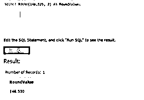
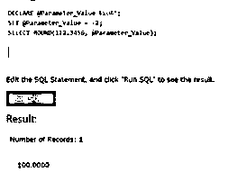
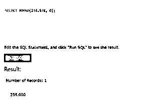
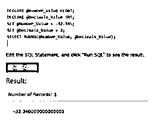
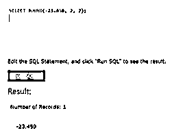
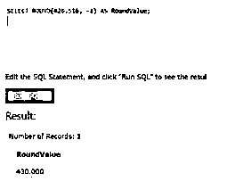

# T-SQL 回合

> 原文：<https://www.educba.com/t-sql-round/>


## T-SQL 回合简介

T-SQL ROUND 是一个函数，其语法接受三个参数，如数字、小数点和运算。该数字是提供粗略数值的必需参数。Decimals 是计算数字的小数位数，operation 是可选参数，可以是零，也可以不是零。因此，如果它是零，它计算出输出的小数位数，如果它是任何值，那么 ROUND 函数()可以将输出截断为小数点位数。

### T-SQL ROUND 是什么？

ROUND()是 T-SQL 中的函数，可用于计算一个数字的特定小数点位数，它总是可以返回一个值，如果运算的值是负数并且比小数点前的位数更有效，ROUND 可以在输出中返回零值。如果指定了非零值，则可能会截断数值表达式；它还返回一个可以计算出特定长度的数值，因此我们可以说 ROUND()函数可以返回根据长度计算出的最接近的值，该函数还可以根据需要使用不同的值来获得不同的值。

<small>Hadoop、数据科学、统计学&其他</small>

### T-SQL ROUND 函数？

ROUND()是 T-SQL 中的函数，可以返回最接近小数位数的值。ROUND()函数可以用来计算一个特定的数字到小数点；它可以接受各种数字，可能是负数、正数或零。它还可以接受分数，分数总是在四舍五入到小数点后返回一个数字。

### T-SQL 中 ROUND()函数的语法

```
“ROUND (numbers, decimal_points, operation)”
```

在哪里，

*   **数字:**是能算出来是数字的数字。
*   **decimal_points:** 是算出来的小数位数；该值可以是正数，也可以是负数；如果我们试着不使用这个参数，那么这个 ROUND()函数会计算出一个小数点，这样这个参数就是必需的参数。
*   **运算:**可选参数可以为零或非零数值。

有些事情需要记住:

*   首先，如果操作参数的值为零或未给定，那么 ROUND()函数可以计算出输出到小数点的位数。
*   如果操作参数中的值不是零或数字，那么 ROUND()函数可以将输出截断到小数点位数。

### T-SQL 回合示例

让我们看看使用 ROUND()函数的 T-SQL ROUND 示例:

#### 示例#1

得到一个精确到小数点后两位的整数。

**代码:**

```
SELECT ROUND (146.525, 2) AS RoundValue;
```

**输出:**




在上面的例子中，我们使用了一个值“146.525”，我们试图从提供的值中找出一个值，其中我们找到了一个最高达两位小数点的舍入值，如屏幕截图所示。

#### 实施例 2

要使用操作参数 1 得到一个小数点后三位的数字，请将特定数字截断到提供的小数点后三位，即 3。

**代码:**

```
SELECT ROUND(23.1465, 3, 1) AS RoundValue;
```

**输出:**


在上面的例子中，我们取了一个值“23.1465”，我们想算出一个小数点后三位的数字，在这个数字中我们可以参考屏幕截图中显示的输出。

#### 实施例 3

使用一个带有变量的 ROUND()函数算出一个数字的-2 位小数。

**代码:**

```
DECLARE @Parameter_Value FLOAT;
SET @Parameter_Value = -2;
SELECT ROUND(112.3456, @Parameter_Value);
```

**输出:**




在本例中，我们必须通过设置参数值来计算出一个数字，因为提供的值是 112.3456，所以将该值四舍五入到小数点后两位，我们得到的值如输出所示。

#### 实施例 4

将四舍五入后的数字返回到小数点后零位。

**代码:**

```
SELECT ROUND (234.578, 0);
```

**输出:**




在本例中，我们使用了一个值 234.578，我们必须将该值四舍五入到小数点后 0 位，这样您就可以参考上面给出的输出。

#### 实施例 5

ROUND()函数的一个例子使用变量计算出一个数字的三个小数点。

**代码:**

```
DECLARE @Number_Value FLOAT;
DECLARE @Decimals_Value INT;
SET @Number_Value = -32.345;
SET @Decimals_Value = 2;
SELECT ROUND (@Number_Value, @Decimals_Value);
```

**输出:**




在本例中，我们使用了一个负值，如'-32.345 '，该值四舍五入到小数点后两位，我们得到的结果如屏幕截图所示。

#### 实施例 6

使用操作参数 2 将一个数字返回到后面的两位小数点，这可以将特定的数字截断到提供的小数点，即 2。

**代码:**

```
SELECT ROUND (-23.456, 2, 2);
```

**输出:**




在上面的例子中，我们使用了一个负数'-23.456 '，使用 2 作为操作参数，可以将其四舍五入到小数点后两位。

#### 实施例 7

将一个数恢复到小数点后-1 位。

**代码:**

```
SELECT ROUND (426.516, -1) AS RoundValue;
```

**输出:**




在这个例子中，我们使用了一个负值，其中我们想要一个四舍五入的值，如屏幕截图所示。

### 结论

在本文中，我们得出结论，ROUND()是当我们希望输出小数位数时可以使用的函数，它可以计算出最接近小数点的输出；我们还详细了解了 T_SQL ROUND()函数和 T-SQL ROUND 示例。

### 推荐文章

这是一个 T-SQL 回合的指南。这里我们讨论一下入门，T-SQL ROUND 函数？以及更好理解的例子。您也可以看看以下文章，了解更多信息–

1.  [desc 的 SQL 订单](https://www.educba.com/sql-order-by-desc/)
2.  [SQL 执行](https://www.educba.com/sql-execute/)
3.  [SQL 排除](https://www.educba.com/sql-exclude/)
4.  [MySQL InnoDB 集群](https://www.educba.com/mysql-innodb-cluster/)


