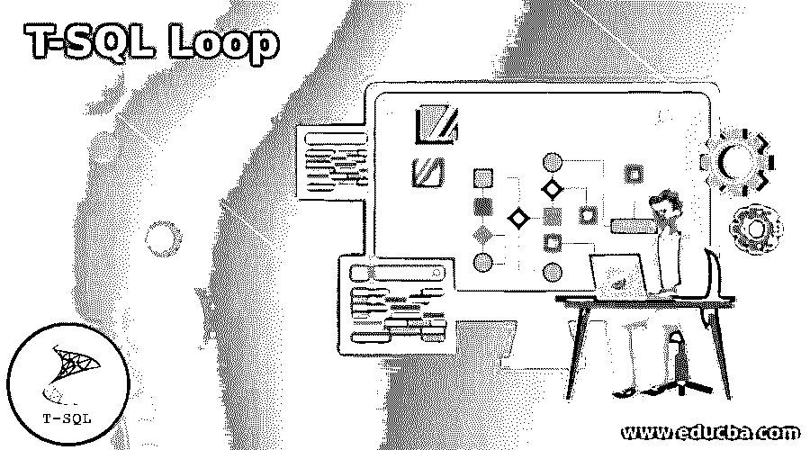
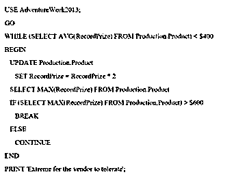
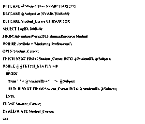

# T-SQL 循环

> 原文：<https://www.educba.com/t-sql-loop/>




## T-SQL 循环简介

T-SQL 循环被定义为在特定时期内循环执行多个语句的循环，这些语句也可以被称为控制语句，其中在 T-SQL 中，循环语句被调整为 SQL 语句或语句块的重复执行，其中语句可以重复执行，直到特定条件将变得准确。使用“WHILE”循环的语句实现可以在三个参数的帮助下从循环内部进行管理:布尔表达式、“BREAK”和“CONTINUE”关键字。

### 什么是 T-SQL 循环？

T-SQL 可以通过授权我们在循环条件保持不变时复制特定代码来执行“WHILE”循环；如果我们需要另一个循环，那么我们可以在 WHILE 循环的帮助下重新生成它们，因此循环可以频繁地用于查询可以执行大部分任务的情况。尽管如此，有时候循环还是很有用的，可以让我们的生活变得更容易。

<small>Hadoop、数据科学、统计学&其他</small>

通常，有三种类型的循环:

*   **WHILE:** 如果 WHILE 循环条件为真，那么内部循环代码已经实现；WHILE 循环可以提供重复实现 SQL 语句直到特定条件提供结果的优势。
*   做…..WHILE: 这个循环也和 WHILE 循环一样工作，但是在这个语句中，循环条件已经在循环的末尾执行了，WHILE 循环和 DO…WHILE 循环都是一样的，循环可以迭代到条件。
*   **FOR:** 当我们要在循环内部运行代码的迭代次数时，可以使用这个循环；我们还可以改变循环可以执行的次数。

### T-SQL Server 循环

服务器循环是在实现 SQL 语句或语句块时可以重复使用的一组或一组条件；语句可以一直执行到给定的条件为真，WHILE 循环中语句的实现可以通过使用 BREAK 和 CONTINUE 关键字在循环内部进行管理，SQL server 可以允许在 WHILE 循环中重复特定的代码，并且循环条件可以处理它。

让我们看一下 T-SQL server 循环，其中我们假设在分配时有一个 WHILE 循环。

**代码:**

```
WHILE (condition)
BEGIN
{----Body of the statement-----}
END;
```

从上面的陈述中，我们得出结论，当 WHILE 循环条件为真时，BEGIN-END 块已经实现，如果我们正在讨论 SQL server 循环，那么我们可以说我们有一个附件，并且我们能够在 WHILE 循环中使用它们。

让我们通过下面的例子来看看上面的内容:

**代码:**

```
DECLARE @i INTEGER;
SET @i = 1;
WHILE @i <= 10
BEGIN
PRINT CONCAT ('Pass...', @i);
SET @i = @i + 1;
END;
```


**输出:**


在上面的例子中，我们将变量声明为@i，并将值设置为 1；如果变量的幸存值< =10，那么我们可以将它输入到循环体中，每当我们试图进入循环体时，语句都被执行，它会将@i 递增 1，这样我们可以说，变量@i 的值在某些地方将为 10，这样就可以停止循环的反复运行。

### T-SQL 循环语句的示例

下面提到了不同的例子:

#### 示例#1

通过使用嵌套 IF…ELSE 和 WHILE 的 BREAK 和 CONTINUE 语句。

在此示例中，我们尝试使用 BREAK 和 CONTINUE 关键字，并且我们还使用了嵌套的 IF…ELSE 和 WHILE 语句，BREAK 语句已在 T-SQL WHILE 循环中使用，以便在存在各种条件时立即终止幸存的迭代循环，通常 IF…ELSE 语句已用于验证条件是否已发生。CONTINUE 关键字可以在带有 WHILE 循环的 T-SQL 语句中使用，在 WHILE 循环中，当有特定代码可用时，它可以停止循环的幸存迭代。然后新的迭代将开始，如果我们想在使用循环时只写偶数，我们可以使用 CONTINUE 语句来控制这样的条件。

**代码:**

```
USE AdventureWork2013;
GO
WHILE (SELECT AVG(RecordPrize) FROM Production.Product) < $400
BEGIN
UPDATE Production.Product
SET RecordPrize = RecordPrize * 2
SELECT MAX(RecordPrize) FROM Production.Product
IF (SELECT MAX(RecordPrize) FROM Production.Product) > $600
BREAK
ELSE
CONTINUE
END
PRINT 'Extreme for the vendor to tolerate';
```

**输出:**




在本例中，如果 RecordPrize 的平均值小于 400 美元，WHILE 循环可以将奖金翻倍。之后，它可以选择最高奖金，如果最高奖金少于或接近 600 美元，那么 WHILE 循环可以重新开始。奖金将翻倍，这样循环可以使奖金翻倍，直到奖金获得大于 600 美元的最高奖金，之后，WHILE 循环可以终止，给出消息。

#### 实施例 2

通过在光标中使用。

**代码:**

```
DECLARE @StudentID as NVARCHAR (255)
DECLARE @Subject as NVARCHAR (55)
DECLARE Student_Cursor CURSOR FOR
SELECT LogID, JobRole
FROM AdventureWorks2013.HumanResource.Student
WHERE JobRole = 'Marketing Professional';
OPEN Student_Cursor;
FETCH NEXT FROM Student_Cursor INTO @StudentID, @Subject;
WHILE @@FETCH_STATUS = 0
BEGIN
Print ' ' + @StudentID + ' '+ @Subject
FETCH NEXT FROM Student_Cursor INTO @StudentID, @Subject;
END;
CLOSE Student_Cursor;
DEALLOCATE Student_Cursor;
GO
```

**输出:**




在上面的例子中，我们试图利用@@FETCH_STATUS 来管理 WHILE 循环中的活动。

### 结论

在本文中，我们得出结论，WHILE 循环可以用于放置条件语句，这样它们就可以有一个语句体；如果我们必须执行一个语句，那么可以使用循环，我们也看到了 T-SQL 的定义，T-SQL 服务器循环，以及与 T-SQL 循环相关的例子。

### 推荐文章

这是一个 T-SQL 循环的指南。为了更好地理解，我们在这里讨论简介、T-SQL server 循环和示例。您也可以看看以下文章，了解更多信息–

1.  [desc 的 SQL 订单](https://www.educba.com/sql-order-by-desc/)
2.  [SQL 执行](https://www.educba.com/sql-execute/)
3.  [SQL 排除](https://www.educba.com/sql-exclude/)
4.  [MySQL InnoDB 集群](https://www.educba.com/mysql-innodb-cluster/)


